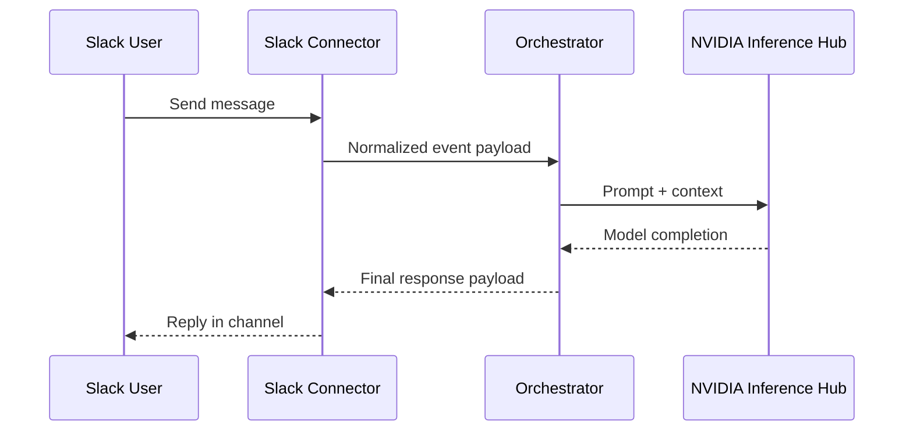

# M1 — Building Our Own Agent: Local Orchestrator + NVIDIA Inference Hub (DRAFT)

---

## TODOs

Items still needed before this post is complete:

- [ ] **Slack permissions walkthrough** — Detailed setup guide covering OAuth
  scopes, bot token vs. user token, event subscriptions, socket mode vs.
  HTTP endpoint, workspace installation flow, and the minimum permission
  set required for the connector to receive and reply to messages.
- [ ] **NVIDIA Inference Hub setup walkthrough** — How to create an account,
  obtain API keys, select an endpoint/model, and configure the inference
  backend with those credentials.
- [ ] **Local development environment setup** — Prerequisites (Python version,
  dependencies, env vars), repo clone-to-first-run instructions, and a
  "hello world" smoke test that proves the loop works end-to-end.
- [ ] **Connector implementation walkthrough** — Code-level explanation of the
  Slack connector: event normalization, response formatting, error
  propagation back to the channel.
- [ ] **Orchestrator implementation walkthrough** — Code-level explanation of
  context assembly, prompt shaping, inference dispatch, retry logic, and
  response construction.
- [ ] **Inference backend interface walkthrough** — How the generic backend
  contract is defined and how the NVIDIA Inference Hub adapter implements
  it, with notes on swapping providers later.
- [ ] **Observability and logging setup** — What gets logged, where logs live,
  how to read them, and how to simulate failure modes (auth, network,
  model) to verify error handling.
- [ ] **End-to-end demo / screenshots** — Annotated screenshots or a recorded
  walkthrough showing a Slack message flowing through the system and back.

---

## Why This Milestone Comes First

If the series introduction explains why this project exists, M1 explains why
the first implementation milestone is intentionally small. We are starting with
the smallest useful loop that still teaches something real.

So M1 is deliberately narrow. We are not starting with a coding agent, a review
agent, a memory system, or a self-improvement loop. We are starting with the
minimum viable runtime that lets us see where the core pieces of an agent system
actually live:

- the connector that receives and returns messages,
- the orchestrator that owns the agent loop,
- the inference backend that talks to a model,
- and the deployment/runtime choices that determine where each part runs.

One of the easiest ways to get confused by modern agent projects is to blur the
agent loop, the surrounding infrastructure, and the tools it may eventually
call. M1 exists to make those boundaries visible.

## What We Are Intending to Build

M1 establishes the first production-oriented runtime loop for
`nemoclaw_escapades`. A Slack message enters the connector, the orchestrator
builds context and routes inference, and the response returns to Slack with
basic observability around failures and retries.

Even though the project references NemoClaw in its broader research context,
this milestone is **not** about deploying vanilla NemoClaw. The objective is to
build and run our own orchestrator-based stack with clean, reusable seams.

In concrete terms, "builds context" in M1 means only the essentials: normalize
the incoming Slack event, shape the prompt, call the model through a reusable
backend interface, and return a response with enough logging to debug failures.
That is intentionally modest. The point of M1 is not sophistication. The point
is legibility.

This is the foundation milestone. If this loop is not reliable, inspectable,
and easy to explain, then later work on sandboxed coding agents, review loops,
memory, and self-improvement will be built on sand.

## What M1 Teaches

This milestone is doing more than wiring Slack to a model endpoint. It is meant
to clarify the shape of a minimal agent system.

| Boundary | Responsibility in M1 | Why isolate it now |
|---|---|---|
| Connector | Translate Slack events into internal request/response objects | Prevent channel-specific logic from leaking into the core loop |
| Orchestrator | Own context assembly, routing, retries, and response shaping | Make the "main brain" explicit from day one |
| Inference backend | Provide one interface for model calls | Keep provider choice swappable instead of hard-coded |
| Observability | Surface failures, retries, and runtime state | Make the system debuggable before it becomes more complex |

If M1 works, we will have a clean answer to an important question for the whole
series: what is the minimum useful agent architecture before delegation even
enters the picture?

## Deployment Model

M1 also establishes the first deployment split for the system: the orchestrator
and Slack connector run locally, while model inference is hosted remotely
through NVIDIA Inference Hub.

That split is a concrete engineering choice, not just a convenience:

- Running the control loop locally keeps the architecture easy to inspect,
  iterate on, and debug.
- Using hosted inference avoids premature model-serving work while still
  forcing a real backend abstraction.
- Keeping the boundary explicit gives us a cleaner path toward later always-on
  deployment on managed infrastructure rather than trapping the project in a
  laptop-only demo.

| Runtime Element | Where It Runs | Notes |
|---|---|---|
| Orchestrator | Local machine | Main agent loop, routing, and response shaping |
| Connector (Slack) | Local machine | Ingress/egress channel adapter |
| Model inference | NVIDIA Inference Hub | Orchestrator calls hosted model endpoints remotely |
| Logs/observability | Local machine | First-pass operational visibility for M1 |

NVIDIA Inference Hub is a good fit for this stage because it lets the project
focus on orchestration instead of model serving. The architectural goal is not
loyalty to one inference provider. The goal is to keep inference behind a
generic backend contract so the orchestrator remains portable.

## Architecture Flow

The loop is simple on purpose:

1. A Slack user sends a message.
2. The connector converts that platform event into a normalized payload.
3. The orchestrator builds the prompt context and decides how to call the model.
4. The inference backend sends that request to NVIDIA Inference Hub.
5. The orchestrator shapes the result into a final response and returns it
   through the connector.

That is the first "real" agent loop for this project. It is only one turn, but
it gives us a working baseline for control flow, abstraction boundaries, and
deployment.

## Learning Objectives

M1 should teach the mechanics of channel abstraction, inference abstraction, and
orchestrator control flow under real operational constraints.

| Objective | Evidence We Expect by End of M1 |
|---|---|
| Channel abstraction | Slack logic remains in connector, not orchestration core |
| Inference abstraction | Backend routes through inference hub without provider lock-in |
| Runtime reliability | One-turn request/response works repeatedly with retries/logging |
| Operability | Failure modes are visible and diagnosable from logs |

## Deliverables

The deliverables below are intentionally practical. Each one should leave
behind a reusable piece of the stack rather than a one-off demo.

| Deliverable | Description | Done When |
|---|---|---|
| Repo + docs baseline | Core project structure and architecture notes | New contributor can understand system boundaries quickly |
| Slack connector | Reusable connector interface with Slack implementation | Messages can be received and replied to reliably |
| Inference backend integration | Reusable backend interface routed through inference hub | Orchestrator can call model endpoints through one contract |
| Local runtime deployment | Orchestrator and connector run locally against hosted inference | End-to-end flow runs from local process to NVIDIA Inference Hub |
| Minimal orchestrator loop | End-to-end one-turn processing pipeline | Slack -> model -> Slack works with realistic prompts |
| Architecture diagrams | Visual map of runtime responsibilities | Diagram matches actual code path and is reviewable |

## Acceptance Criteria

The acceptance criteria are deliberately narrow. M1 is successful if it proves
the baseline loop and preserves clean seams for the milestones that follow.

| Check | Validation Method |
|---|---|
| End-to-end loop works | Send a Slack message and receive model response |
| Pluggable boundaries exist | Confirm no Slack/provider-specific logic in core orchestrator |
| Deployment behavior is explicit | Verify orchestrator runs locally while model calls are remote via NVIDIA Inference Hub |
| Error handling exists | Simulate auth/network/model failures and inspect logs |
| M2 readiness | Documentation is clear enough for coding-agent milestone handoff |

## Why This Sets Up the Rest of the Series

M1 is the point where the architecture stops being an idea and becomes a
running system.

Once this baseline exists, the next milestones can add complexity for good
reasons instead of for their own sake:

- M2 adds sandboxed execution through a coding agent.
- M3 adds collaboration through a review agent.
- M4 adds professional knowledge capture.
- M5 adds memory orchestration.
- M6 adds a self-improvement loop.

But every one of those later steps assumes the same foundation: a clear
connector, a clear orchestrator, a clear inference boundary, and a deployment
model we can reason about. That is what M1 is really buying us.

## Sources and References

- [`docs/design.md`](../../design.md)
- [`docs/deep_dives/hermes_deep_dive.md`](../../deep_dives/hermes_deep_dive.md)
- [`docs/deep_dives/openclaw_deep_dive.md`](../../deep_dives/openclaw_deep_dive.md)
- [`docs/deep_dives/openshell_deep_dive.md`](../../deep_dives/openshell_deep_dive.md)
- [`docs/deep_dives/nemoclaw_deep_dive.md`](../../deep_dives/nemoclaw_deep_dive.md)
