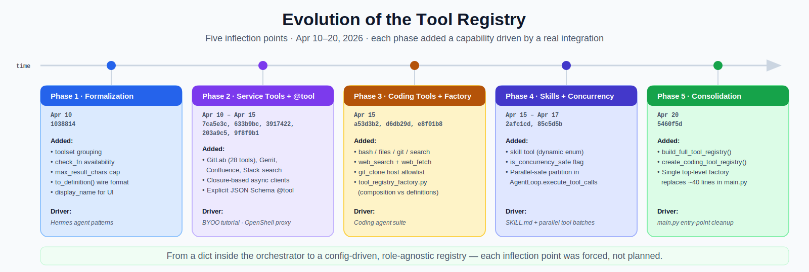
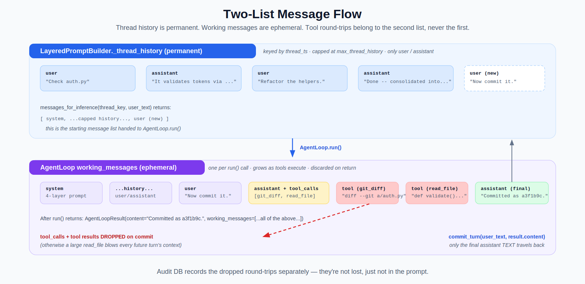
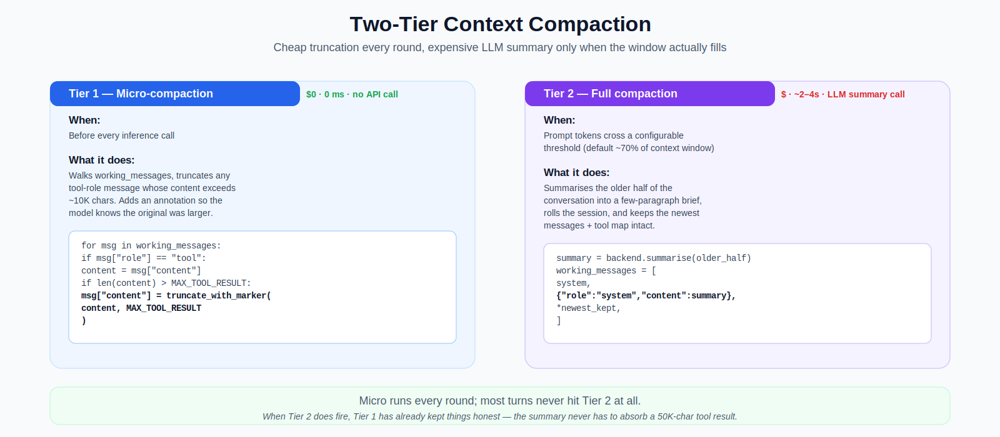
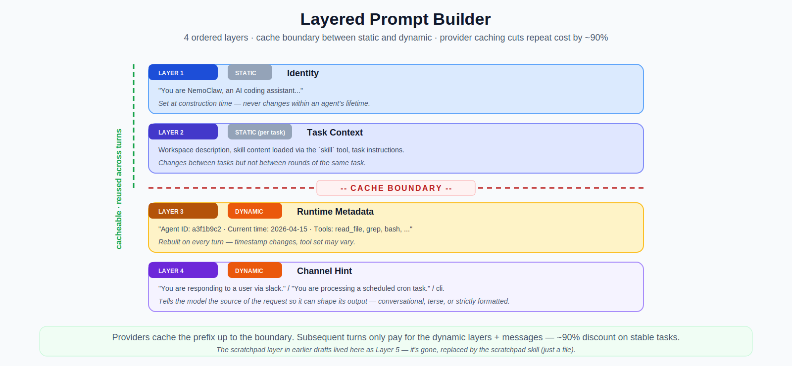

# (WIP) M2a — The Reusable Agent Loop, Coding Tools, and Context Management

> *"No plan survives first contact with the enemy."*
> — attributed to Prussian Field Marshal [Helmuth von Moltke the Elder](https://en.wikipedia.org/wiki/Helmuth_von_Moltke_the_Elder)

Moltke's dictum is that the initial plan is rendered obsolete the moment it meets the unpredictable reality of battle — adaptability, flexibility, and rapid decision-making beat rigid adherence to a pre-set strategy. There's no enemy here, but there is a *challenge*, and its name is [OpenShell](https://github.com/NVIDIA/OpenShell). The sandbox's policy semantics, egress-proxy quirks, and real-service behaviour kept surfacing constraints the original M2 design hadn't accounted for, and much of the cleanup below — availability checks that skip unreachable toolsets, fail-closed allowlists, closure-based clients, eliminating module globals — is the *residue* of first contact with it. The plan changed; the milestone is what we ended up with once it did.

The second milestone in the "Agent from scratch" series was originally going to be one big push: extract a reusable agent loop, ship coding tools, add sub-agent delegation via a message bus, and run each agent in its own sandbox. That scope turned out to be too large to reason about in one step, so it split into [M2a](../../design_m2a.md) (single-agent, in-process) and [M2b](../../design_m2b.md) (multi-agent, cross-sandbox). This post covers M2a — everything that lets one agent run richer, longer coding tasks inside the existing orchestrator. M2b will come in a follow-up once it lands.

M2a's central move is **factoring the "agent" out of the orchestrator**. In M1 the multi-turn tool-calling loop lived inside `Orchestrator._run_agent_loop()` and was fused to Slack-specific concerns. By the end of M2a the loop is a role-agnostic `AgentLoop` class, the orchestrator is just one of its callers, and the same class is ready to drive M2b's sub-agents without modification.

---

## Table of Contents

- [Why split M2 in two](#why-split-m2-in-two)
- [The reusable AgentLoop](#the-reusable-agentloop)
- [Coding tool suite](#coding-tool-suite)
- [Evolution of the tool registry](#evolution-of-the-tool-registry)
- [Concurrent tool execution](#concurrent-tool-execution)
- [The two-list message model](#the-two-list-message-model)
- [Two-tier context compaction](#two-tier-context-compaction)
- [Skills — including scratchpad](#skills-including-scratchpad)
- [Evolution of the scratchpad](#evolution-of-the-scratchpad)
- [Layered prompt builder](#layered-prompt-builder)
- [What we dropped and why](#what-we-dropped-and-why)
- [What comes next](#what-comes-next)
- [Sources and references](#sources-and-references)

---

## Why split M2 in two

The [original M2 design](../../design_m2.md) tried to deliver sub-agent delegation, NMB wiring, sandbox spawn, work collection, *and* all the single-agent machinery at once. That meant the very first thing a reader needed to understand (what even makes a loop "reusable"?) was entangled with the last thing a reader needed to understand (how do two agents in different sandboxes coordinate?). M2a strips the milestone back to one question — *"what's the best single-agent loop we can build?"* — and defers every multi-agent concern to M2b. The split also matches what the [BYOO tutorial](../../deep_dives/build_your_own_openclaw_deep_dive.md) validated empirically: context compaction and basic `SKILL.md` loading become essential *before* the system is worth scaling out, so M2a promotes both of those in from their original M3 / M6 homes.

---

## The reusable AgentLoop

The `AgentLoop` is Layer 1 of a three-layer composition model: *role-agnostic core* at the bottom, *role-specific wrappers* (the orchestrator in production, the local dev loop in `main.py`, and the integration-test harness) in the middle, and *channels* (Slack, NMB, CLI, cron) at the top. The loop itself knows nothing about Slack, NMB, or OpenShell; it takes a backend, a tool registry, a config, and optional audit / approval gates via dependency injection. Its `run()` method accepts a pre-built message list and returns an `AgentLoopResult` — no hidden state, no shared mutable objects, safe to run concurrently. This is the piece every subsequent milestone builds on.

---

## Coding tool suite

M2a ships a workspace-rooted tool suite that covers what a coding agent actually needs in a single session: `read_file`, `write_file`, `edit_file`, `list_directory` for file I/O; `grep` and `glob_search` for search; `bash` for arbitrary shell with timeout and output truncation; and `git_diff`, `git_log`, `git_commit`, `git_checkout`, `git_clone` for version control. Every tool is rooted at a configurable `workspace_root` and rejects path traversal, and the `@tool` decorator takes an explicit JSON Schema as an argument — no docstring parsing, no type-hint introspection — so each tool's definition, validation, and registration stay in one file. The registry composition lives in `tools/tool_registry_factory.py`, which exposes `build_full_tool_registry(config)` as the single call `main.py` needs at startup.

---

## Evolution of the tool registry

The registry you see in `tools/registry.py` today — grouped toolsets, availability checks, explicit per-tool schemas, output caps, concurrency flags, a top-level factory — didn't arrive in one commit. It grew outward from a barely-more-than-a-dict inside the M1 orchestrator, picking up a new capability each time a real integration or the OpenShell sandbox exposed a sharp edge. The key inflection points, in order:

**Formalization** ([`1038814`](https://github.com/dpickem/nemoclaw_escapades/commit/1038814)). The first `tools/registry.py` file. Adopted three patterns from the Hermes agent's tool system: **toolset** for bulk per-service enable/disable (e.g. `"jira"`), **`check_fn`** as an optional availability predicate so tools whose credentials aren't set get skipped with a single warning instead of crashing startup, and **`max_result_chars`** as a per-tool output cap enforced by `registry.execute()` — replacing ad-hoc truncation inside every handler. `ToolSpec.to_definition()` also arrived here so the registry owns the wire-format conversion to `ToolDefinition`.

**Service tools and the BYOO-style `@tool` decorator** ([`7ca5e3c`](https://github.com/dpickem/nemoclaw_escapades/commit/7ca5e3c), [`633b9bc`](https://github.com/dpickem/nemoclaw_escapades/commit/633b9bc), [`3917422`](https://github.com/dpickem/nemoclaw_escapades/commit/3917422), [`203a9c5`](https://github.com/dpickem/nemoclaw_escapades/commit/203a9c5), [`9f8f9b1`](https://github.com/dpickem/nemoclaw_escapades/commit/9f8f9b1)). Adding GitLab, Gerrit, Confluence, and Slack search — and later 18 more GitLab tools covering the full merge-request lifecycle — forced a single shape on every tool module: async `httpx` client held in a **closure** (not a module global), consistent `_request` / `_format` helpers, registration via the `@tool` decorator with `check_fn` guarding the credential. `9f8f9b1` simplified `@tool` itself: an earlier iteration introspected docstrings and type hints to *build* the JSON Schema, which was fragile and hid schema bugs; the BYOO-inspired rewrite takes `name`, `description`, and `parameters` as explicit arguments — no magic, the schema you ship is the schema you wrote. This is also where the "log one warning per skipped toolset" behaviour matters in practice: in the OpenShell sandbox, RFC 1918 services (GitLab, Gerrit behind internal IPs) are blocked by the egress proxy, so their whole toolset disables itself gracefully instead of filling the log with 28 per-tool errors.

**Coding tools and the factory module** ([`a53d3b2`](https://github.com/dpickem/nemoclaw_escapades/commit/a53d3b2), [`d6db29d`](https://github.com/dpickem/nemoclaw_escapades/commit/d6db29d), [`e8f01b8`](https://github.com/dpickem/nemoclaw_escapades/commit/e8f01b8)). `a53d3b2` shipped the coding agent's core toolkit — `bash`, `files`, `git`, `search` — all rooted at `workspace_root` with path-traversal rejection, all using the now-standard closure + `@tool` pattern. It also split registry *composition* from tool *definitions*: the new `tool_registry_factory.py` owns which `register_*` functions run and when, so individual tool files stay focused on their handlers. `d6db29d` added `web_search` (Brave) and `web_fetch` (Jina Reader with an HTML-stripping fallback), both default-on because `web_fetch` works with zero configuration and `web_search` quietly disables itself via `check_fn` when `BRAVE_SEARCH_API_KEY` isn't set. `e8f01b8` rounded out the git suite with `git_checkout` and `git_clone` — the latter guarded by a **fail-closed** `GIT_CLONE_ALLOWED_HOSTS` allowlist: empty list disables the tool entirely.

**Skill tool and concurrency flag** ([`2afc1cd`](https://github.com/dpickem/nemoclaw_escapades/commit/2afc1cd), [`85c5d5b`](https://github.com/dpickem/nemoclaw_escapades/commit/85c5d5b)). `2afc1cd` added the `skill` tool — a single registration whose parameter `enum` is populated *dynamically* at startup from `SKILL.md` files discovered by `SkillLoader`. The registry didn't need any new machinery for this; the dynamic enum is just the `"enum": [...]` array in the parameter schema, written once at `register_skill_tool()` time. `85c5d5b` then added `is_concurrency_safe: bool = True` to `ToolSpec` — the flag that [Concurrent tool execution](#concurrent-tool-execution) below is actually built on. Writes and shell/commit tools explicitly opt out; everything else defaults to safe.

**Consolidation** ([`5460f5d`](https://github.com/dpickem/nemoclaw_escapades/commit/5460f5d)). The previous `main.py` had ~40 lines of hand-wired registration — one `if config.X.enabled:` for every service, plus a hand-written `register_*` call. This commit moved all of it into `build_full_tool_registry(config, skill_loader)`, a single top-level factory that reads `AppConfig` and encapsulates which services exist and when they apply. `main.py` now has one call; the entry point no longer needs to know which individual `register_*` functions exist, and `create_coding_tool_registry(workspace_root)` sits alongside it for the standalone / sub-agent / test case so the list of coding tools is defined in exactly one place.

The order above isn't incidental: the patterns from step 1 (`check_fn`, toolset-level skip) had to land *before* the service expansion in step 2, and the closure + explicit-schema patterns from steps 2 and 3 had to land *before* the coding tools in step 4 — because the coding tools were the first case where the same `register_*` function would be invoked from two different callers (`main.py` directly and `create_coding_tool_registry` in tests). Most of those "had to land before" ordering constraints didn't come from the design doc; they came from first contact.

---

## Concurrent tool execution

When the model emits a batch of tool calls in one turn, `AgentLoop.execute_tool_calls` partitions them by the `is_concurrency_safe` flag on each `ToolSpec`. Safe tools (reads, searches, idempotent ops) run through `asyncio.gather` together; unsafe ones (writes, `bash`, `git_commit`, `edit_file`) run sequentially afterwards so they can't race against each other on shared workspace state. Defaults favour safety: new tools are concurrency-safe unless their author opts out, matching the BYOO tutorial's default-concurrent pattern. For a three-file `read_file` batch this cuts wall-clock time by roughly 3× at zero coordination cost.

---

## The two-list message model

This is probably the most important concept in M2a to internalise. NemoClaw keeps **two separate message lists** and never mixes them:

- **`LayeredPromptBuilder._thread_history`** is the permanent per-thread conversation. Only `user` and `assistant` role messages. Grows across turns, is capped at `max_thread_history`, and is what every future turn's prompt gets seeded from.
- **`AgentLoop` `working_messages`** is the ephemeral per-run log. It starts as `[system, …history…, user]` and then accumulates `assistant`-with-`tool_calls` and `tool`-role messages as the loop executes. It lives only for the duration of one `run()` call.

When the loop finishes, the orchestrator persists *only* the final assistant text via `prompt.commit_turn()` — the intermediate tool round-trips survive only in the audit DB. Without this split, a single `read_file` on a large file would dominate every subsequent prompt in that thread. With it, thread history stays a clean record of "what the user asked, what the agent concluded" and the context window stays predictable.

---

## Two-tier context compaction

Compaction runs in two tiers so the common case is free and only the worst case is expensive. **Tier 1 (micro)** walks `working_messages` before every inference call and truncates any `tool`-role message whose content exceeds a configurable char limit, appending a marker so the model knows the original was larger. No API call, sub-millisecond cost. **Tier 2 (full)** only fires when the prompt-token count crosses a threshold (default ~70% of the context window): it summarises the older half of the conversation via an LLM call and rolls the session with a synthetic system message in front of the newest kept messages. Tier 1 keeps the prompt honest enough that Tier 2, when it eventually fires, never has to absorb a 50 KB tool result.

---

## Skills — including scratchpad

Skills in M2a are just `SKILL.md` files in a directory. `SkillLoader` scans that directory at startup and registers the `skill` tool with a dynamic enum of discovered skill IDs. When the model calls `skill("debugging")`, the loader returns the skill's content as the tool result and the model follows it from there. M2a ships four starter skills: `code-review`, `debugging`, `refactor`, and — notably — `scratchpad`. The scratchpad skill is the one that replaced an earlier M2a design that involved a dedicated `Scratchpad` class, three purpose-built tools, contextvar plumbing, and automatic prompt injection. See [Evolution of the scratchpad](#evolution-of-the-scratchpad) below for the full story.

---

## Evolution of the scratchpad

The scratchpad went through five iterations before landing as a `SKILL.md` file. Each iteration individually was defensible; taken together they added up to a dedicated primitive doing what a file + a convention could do just as well. The commits, in order:

**Inception** ([`a53d3b2`](https://github.com/dpickem/nemoclaw_escapades/commit/a53d3b2)). Shipped `agent/scratchpad.py` — a `Scratchpad` class with `read` / `write` / `append` / `snapshot` / `context_block` methods, file-backed on disk at a configurable path, with a 32 KiB byte-level size cap. Alongside it, `tools/scratchpad.py` exposed three LLM-visible tools (`scratchpad_read`, `scratchpad_write`, `scratchpad_append`) as thin adapters over the class. The design premise was that working memory deserves a dedicated primitive because it's cross-cutting: every multi-step task benefits from externalising intermediate observations, so the agent shouldn't have to re-invent a filename convention each time.

**UTF-8 hardening** ([`c1e2860`](https://github.com/dpickem/nemoclaw_escapades/commit/c1e2860)). `Scratchpad.write()` originally enforced the size cap by slicing Python strings; that worked until someone wrote a scratchpad with emoji or non-ASCII content and the on-disk byte size blew past the limit. Switched to slicing encoded bytes. Trivial, but it foreshadowed how much detail the class kept accumulating for what was, ultimately, `open(path, "w").write(content)`.

**Runtime wiring** ([`f08cdb2`](https://github.com/dpickem/nemoclaw_escapades/commit/f08cdb2)). Phase 3 had added the class and the tools but never wired them together. This commit bolted everything into place: `CodingAgentConfig.scratchpad_path` + `SCRATCHPAD_PATH` env var; `Orchestrator` now accepted a `Scratchpad` and an `agent_id`; `LayeredPromptBuilder.messages_for_inference` gained a `scratchpad=` kwarg that injected the contents into the system prompt as **Layer 5**; `main.py` instantiated the `Scratchpad` at startup. At this point "scratchpad" was a first-class primitive that touched config, orchestrator, AgentLoop, and prompt builder.

**Concurrency marking** ([`85c5d5b`](https://github.com/dpickem/nemoclaw_escapades/commit/85c5d5b)). When the concurrent-tool-execution work added `is_concurrency_safe` to `ToolSpec`, `scratchpad_write` and `scratchpad_append` were the obvious opt-outs — both mutate the same backing file. `scratchpad_read` stayed safe. This was the first time the dedicated tools paid a *cost* compared to ordinary file tools: the write/append paths couldn't race each other, but the registry now had to carry the partitioning logic for them too.

**The dual-injection bug** ([`2105ed5`](https://github.com/dpickem/nemoclaw_escapades/commit/2105ed5)). Integration tests surfaced a subtle correctness bug: the orchestrator was passing `scratchpad=self._scratchpad.read()` into `messages_for_inference` (baking a snapshot into Layer 5), while `AgentLoop._inject_scratchpad` was simultaneously appending its *own* `<scratchpad>` block on every inference round. After a `scratchpad_write` the baked copy went stale while the injected copy was fresh, so the model saw two `<scratchpad>` blocks that disagreed. The mechanical fix was to make `AgentLoop` the sole injector and drop the orchestrator's kwarg, but the bug exposed a real design flaw: two reasonable parties (orchestrator as context-owner, AgentLoop as per-round injector) both had a plausible claim on the same "magic" primitive, and the boundary between them was muddled by it.

**The drop** ([`5460f5d`](https://github.com/dpickem/nemoclaw_escapades/commit/5460f5d)). Deleted everything: `agent/scratchpad.py` (168 lines), `tools/scratchpad.py` (96 lines), `test_scratchpad.py` (112 lines), `test_scratchpad_tools.py` (96 lines), plus the `_inject_scratchpad` / `_snapshot_active_scratchpad` hooks in `AgentLoop`, the `scratchpad_contents` field on `AgentLoopResult`, Layer 5 of `LayeredPromptBuilder` (5 → 4 layers), and the `scratchpad_dir` / `scratchpad_path` / `SCRATCHPAD_DIR` fields across config and wiring. In place: a single `skills/scratchpad/SKILL.md` file that tells the agent to keep working notes in `notes-<task-slug>-<agent-id>.md` in its workspace, edited with the ordinary `read_file` / `write_file` / `edit_file` tools, with an `Owner:` header for collision detection.

### Why we dropped it altogether

Each commit above was justifiable in isolation — none of them individually look overbuilt. But by the time the dual-injection bug surfaced, the scratchpad was pulling its own weight in five separate places (a domain class, three tool handlers, a config field, a prompt layer, and AgentLoop injection logic) and **none of them did anything a file + a convention couldn't do just as well**. The specific weaknesses that made the replacement obvious:

- **Scope creep.** At ~550 LoC counting the class, tools, tests, and wiring, the scratchpad was one of the larger pieces of M2a by volume. For working memory, on an agent that already had `read_file`, `write_file`, and `edit_file`, that's a lot of code for a glorified text file.
- **Concurrency ambiguity.** The original `Scratchpad` design was a shared instance whose `path` got retargeted per request via `set_path()` — fine serially, broken under concurrent requests. A contextvars-based fix was sketched (hence "contextvar plumbing" in [`5460f5d`](https://github.com/dpickem/nemoclaw_escapades/commit/5460f5d)'s removed-files list) but, per the commit message, was "strictly more machinery than the agent actually needs". An agent writing to `notes-<task>-<agent>.md` via `write_file` has no shared mutable state to worry about in the first place.
- **Responsibility boundary.** The dual-injection bug wasn't a typo — it was the design leaking through. With a skill, the prompt is just a prompt and the file is just a file; no special primitive, no claim dispute between the orchestrator and the AgentLoop.
- **Schema cost.** Three dedicated tools used three slots in the tool list sent to the model every turn, plus three per-tool descriptions. Deleting them trimmed both the inference payload and the number of tool-name branches the model had to choose from. The `skill` tool is one entry whose dynamic enum costs a handful of characters.

The positive case for the skill is the mirror of the above: a `SKILL.md` file describes a convention cheaply, evolves without code changes, doesn't appear in the tool list, and stays out of the context window until the model asks for it via `skill("scratchpad")`. That's the general lesson — **skills > dedicated primitives** — that also shows up in the [BYOO tutorial](../../deep_dives/build_your_own_openclaw_deep_dive.md) and [Claude Code](https://docs.anthropic.com/en/docs/claude-code), and it's why [`5460f5d`](https://github.com/dpickem/nemoclaw_escapades/commit/5460f5d) rewrote the M2a design doc's §5 end-to-end in the same commit that removed the class.

---

## Layered prompt builder

The system prompt is assembled from four ordered layers: identity, task context, runtime metadata, and channel hint. A cache-boundary marker sits between the first two (static) and the last two (dynamic). Providers that support prompt caching — Anthropic, OpenAI, Gemini — reuse the prefix before the boundary on subsequent turns, cutting cost by roughly 90% on stable tasks. The channel-hint layer carries the source type (`slack`, `agent`, `cron`, `cli`) so the model can shape its output appropriately — terse for agent-to-agent handoffs, conversational for humans, strictly formatted for scheduled jobs.

---

## What we dropped and why

Two pieces made it into earlier M2a drafts and then got removed before merge.

**The `Scratchpad` class.** The full story — class, tools, runtime wiring, the dual-injection bug, the removal, and the design argument for why a skill + a filename convention beats a dedicated primitive — is covered in [Evolution of the scratchpad](#evolution-of-the-scratchpad) above. The short version: ~550 LoC of machinery doing what a file + a convention can do, replaced with a single `scratchpad` skill that prescribes a `notes-<task>-<agent-id>.md` file edited with the ordinary file tools.

**Layer 5 of the prompt.** Originally the prompt builder had a fifth layer that injected the scratchpad's contents automatically. With the Scratchpad class gone there's nothing to inject, so the prompt is now four layers. The skill loader is what supplies agent context now, on demand.

The general lesson (not mine — [Claude Code](https://docs.anthropic.com/en/docs/claude-code) and the [BYOO tutorial](../../deep_dives/build_your_own_openclaw_deep_dive.md) both call this out): **skills > dedicated primitives**. A skill can describe a convention cheaply, evolve without code changes, and stay out of the context window until the model asks for it.

---

## What comes next

M2a is in-process, single-agent. [M2b](../../design_m2b.md) takes the exact same `AgentLoop` class and runs it in a second sandbox as a delegated sub-agent: the orchestrator dispatches a task over NMB, the sub-agent runs its loop, and the orchestrator model-synthesises the sub-agent's result (diff, notes file, summary) through dedicated *finalization tools* before replying to the user. Because the loop is role-agnostic, zero lines of `AgentLoop` need to change — the sub-agent just gets a different tool registry, a different approval gate (auto-approve writes inside its own sandbox), and a different channel-hint layer. That's the payoff of the M2a / M2b split: every concept in this post is something M2b can rely on without revisiting.

---

## Sources and references

- **Design docs:** [M2a design](../../design_m2a.md), [original M2 design (superseded)](../../design_m2.md), [M2b design](../../design_m2b.md).
- **Deep dives:** [Build Your Own OpenClaw tutorial](../../deep_dives/build_your_own_openclaw_deep_dive.md) — validated compaction and basic `SKILL.md` loading as essential early capabilities.
- **Related posts:** [M1 — Local orchestrator + NVIDIA Inference Hub + Slack](../m1/m1_setting_up_nemoclaw.md), [Building NMB](../nmb/nmb_building_a_message_bus.md).
- **Code:** [`src/nemoclaw_escapades/agent/`](../../../src/nemoclaw_escapades/agent/) (AgentLoop, prompt builder, compaction, skill loader), [`src/nemoclaw_escapades/tools/`](../../../src/nemoclaw_escapades/tools/) (coding and service tools), [`skills/`](../../../skills/) (starter skills including `scratchpad`).
