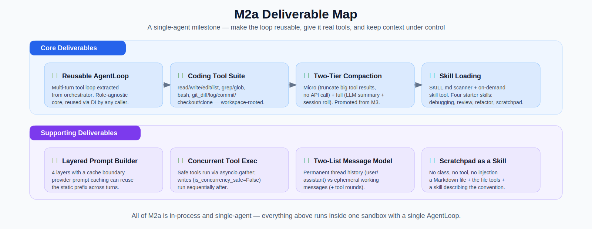
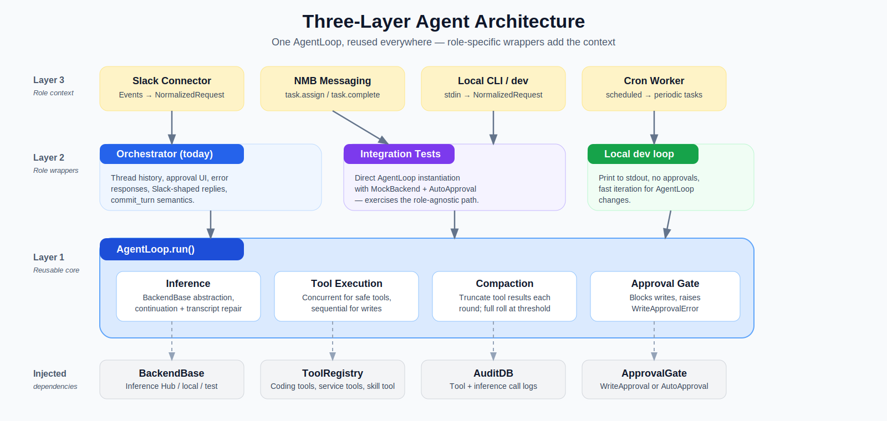

# (WIP) M2a — The Reusable Agent Loop, Coding Tools, and Context Management

> *"No plan survives first contact with the enemy."*
> — attributed to Prussian Field Marshal [Helmuth von Moltke the Elder](https://en.wikipedia.org/wiki/Helmuth_von_Moltke_the_Elder)

Moltke's dictum is that the initial plan is rendered obsolete the moment it meets the unpredictable reality of battle — adaptability beats rigid adherence to a pre-set strategy. There's no enemy here, but there is a *challenge*: [OpenShell](https://github.com/NVIDIA/OpenShell) and the sandboxed-agent shape it forces. The [M2a design](../../design_m2a.md) was a clean, sequential plan; the milestone is what we ended up with after several rounds of contact with the policy semantics, the egress proxy, real services, and concurrent traffic. This post is mostly about that *delta* — what the implementation taught us that the design didn't predict — and only secondarily about what M2a ships. For the latter, the [design doc](../../design_m2a.md) is still the source of truth; this post tries not to repeat it.

The headline result is small to state and was hard to earn: M2a factors the agent out of the orchestrator. The multi-turn tool-calling loop that lived inside `Orchestrator._run_agent_loop()` in M1 is now a role-agnostic `AgentLoop` class, the orchestrator is just one of its callers, and M2b's sub-agent will use the same class without modification. Around it sits a coding tool suite (file / search / bash / git), a workspace-rooted toolset model, two-tier context compaction, a layered prompt builder with a cache boundary, and basic `SKILL.md` loading. ([Design §1–§8](../../design_m2a.md), [`agent/`](../../../src/nemoclaw_escapades/agent/), [`tools/`](../../../src/nemoclaw_escapades/tools/), [`skills/`](../../../skills/).)

---

## Table of Contents

- [Lessons learned](#lessons-learned)
  - [1. Stateless per-request beats shared mutable state](#1-stateless-per-request-beats-shared-mutable-state)
  - [2. Skills > dedicated primitives](#2-skills--dedicated-primitives)
  - [3. Less magic in the tool decorator](#3-less-magic-in-the-tool-decorator)
  - [4. First contact with OpenShell](#4-first-contact-with-openshell)
  - [5. Integration tests find the bugs unit tests miss](#5-integration-tests-find-the-bugs-unit-tests-miss)
  - [6. Tool surface area is a prompt budget problem](#6-tool-surface-area-is-a-prompt-budget-problem)
  - [7. The unglamorous trio: bytes, log keys, default-on](#7-the-unglamorous-trio-bytes-log-keys-default-on)
- [What M2a actually ships (in brief)](#what-m2a-actually-ships-in-brief)
- [The Scratchpad saga](#the-scratchpad-saga)
- [What comes next](#what-comes-next)
- [Sources and references](#sources-and-references)

---

## Lessons learned

These are grouped from the M2a commit history (range `1038814..5460f5d`, plus follow-ups through `b6fc254`). Each subsection is one cluster of related discoveries, with the relevant commits inline.

### 1. Stateless per-request beats shared mutable state

The single recurring lesson of M2a, which we re-learned in five different shapes:

- **Service-tool config globals → closures** ([`1038814`](https://github.com/dpickem/nemoclaw_escapades/commit/1038814), [`203a9c5`](https://github.com/dpickem/nemoclaw_escapades/commit/203a9c5)). The original Jira-tool style held a module-level `_config` dict that `register_*_tools()` mutated at startup. As soon as a second service joined and we wanted parallel test fixtures, every shared global became a contention point. The fix: a single client instance constructed in `register_*_tools` and shared via closures captured by each `@tool`-decorated handler. The service-tool conversion is what locked this pattern in across the codebase.

- **`on_tool_start` callback was instance state** ([`8c31d54`](https://github.com/dpickem/nemoclaw_escapades/commit/8c31d54)). `AgentLoop` originally let the orchestrator install a thinking-indicator callback by mutating `self._on_tool_start`. Two concurrent Slack threads would clobber each other's indicators — agent A's tool starts would fire agent B's "typing in #channel-b" notification. Fix: the callback is now a per-call argument to `run()` and `execute_tool_calls()`. The orchestrator's `_with_status_callback` (which had to remember to *unset* the field after each request) became `_make_tool_start_callback` (a pure static method that returns a closure), and the failure mode is gone by construction.

- **Per-agent workspace subdirectories** ([`4baa034`](https://github.com/dpickem/nemoclaw_escapades/commit/4baa034)). Two CLI invocations of the sub-agent against `config.coding.workspace_root` produced two scratchpad files, two `git_clone`s, and two simultaneous edits all racing on the same directory. Fix: each agent gets `<base>/agent-<agent_id>` and the rest of the stack only sees the scoped path. The scratchpad skill was already keying its filenames off `<task-slug>-<agent-id>` for exactly this reason — extending the invariant one level up gives the filesystem the same isolation the scratchpad convention was already assuming.

- **Tool surface state needs ContextVar isolation** ([`b6fc254`](https://github.com/dpickem/nemoclaw_escapades/commit/b6fc254), [`c10bc58`](https://github.com/dpickem/nemoclaw_escapades/commit/c10bc58)). This one bit twice. Once we added the M2b `ToolSearch` meta-tool, the registry held a `_surfaced_non_core` set: which non-core tools had been surfaced into the prompt. As an instance field on the singleton registry, two concurrent `run()` calls clobbered each other (request B's reset wiped A's surface; A's `mark_surfaced(jira_*)` was visible to B). Fix: move surface state to a module-level `ContextVar[frozenset[str]]` so each `asyncio.Task` inherits its own copy. Separately, the approval-resume path (write-approval click is a separate event in a separate task) needed `pre_surfaced_tools=` on `run()` to restore the snapshot from the paused turn — a ContextVar reset is the right default for fresh tasks, but resume needs to opt out.

The pattern is consistent: anywhere we held instance state on something that gets shared across requests — registries, agent loops, workspace roots — concurrent traffic eventually found it. The fixes all look the same: per-call argument, closure capture, or `ContextVar`. No new abstraction required.

### 2. Skills > dedicated primitives

The largest single chunk of code we wrote and then deleted in M2a was the `Scratchpad` class. ~550 LoC across a domain class, three `scratchpad_*` tools, contextvars plumbing, a config field, a fifth prompt layer, and an `AgentLoop` injection hook — all replaced by [`skills/scratchpad/SKILL.md`](../../../skills/scratchpad/SKILL.md), which prescribes a `notes-<task-slug>-<agent-id>.md` file edited with the ordinary `read_file` / `write_file` / `edit_file` tools.

The full progression — five commits including a UTF-8 hardening fix and a dual-injection correctness bug before the final delete — is in [The Scratchpad saga](#the-scratchpad-saga) below. The headline lesson is that **a `SKILL.md` file describes a convention cheaply, evolves without code changes, doesn't appear in the tool list, and stays out of the context window until the model asks for it via `skill("scratchpad")`**. That same conclusion shows up in [Claude Code's `CLAUDE.md` convention](https://docs.anthropic.com/en/docs/claude-code) and the [BYOO tutorial's file-based memory guidance](../../deep_dives/build_your_own_openclaw_deep_dive.md). We arrived at it independently by running into the cost of *not* doing it.

### 3. Less magic in the tool decorator

The first `@tool` decorator was introspection-based: it parsed docstrings, inspected type hints, and built a JSON Schema for you. It was beautiful when it worked and a debugging tarpit when it didn't — the schema actually being shipped to the model was three layers removed from the source code, and a typo in a docstring silently produced a malformed parameter description.

[`9f8f9b1`](https://github.com/dpickem/nemoclaw_escapades/commit/9f8f9b1) (BYOO-inspired) replaced it with an explicit-schema pattern: `@tool(name="...", description="...", parameters={...})`, no inference, no parsing. The schema you ship is the schema you wrote, in one place, in one file. Every tool we added after this — the [coding agent suite](https://github.com/dpickem/nemoclaw_escapades/commit/a53d3b2), [web search and fetch](https://github.com/dpickem/nemoclaw_escapades/commit/d6db29d), the [GitLab MR-lifecycle expansion](https://github.com/dpickem/nemoclaw_escapades/commit/633b9bc) — used the explicit-schema decorator from day one and we never looked back. Rule of thumb: when a system's clever convenience layer makes failures harder to diagnose, prefer the boring explicit version.

### 4. First contact with OpenShell

The OpenShell sandbox surfaced three categories of constraints the design didn't fully predict:

- **RFC 1918 services are unreachable from inside a sandbox** ([`7ca5e3c`](https://github.com/dpickem/nemoclaw_escapades/commit/7ca5e3c)). The egress proxy refuses CONNECT tunnels to private IP ranges. Internal GitLab and Gerrit (10.x.x.x) silently fail every request inside the sandbox; CDN-fronted services (Jira via Akamai, Confluence via AWS) keep working because their public IPs route normally. The design assumption "we'll register all the tools and disable the ones whose creds aren't set" wasn't enough — we also needed to gracefully skip whole toolsets whose hosts the sandbox can't reach. The registry's `check_fn` predicate plus the "log one warning per skipped toolset" behaviour ([`1038814`](https://github.com/dpickem/nemoclaw_escapades/commit/1038814)) absorbs this: 28 GitLab tools turning off becomes a single log line, not 28 errors. Without it, the operator-experience cost of running with degraded connectivity would have been brutal.

- **Provider-injected env vars are L7-proxy placeholders, not real values** ([`c0495fe`](https://github.com/dpickem/nemoclaw_escapades/commit/c0495fe)). OpenShell's `--credential` flag rewrites secrets into placeholder strings inside the sandbox; the L7 proxy resolves them at HTTP-request time. That's fine for tokens used only as Authorization headers, but `GIT_CLONE_ALLOWED_HOSTS` is parsed at config-load time and used by the `git_clone` tool's URL validator. A comma-split at `os.environ` read time would have poisoned the allowlist with placeholder tokens. Fix: bake the sandbox allowlist value into the image as a constant (`_SANDBOX_GIT_CLONE_ALLOWED_HOSTS`) and route around the placeholder mechanism entirely. The general lesson: not every config value can flow through the same channel, even if they're all "env vars".

- **Fail-closed allowlists are non-negotiable for network egress** ([`e8f01b8`](https://github.com/dpickem/nemoclaw_escapades/commit/e8f01b8)). `git_clone` needed an explicit host allowlist before it could ship at all — empty list means tool disabled, period. Once the constraint is the L7 proxy, "any host the user can name" is a vulnerability surface, not a feature.

These showed up in roughly that order. Each one rewired the same lesson: the sandbox is not a transparent runtime — its network policy and credential model leak into the application's config and tool surface, and the cleanest abstractions are the ones that admit it.

### 5. Integration tests find the bugs unit tests miss

[`2105ed5`](https://github.com/dpickem/nemoclaw_escapades/commit/2105ed5) is one commit, three correctness bugs, all surfaced by the §10.2 integration tests (orchestrator → AgentLoop → tools, end-to-end against a real filesystem). All three had passed unit tests:

1. **Off-by-one in thread history cap.** `commit_turn()` capped the history *before* appending the user message, then appended the assistant reply *without* re-capping. `messages_for_inference` re-capped on read, so inference was correct — but anything that inspected `thread_history` directly saw `max + 1` entries.
2. **Dual-injection of the scratchpad.** Orchestrator passed `scratchpad=self._scratchpad.read()` into the prompt builder (baking it into Layer 5), and `AgentLoop._inject_scratchpad` *also* appended a `<scratchpad>` block on every round. After a `scratchpad_write` the baked copy went stale while the injected copy was fresh, so the model saw two contradictory blocks. (This bug ended up being the immediate trigger for the [scratchpad-deletion commit](#the-scratchpad-saga).)
3. **`StrEnum` coercion blew up on unknown sources.** `_resolve_source_type("teams")` raised `ValueError`, then was silently coerced to `SourceType.USER`, producing `"responding to a user via user"` and losing the platform name. Fix: widen the prompt-builder APIs to accept plain `str` and let the value flow through untouched.

None of these were discoverable without an end-to-end run against a real conversation. Unit-testing each piece in isolation hid the integration seams.

### 6. Tool surface area is a prompt budget problem

We didn't appreciate this until production traffic exposed it post-blog ([`f28b06c`](https://github.com/dpickem/nemoclaw_escapades/commit/f28b06c)): with all 75 tools registered, the system prompt + tool schema fills roughly 95% of each turn's ~10.8K prompt tokens. Real conversation context — the 5–10 prior messages of thread history that *should* drive the model's behaviour on a short follow-up like "the first one" — got drowned out. The bot started treating short replies as standalone messages, ignoring the prior turn's question.

Two responses, both in flight: a short-term prompt nudge ("read the thread history first") landed in `f28b06c`, and the proper fix — a `ToolSearch` meta-tool that swaps non-core tools out of the prompt and lets the model pull them in by keyword — graduated from M2b Phase 4 to a dedicated M2b Phase 2 specifically because the prompt-budget pressure made it the next bottleneck after sub-agents themselves. The lesson for M2a is retrospective: **the marginal cost of "default-on" for every tool isn't free; it's measured in the conversation context the tools displace**. Future toolsets should be opted in via meta-tool, not registered by default.

### 7. The unglamorous trio: bytes, log keys, default-on

Three small commits with disproportionate impact, each one the kind of thing you can't predict in design:

- **UTF-8 byte slicing** ([`c1e2860`](https://github.com/dpickem/nemoclaw_escapades/commit/c1e2860)). The original `Scratchpad.write()` enforced its size cap by slicing Python strings — fine for ASCII, broken the moment someone wrote emoji or non-ASCII characters because the on-disk byte count blew past the limit. Fixed by encoding first, slicing second. Same trap will exist in any size-cap-enforced byte boundary; worth eyeballing every `len(x) > N` check in the codebase.
- **Reserved log keys** ([`b16beb5`](https://github.com/dpickem/nemoclaw_escapades/commit/b16beb5)). Python's `logging.LogRecord` reserves `name` for the logger name. Passing `extra={"name": skill_id}` either silently overwrites the logger name or crashes the JSON formatter, depending on the formatter. Renamed to `skill_name`. Lesson: structured-logging extras share a namespace with the log machinery's own attributes; `name`, `msg`, `args`, `levelname`, `pathname`, `filename`, `module`, etc. are all live mines.
- **Default-on with the right guardrails** ([`c0495fe`](https://github.com/dpickem/nemoclaw_escapades/commit/c0495fe)). The coding agent flipped from default-OFF to default-ON late in the milestone. The bar to clear: file / bash / git writes still require interactive write-approval, so default-ON didn't widen blast radius for non-trusted users — but `git_clone` needed a fail-closed allowlist *before* the flip. The order matters; flipping the default first and adding the allowlist later would have shipped a tool that could clone arbitrary URLs into the workspace.

---

## What M2a actually ships (in brief)

Detail lives in [the design doc](../../design_m2a.md); this section is the elevator pitch.

- **`AgentLoop`** ([`agent/loop.py`](../../../src/nemoclaw_escapades/agent/loop.py)). Role-agnostic. Takes a backend, a tool registry, a config, and optional audit / approval gates via DI. `run()` accepts a pre-built message list and returns an `AgentLoopResult`. No hidden state. Safe to invoke concurrently. The orchestrator is one caller; M2b's sub-agent is another.

  

- **Coding tool suite** ([`tools/{files,search,bash,git}.py`](../../../src/nemoclaw_escapades/tools/)). `read_file`, `write_file`, `edit_file`, `list_directory`, `grep`, `glob_search`, `bash`, `git_diff`, `git_log`, `git_commit`, `git_checkout`, `git_clone`. All workspace-rooted with path-traversal rejection. The `@tool` decorator takes an explicit JSON Schema as an argument — no docstring parsing, no introspection. ([Design §4](../../design_m2a.md#4--coding-agent-file-tools), [tool-registry-evolution diagram](./m2a_tool_registry_evolution.svg) for how the patterns landed.)

- **Concurrent tool execution.** Every `ToolSpec` has `is_concurrency_safe: bool = True`; `AgentLoop.execute_tool_calls` partitions calls into `asyncio.gather` for safe ones and a sequential tail for unsafe ones (writes, `bash`, `git_commit`, `edit_file`). For a three-file `read_file` batch this is roughly a 3× wall-clock win at zero coordination cost. ([`85c5d5b`](https://github.com/dpickem/nemoclaw_escapades/commit/85c5d5b), [design §3.2](../../design_m2a.md#32-concurrent-tool-execution).)

- **Two-list message model** ([diagram](./m2a_two_list_message_flow.svg)). `LayeredPromptBuilder._thread_history` is the permanent per-thread conversation (user / assistant only). `AgentLoop` `working_messages` is the ephemeral per-run log (assistant-with-tool-calls + tool-role messages). When the loop finishes, only the final assistant text is persisted via `commit_turn()`. Without this split, a single `read_file` on a large file would dominate every subsequent prompt in that thread.

- **Two-tier context compaction** ([diagram](./m2a_two_tier_compaction.svg), [`agent/compaction.py`](../../../src/nemoclaw_escapades/agent/compaction.py)). Tier 1 truncates oversized tool-role messages before each inference call (no API call, sub-millisecond). Tier 2 fires only when prompt-token count crosses a threshold and summarises the older half of the conversation via an LLM call. Tier 1 keeps the prompt honest enough that Tier 2, when it eventually runs, never has to absorb a 50 KB tool result. ([Design §6](../../design_m2a.md#6--context-compaction).)

- **Layered prompt builder with cache boundary** ([diagram](./m2a_layered_prompt_builder.svg), [`agent/prompt_builder.py`](../../../src/nemoclaw_escapades/agent/prompt_builder.py)). Four ordered layers: identity, task context, runtime metadata, channel hint. A cache marker between the static prefix and the dynamic suffix lets prompt-caching providers reuse ~90% of the prefix on subsequent turns. The channel-hint layer carries source type (`slack` / `agent` / `cron` / `cli`) so the model can shape its output appropriately. ([Design §8](../../design_m2a.md#8--layered-prompt-builder).)

- **Skills via `SKILL.md` + a single `skill` tool.** `SkillLoader` scans a directory at startup and registers the `skill` tool with a dynamic `enum` of discovered IDs. M2a ships four starter skills: `code-review`, `debugging`, `refactor`, and `scratchpad`. The model calls `skill("scratchpad")` and gets the file's content as a tool result. ([Design §7](../../design_m2a.md#7--basic-skill-loading), [`skills/`](../../../skills/).)

The [tool-registry evolution diagram](./m2a_tool_registry_evolution.svg) shows the order patterns landed (toolsets and `check_fn` first, then service-tool standardisation, then the coding suite, then the factory consolidation) — that ordering wasn't accidental, it's what made each subsequent step possible.

---

## The Scratchpad saga

This is the marquee illustration of [Lesson 2](#2-skills--dedicated-primitives) and worth keeping in detail because each individual commit was defensible — only the cumulative shape revealed it as overbuilt.

**Inception** ([`a53d3b2`](https://github.com/dpickem/nemoclaw_escapades/commit/a53d3b2)). Shipped `agent/scratchpad.py` — a `Scratchpad` class with `read` / `write` / `append` / `snapshot` / `context_block` methods, file-backed, 32 KiB cap. Three LLM-visible tools (`scratchpad_read` / `_write` / `_append`) wrapped it. The premise: working memory is cross-cutting, every multi-step task benefits from externalising intermediate observations, give it a dedicated primitive.

**UTF-8 hardening** ([`c1e2860`](https://github.com/dpickem/nemoclaw_escapades/commit/c1e2860)). The 32 KiB cap was implemented by slicing Python strings — broken for non-ASCII content. Switched to byte slicing. Trivial in isolation; in retrospect, an early sign of how much detail the class was accumulating to do what `open(path, "w").write(content)` does.

**Runtime wiring** ([`f08cdb2`](https://github.com/dpickem/nemoclaw_escapades/commit/f08cdb2)). The class and tools existed, but the running orchestrator never exercised them. This commit bolted everything into place: `CodingAgentConfig.scratchpad_path` + `SCRATCHPAD_PATH` env var; `Orchestrator` now took a `Scratchpad` and an `agent_id`; `LayeredPromptBuilder.messages_for_inference` gained a `scratchpad=` kwarg that injected contents into the system prompt as **Layer 5**; `main.py` instantiated everything at startup. At this point "scratchpad" was a first-class primitive touching config, orchestrator, AgentLoop, and prompt builder.

**Concurrency marking** ([`85c5d5b`](https://github.com/dpickem/nemoclaw_escapades/commit/85c5d5b)). The concurrency flag arrived; `scratchpad_write` and `scratchpad_append` had to opt out as unsafe. First time the dedicated tools paid a *cost* compared to ordinary file tools.

**The dual-injection bug** ([`2105ed5`](https://github.com/dpickem/nemoclaw_escapades/commit/2105ed5)). Integration tests caught it: orchestrator was passing `scratchpad=self._scratchpad.read()` into `messages_for_inference` (baking a snapshot into Layer 5), while `AgentLoop._inject_scratchpad` was simultaneously appending its own `<scratchpad>` block on every inference round. After a `scratchpad_write` the baked copy went stale while the injected copy was fresh; the model saw two `<scratchpad>` blocks that disagreed. The mechanical fix was to make `AgentLoop` the sole injector — but the bug exposed a design flaw: two reasonable parties (orchestrator as context-owner, AgentLoop as per-round injector) both had a plausible claim on the same primitive, and the boundary between them was muddled by it.

**The drop** ([`5460f5d`](https://github.com/dpickem/nemoclaw_escapades/commit/5460f5d)). Deleted everything: `agent/scratchpad.py` (168 lines), `tools/scratchpad.py` (96 lines), `test_scratchpad.py` + `test_scratchpad_tools.py` (208 lines), the `_inject_scratchpad` / `_snapshot_active_scratchpad` hooks, `AgentLoopResult.scratchpad_contents`, Layer 5 of `LayeredPromptBuilder` (5 → 4 layers), and the `scratchpad_dir` / `scratchpad_path` / `SCRATCHPAD_DIR` fields across config and wiring. In place: a single [`skills/scratchpad/SKILL.md`](../../../skills/scratchpad/SKILL.md) telling the agent to keep working notes in `notes-<task-slug>-<agent-id>.md` in its workspace, edited with the ordinary file tools, with an `Owner:` header for collision detection.

The cumulative diagnosis:

- **~550 LoC for what a file + a convention can do.** Big in absolute terms for a working-memory feature on an agent that already had `read_file` / `write_file` / `edit_file`.
- **Concurrency ambiguity.** The original design retargeted a shared instance's path per request via `set_path()` — fine serially, broken under concurrent requests. A contextvars-based fix was sketched but, per the commit message, "strictly more machinery than the agent actually needs". An agent writing to `notes-<task>-<agent>.md` via `write_file` has no shared mutable state to worry about in the first place.
- **Responsibility boundary.** The dual-injection bug wasn't a typo, it was the design leaking through. With a skill, the prompt is just a prompt and the file is just a file; no special primitive, no claim dispute.
- **Schema cost.** Three dedicated tools used three slots in the tool list every turn, plus three descriptions. Deleting them trimmed both the inference payload and the model's branching factor on tool-name selection. The `skill` tool is one entry whose dynamic enum costs a handful of characters.

Generalised: **a `SKILL.md` file describes a convention cheaply, evolves without code changes, doesn't appear in the tool list, and stays out of the context window until the model asks for it via `skill("scratchpad")`**. That same conclusion is independently in [Claude Code](https://docs.anthropic.com/en/docs/claude-code) and the [BYOO tutorial](../../deep_dives/build_your_own_openclaw_deep_dive.md). The [`5460f5d`](https://github.com/dpickem/nemoclaw_escapades/commit/5460f5d) commit also rewrote design_m2a §5 end-to-end so the doc no longer described the deleted system.

---

## What comes next

M2a is in-process, single-agent. [M2b](../../design_m2b.md) takes the exact same `AgentLoop` class and runs it in a second sandbox as a delegated sub-agent: the orchestrator dispatches a task over NMB, the sub-agent runs its loop, and the orchestrator model-synthesises the result through dedicated finalization tools before replying to the user. Because the loop is role-agnostic, zero lines of `AgentLoop` need to change — the sub-agent just gets a different tool registry, a different approval gate (auto-approve writes inside its own sandbox), and a different channel-hint layer.

Two M2a-discovered constraints are already shaping M2b:

- **Tool surface area** ([Lesson 6](#6-tool-surface-area-is-a-prompt-budget-problem)). The `ToolSearch` meta-tool was originally M2b Phase 4; it's now Phase 2, and service tools are flipped to `is_core=False` so they don't appear in the prompt by default. Without this, growing the tool surface for delegation / finalization (`delegate_task`, `present_work_to_user`, `push_and_create_pr`, …) would push the orchestrator past the prompt-token budget that already drowns out short follow-ups.
- **Per-request state isolation** ([Lesson 1](#1-stateless-per-request-beats-shared-mutable-state)). The `ContextVar` move for `_surfaced_non_core` was a M2b-Phase-2 follow-up directly motivated by re-discovering the M2a "shared mutable state breaks under concurrency" lesson in a new place. The principle is now codified in the tool registry's surface API — anything per-run lives in a `ContextVar`, not on the registry instance.

That's the payoff of the M2a / M2b split: every concept and every lesson in this post is something M2b can rely on or extend without re-deriving.

---

## Sources and references

- **Design docs:** [M2a design](../../design_m2a.md), [original M2 design (superseded)](../../design_m2.md), [M2b design](../../design_m2b.md).
- **Deep dives:** [Build Your Own OpenClaw tutorial](../../deep_dives/build_your_own_openclaw_deep_dive.md) — independently validates skills > primitives, file-based memory, and explicit tool schemas.
- **Related posts:** [M1 — Local orchestrator + NVIDIA Inference Hub + Slack](../m1/m1_setting_up_nemoclaw.md), [Building NMB](../nmb/nmb_building_a_message_bus.md).
- **Code:** [`src/nemoclaw_escapades/agent/`](../../../src/nemoclaw_escapades/agent/) (AgentLoop, prompt builder, compaction, skill loader), [`src/nemoclaw_escapades/tools/`](../../../src/nemoclaw_escapades/tools/) (coding and service tools), [`skills/`](../../../skills/) (starter skills including `scratchpad`).
- **Commit range:** [`1038814..5460f5d`](https://github.com/dpickem/nemoclaw_escapades/compare/1038814...5460f5d) plus follow-ups through [`b6fc254`](https://github.com/dpickem/nemoclaw_escapades/commit/b6fc254) — every lesson above is grounded in this range.
