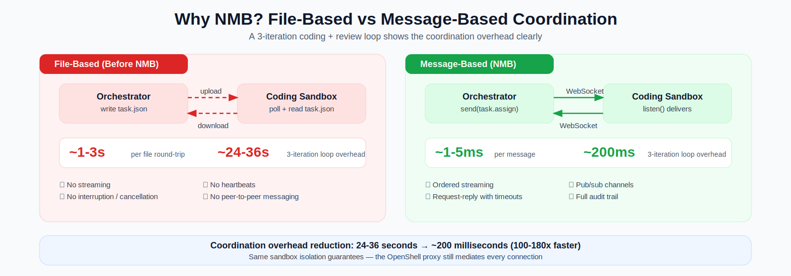
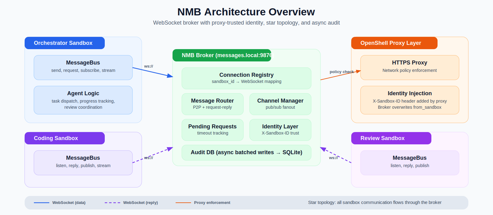
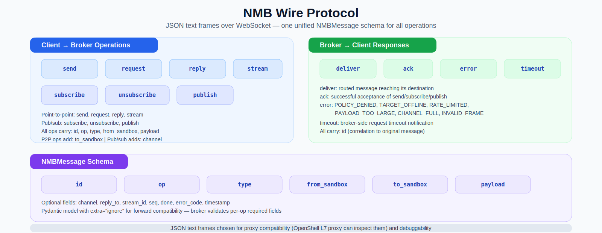
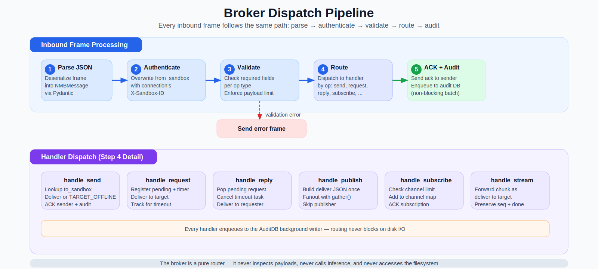
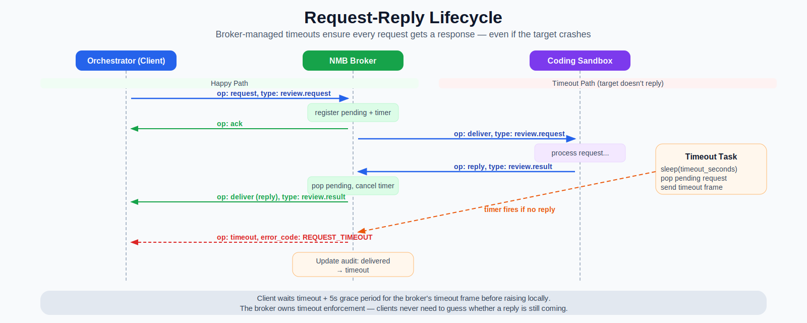
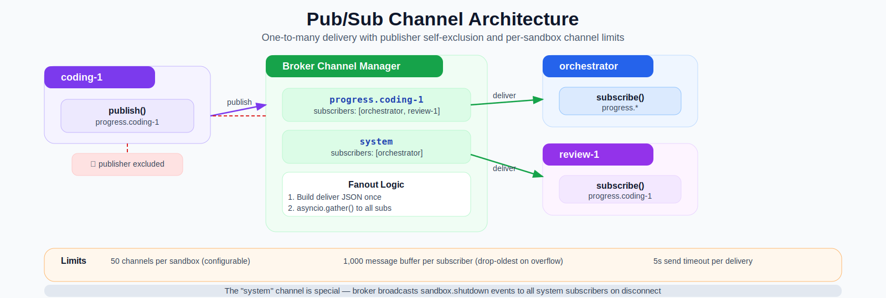
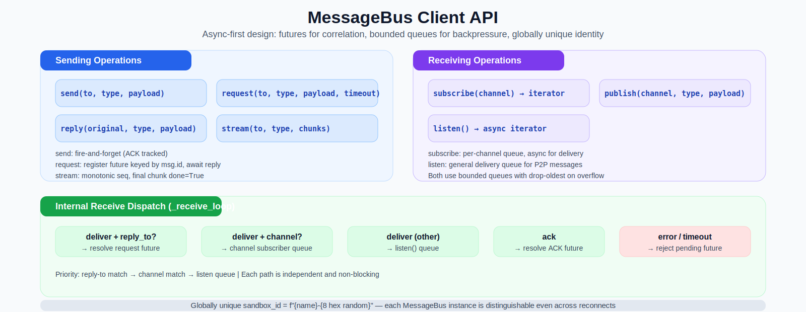
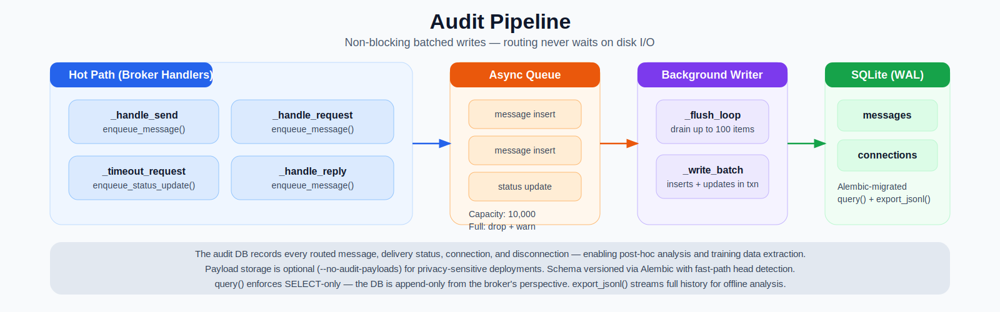
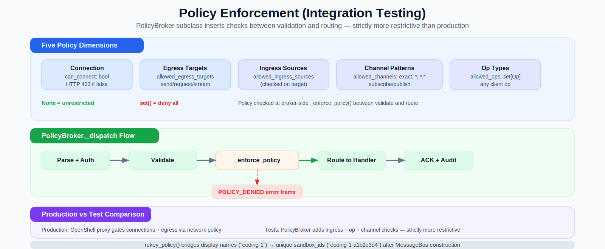
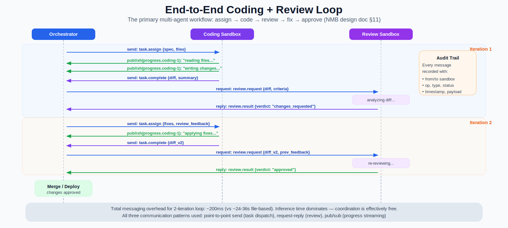

# Building NMB: A WebSocket Message Bus for Sandboxed Multi-Agent Coordination

Multi-agent systems need agents to talk to each other. When those agents run in isolated sandboxes with strict network policies, the coordination layer must be fast, auditable, and compatible with the proxy infrastructure that enforces isolation. This post walks through the design and implementation of NMB (NemoClaw Message Bus) — a custom WebSocket broker that replaces file-based coordination with sub-millisecond messaging while preserving sandbox isolation guarantees.



This is not a theoretical exercise. The coding + review loop — the primary multi-agent workflow in the NemoClaw system — performs 8-12 file round-trips per iteration. At ~1-3 seconds per round-trip, a 3-iteration review loop burns 24-36 seconds on coordination overhead alone. NMB reduces this to ~200 milliseconds. The model inference time (the actual thinking) now dominates the wall-clock time, which is exactly where we want the bottleneck to be.

---

## Table of Contents

- [Why Build a Custom Message Bus?](#why-build-a-custom-message-bus)
- [Architecture Overview](#architecture-overview)
- [The Wire Protocol](#the-wire-protocol)
- [Broker Implementation Walkthrough](#broker-implementation-walkthrough)
  - [Connection lifecycle](#connection-lifecycle)
  - [The dispatch pipeline](#the-dispatch-pipeline)
  - [Request-reply with broker-managed timeouts](#request-reply-with-broker-managed-timeouts)
  - [Pub/sub channel architecture](#pubsub-channel-architecture)
  - [Streaming](#streaming)
- [Client Implementation Walkthrough](#client-implementation-walkthrough)
  - [Identity and connection](#identity-and-connection)
  - [The receive loop](#the-receive-loop)
  - [Sending with ACK tracking](#sending-with-ack-tracking)
  - [Backpressure and queue management](#backpressure-and-queue-management)
- [Audit Database](#audit-database)
- [Integration Testing Framework](#integration-testing-framework)
  - [PolicyBroker: simulating network policy enforcement](#policybroker-simulating-network-policy-enforcement)
  - [The test harness](#the-test-harness)
  - [Name resolution: bridging display names and unique IDs](#name-resolution-bridging-display-names-and-unique-ids)
- [Design Decisions and Tradeoffs](#design-decisions-and-tradeoffs)
- [Lessons Learned](#lessons-learned)
- [What Comes Next](#what-comes-next)
- [Sources and References](#sources-and-references)

---

## Why Build a Custom Message Bus?

The NemoClaw system runs multiple agents in isolated OpenShell sandboxes: an orchestrator that dispatches tasks, coding sandboxes that write code, and review sandboxes that evaluate changes. In the initial design, these agents coordinate through file uploads and downloads — the orchestrator writes a task file, the coding sandbox polls for it, processes it, writes a result file, and the orchestrator polls for the result.

This works, but it has four problems that compound as the system scales:

**Latency.** Each file round-trip costs 1-3 seconds (upload, storage, poll interval, download). A single coding + review iteration involves 4 round-trips at minimum: task dispatch, result submission, review request, review result. Three iterations — a common case when the reviewer requests changes — costs 24-36 seconds in pure coordination overhead.

**No streaming.** File-based coordination is inherently batch-oriented. Progress updates during a long coding task require either polling a status file (more latency) or waiting for the final result. The orchestrator has no visibility into what a worker is doing until it finishes.

**No interruption.** If the orchestrator decides to cancel a task (user request, timeout, policy violation), there is no mechanism to signal the worker. The worker runs to completion and uploads a result that will be discarded.

**No peer messaging.** Workers cannot communicate with each other. A coding sandbox that discovers a dependency on another module cannot ask the review sandbox to check it. All coordination must flow through the orchestrator via file exchanges, adding more round-trips.

Before building a custom solution, I evaluated several existing messaging systems:

| System | Verdict |
|--------|---------|
| NATS | Excellent performance, but requires a separate binary and complicates the container image. Proxy compatibility untested. |
| Redis Pub/Sub | Requires a Redis server. Overkill for 2-5 clients. |
| ZeroMQ | No broker — pure peer-to-peer. Doesn't fit the star topology where the broker enforces identity. |
| gRPC streams | Strong typing, but bidirectional streaming adds complexity. Not naturally compatible with the L7 proxy. |

The deciding factor was **proxy compatibility**. OpenShell's L7 proxy can inspect and route WebSocket frames and HTTP headers. A custom WebSocket broker using JSON text frames works naturally with this infrastructure — the proxy can authenticate connections (via `X-Sandbox-ID` header injection), enforce network policies, and pass frames through without modification. Binary protocols or custom TCP transports would require CONNECT tunneling, which bypasses the proxy's policy enforcement.

The result is NMB: a ~1,100-line Python asyncio WebSocket broker with a ~850-line client library, supporting point-to-point messaging, request-reply with broker-managed timeouts, pub/sub channels, ordered streaming, and a full audit trail. It follows the same pattern as `inference.local` — sandboxes call a well-known endpoint (`messages.local:9876`), and the proxy handles authentication and routing transparently.

---

## Architecture Overview



NMB uses a **star topology**: all sandbox communication flows through a central broker. There is no direct sandbox-to-sandbox communication. This is both a design choice and a constraint — OpenShell's network policies mediate every outbound connection, and the broker is the single point where identity verification, message routing, and audit logging converge.

The architecture has four layers:

**Identity layer.** The OpenShell proxy injects an `X-Sandbox-ID` header on every WebSocket upgrade request. The broker reads this header during the handshake and associates the connection with the sandbox identity. Every subsequent message from that connection has its `from_sandbox` field overwritten by the broker — a client cannot spoof its identity. This mirrors production behavior where the proxy is the trust anchor.

**Routing layer.** The broker maintains a connection registry (`sandbox_id → WebSocket`), a channel subscription map (`channel → set[sandbox_id]`), and a pending request tracker (`request_id → timeout_task`). Inbound frames are parsed, validated, and dispatched to type-specific handlers: `_handle_send`, `_handle_request`, `_handle_reply`, `_handle_subscribe`, `_handle_publish`, `_handle_stream`.

**Audit layer.** Every routed message is enqueued to an asynchronous background writer that batches inserts into a SQLite database. The routing path never blocks on disk I/O. The audit DB records message metadata (op, type, from/to, timestamp, delivery status) and optionally full payloads.

**Client layer.** Each sandbox runs a `MessageBus` instance that connects to the broker, sends frames, and dispatches incoming frames to the appropriate consumer: reply futures, channel subscriber queues, or the general listen queue.

---

## The Wire Protocol



NMB uses a single `NMBMessage` Pydantic model for all frames — both client-to-broker and broker-to-client. The model carries these fields:

```python
class NMBMessage(BaseModel):
    model_config = ConfigDict(extra="ignore")

    id: str
    op: Op
    type: str
    from_sandbox: str | None = None
    to_sandbox: str | None = None
    payload: dict[str, Any] = {}
    channel: str | None = None
    reply_to: str | None = None
    stream_id: str | None = None
    seq: int | None = None
    done: bool | None = None
    error_code: str | None = None
    timestamp: float | None = None
```

The `op` field determines which handler processes the frame. The `type` field is application-level semantics — `task.assign`, `review.request`, `sandbox.shutdown` — that the broker routes but never interprets. The broker cares about addressing (`to_sandbox`, `channel`) and correlation (`reply_to`, `stream_id`); payload contents are opaque.

The `extra="ignore"` config on the Pydantic model is a forward-compatibility choice: if a newer client sends fields the broker doesn't recognize, they're silently dropped rather than causing a validation error. This allows rolling upgrades without coordinated version bumps.

Each `op` has required fields enforced by `validate_frame()`:

| Op | Required Fields |
|----|----------------|
| `send` | `to_sandbox`, `type` |
| `request` | `to_sandbox`, `type` |
| `reply` | `to_sandbox`, `type`, `reply_to` |
| `subscribe` | `channel` |
| `publish` | `channel`, `type` |
| `stream` | `to_sandbox`, `type`, `stream_id`, `seq` |

JSON text frames were chosen over binary protocols (MessagePack, Protobuf) for two reasons: the OpenShell L7 proxy can inspect them for policy enforcement, and they're directly debuggable with standard WebSocket tools. The performance cost is negligible — at 2-5 connected sandboxes, serialization overhead is unmeasurable compared to network latency.

---

## Broker Implementation Walkthrough

The broker ([`broker.py`](https://github.com/dpickem/nemoclaw_escapades/blob/main/src/nemoclaw_escapades/nmb/broker.py)) is ~1,100 lines of Python asyncio code built on the `websockets` library. It is a pure router — it never inspects payloads, never calls inference, and never accesses the filesystem (beyond the audit database).

### Connection lifecycle

When a sandbox connects, the broker performs a three-step handshake:

1. **`_process_request`**: The WebSocket upgrade handler reads `X-Sandbox-ID` from the request headers. If missing, the connection is rejected. The sandbox ID is stashed on the connection object.

2. **`_register`**: The sandbox is added to the connection registry. If a connection with the same `sandbox_id` already exists (duplicate), the new connection is closed — this prevents split-brain scenarios where two processes claim the same identity.

3. **`_handler` loop**: The broker enters a receive loop, dispatching each frame through `_dispatch`. On disconnect, `_unregister` cleans up: removes all channel subscriptions, cancels any pending requests *from* that sandbox, broadcasts a `sandbox.shutdown` event to all `system` channel subscribers, and logs the disconnection to the audit DB.

The `sandbox.shutdown` broadcast is a design choice borrowed from Hermes: when a worker disconnects, the orchestrator learns about it immediately through the `system` channel rather than discovering it when a send fails. This enables proactive task reassignment.

### The dispatch pipeline



Every inbound frame follows the same five-step pipeline:

1. **Parse**: Deserialize the JSON text frame into an `NMBMessage` via Pydantic.
2. **Authenticate**: Overwrite `from_sandbox` with the connection's `X-Sandbox-ID`. This is the critical security property — a client cannot claim to be a different sandbox.
3. **Validate**: Check that all required fields for the given `op` are present. Enforce the payload size limit.
4. **Route**: Dispatch to the appropriate `_handle_*` method based on `op`.
5. **ACK + Audit**: Send an acknowledgment frame to the sender. Enqueue the message to the audit DB's background writer.

Validation failures and routing errors produce `error` frames with typed error codes (`INVALID_FRAME`, `TARGET_OFFLINE`, `PAYLOAD_TOO_LARGE`, `RATE_LIMITED`, `CHANNEL_FULL`). The client's receive loop matches error frames to pending ACK or request futures, surfacing them as `NMBConnectionError` exceptions.

### Request-reply with broker-managed timeouts



Request-reply is the most complex operation because it spans three participants (requester, broker, target) and has a failure mode that neither endpoint can detect on its own: the target crashing after receiving the request but before sending a reply.

The broker solves this with **broker-managed timeouts**:

1. The requester sends a `request` frame. The broker registers a `PendingRequest` with a timeout duration and starts an `asyncio.Task` that sleeps for that duration.
2. The broker delivers the request to the target and ACKs the requester.
3. **Happy path**: The target sends a `reply` with `reply_to` matching the request's `id`. The broker pops the pending request, cancels the timeout task, and delivers the reply to the requester.
4. **Timeout path**: If the timeout task fires before a reply arrives, the broker pops the pending request, sends a `timeout` frame to the requester, and updates the audit DB status from `delivered` to `timeout`.

The client waits `timeout + 5 seconds` (a grace period for the broker's timeout frame to arrive) before raising a local timeout. This two-tier approach means the client almost never needs to guess whether a reply is still in flight — the broker is the authoritative source of timeout information.

Pending request tracking also interacts with disconnection: when a sandbox disconnects, all pending requests *from* that sandbox are cancelled (no one is waiting for replies anymore), and all pending requests *to* that sandbox trigger timeout notifications to the requesters.

### Pub/sub channel architecture



Pub/sub is simpler than request-reply but has its own design considerations:

**Channel maps.** The broker maintains two maps: `_channels` (channel name → set of subscribed sandbox IDs) and `_sandbox_channels` (sandbox ID → set of subscribed channels). The reverse map enables efficient cleanup on disconnect and per-sandbox channel limit enforcement.

**Fanout.** When a sandbox publishes to a channel, the broker builds the `deliver` JSON once, then sends it to all subscribers concurrently with `asyncio.gather()`. The publisher is excluded from its own fanout — you don't receive your own publishes.

**Per-delivery timeouts.** Each `_safe_send` in the fanout has a configurable timeout (default 5 seconds). A slow subscriber that can't accept the message within that window gets skipped rather than blocking delivery to all other subscribers. This prevents a single stalled consumer from poisoning the entire channel.

**Channel limits.** Each sandbox can subscribe to at most 50 channels (configurable). This prevents a misbehaving client from exhausting broker memory with thousands of subscriptions.

**The `system` channel.** This is a broker-managed channel that receives `sandbox.shutdown` events whenever a sandbox disconnects. The orchestrator typically subscribes to `system` to track worker availability. Unlike regular channels, the broker — not a client — is the publisher.

### Streaming

Streaming supports ordered chunk delivery for large data transfers (code diffs, file contents). A stream is a sequence of frames sharing a `stream_id`, with monotonically increasing `seq` numbers and a final chunk where `done=True` and `payload={}`.

The broker forwards each chunk as a `deliver` frame — there is no per-chunk ACK in the current implementation. Stream ordering is guaranteed by the WebSocket transport (TCP ordering) and the single-connection-per-sandbox design.

---

## Client Implementation Walkthrough



The client library ([`client.py`](https://github.com/dpickem/nemoclaw_escapades/blob/main/src/nemoclaw_escapades/nmb/client.py)) provides the `MessageBus` class — an async-first API that handles WebSocket framing, correlation (matching ACKs and replies to their requests), and bounded queue management.

### Identity and connection

Each `MessageBus` generates a **globally unique** `sandbox_id` at construction time:

```python
self.sandbox_id = f"{name}-{secrets.token_hex(4)}"
```

The display name (`"orchestrator"`, `"coding-1"`) is human-readable; the random suffix (`"-a1b2c3d4"`) makes each instance distinguishable even across restarts and reconnects. This is important because the broker's connection registry, audit DB, and pending request tracker all key on `sandbox_id` — reusing the same ID after a reconnect would create ambiguity about which connection is live.

Connection is straightforward:

```python
bus = MessageBus("coding-1", url="ws://messages.local:9876")
await bus.connect()
```

The `connect` method opens a WebSocket with `X-Sandbox-ID` in the headers and starts a background `_receive_loop` task. `connect_with_retry` wraps this in a tenacity exponential backoff loop for production resilience.

### The receive loop

The receive loop is the heart of the client. It reads frames from the WebSocket, parses them, and dispatches to the appropriate consumer:

1. **`deliver` with `reply_to`**: This is a reply to a pending `request()`. The loop resolves the corresponding asyncio `Future`, completing the request-reply cycle.
2. **`deliver` with `channel`**: This is a pub/sub delivery. The loop puts it on the subscriber's per-channel queue.
3. **`deliver` (other)**: This is a point-to-point delivery. The loop puts it on the general `listen()` queue.
4. **`ack`**: Resolves the ACK future for a pending `send()` or `subscribe()`.
5. **`error` / `timeout`**: Resolves the corresponding future with an exception, surfacing the error to the caller.

This priority ordering is important: reply-to matching takes precedence over channel matching, which takes precedence over the general queue. A message can only land in one place.

### Sending with ACK tracking

Every `send()` and `publish()` call follows a send-then-wait pattern:

```python
async def _send_and_await_ack(self, msg: NMBMessage) -> None:
    future = asyncio.get_event_loop().create_future()
    self._ack_futures[msg.id] = future
    await self._ws.send(msg.to_json())
    await asyncio.wait_for(future, timeout=self._ack_timeout)
```

The ACK future is registered *before* sending. This avoids a race where the broker's ACK arrives before the client has set up the future to receive it. If the ACK doesn't arrive within `ack_timeout` seconds, the send raises `NMBConnectionError`.

`request()` is similar but registers a *request* future keyed by the message's `id`. The receive loop resolves this future when a `deliver` frame arrives with a matching `reply_to`.

### Backpressure and queue management

Both the listen queue and per-channel subscriber queues are bounded (default 1,000 items). When a queue is full, the oldest message is dropped. This is a deliberate design choice: the alternative (blocking the receive loop until space is available) would stall all incoming traffic, including ACKs and replies for other operations. Drop-oldest keeps the system responsive at the cost of potentially losing old unprocessed messages — which, for progress updates and status notifications, is the right tradeoff.

---

## Audit Database



Every routed message is recorded in a SQLite database for post-hoc analysis, debugging, and training data extraction. The audit system is designed around one principle: **routing must never wait on disk**.

The broker's handlers call `enqueue_message()` — an `asyncio.Queue.put_nowait()` — which returns immediately. A background writer task (`_flush_loop`) drains the queue in batches of up to 100 items, executing inserts and status updates within a single transaction.

The queue has a capacity of 10,000 items. If the queue is full (disk I/O is backed up), new audit entries are dropped with a warning. This is acceptable because the audit trail is observational — losing a few entries under extreme load doesn't affect message routing.

The database schema is managed by Alembic migrations, with a fast-path optimization: at startup, the broker checks whether the database is already at the head revision before spawning the Alembic subprocess. For an already-migrated database, this saves the subprocess overhead entirely.

Two tables store the data:

| Table | Contents |
|-------|----------|
| `messages` | Every routed message: id, op, type, from/to sandbox, channel, timestamp, delivery status, optional payload |
| `connections` | Connection history: sandbox_id, connected_at, disconnected_at, disconnect_reason |

The `query()` method enforces SELECT-only access — the database is append-only from the broker's perspective. `export_jsonl()` streams the full message history as newline-delimited JSON for offline analysis.

Payload storage is optional (`--no-audit-payloads`). For privacy-sensitive deployments, you can record message metadata without persisting the actual data.

---

## Integration Testing Framework

The integration tests validate the full message-routing stack with multiple sandboxes operating under realistic policy constraints. Everything runs in a single asyncio event loop within the pytest process — no Docker, no OpenShell, no network beyond `127.0.0.1`.

### PolicyBroker: simulating network policy enforcement



In production, OpenShell's network policies control which sandboxes can reach the broker and which external endpoints they can access. The integration tests simulate this with `PolicyBroker`, a subclass of `NMBBroker` that inserts policy checks between frame validation and handler dispatch.

`SandboxPolicy` defines five dimensions of restriction:

```python
@dataclass
class SandboxPolicy:
    sandbox_id: str
    can_connect: bool = True
    allowed_egress_targets: set[str] | None = None
    allowed_ingress_sources: set[str] | None = None
    allowed_channels: set[str] | None = None
    allowed_ops: set[Op] | None = None
```

The semantics are: `None` means unrestricted on that dimension; an empty `set()` means deny all. This convention makes policies composable — you can restrict one dimension without affecting others.

The `PolicyBroker._enforce_policy` method runs after parse/auth/validate and before handler dispatch:

1. **Check `allowed_ops`**: Is this `op` in the sender's allowed set?
2. **Check `allowed_egress_targets`** (for send/request/stream): Is the target in the sender's allowed set?
3. **Check `allowed_ingress_sources`** (for send/request/stream): Is the sender in the *target's* allowed set?
4. **Check `allowed_channels`** (for subscribe/publish): Does the channel match the sender's allowed pattern set? Patterns support exact match, wildcard suffix (`progress.*`), and global wildcard (`*`).

If any check fails, the broker sends a `POLICY_DENIED` error frame instead of routing the message.

The test policy layer is **strictly more restrictive** than production: it enforces ingress checks and op-type restrictions that OpenShell's network policies don't natively support. This means that any interaction that works in the integration tests is guaranteed to work in production — the tests provide a stronger isolation guarantee.

**Why duplicate `_dispatch`?** The policy checks must run after parsing (to know the `op` and addressing) but before handler dispatch. The base `NMBBroker._dispatch` doesn't have a hook point between these steps. Rather than adding test-only hooks to production code, `PolicyBroker` duplicates the ~20-line dispatch body with the policy check inserted. This keeps the production broker clean.

### The test harness

The `IntegrationHarness` manages the lifecycle of a multi-sandbox test:

```python
harness = IntegrationHarness()
await harness.start(policies=[
    SandboxPolicy("orchestrator", allowed_egress_targets={"coding-1", "review-1"}),
    SandboxPolicy("coding-1", allowed_egress_targets={"orchestrator"}),
    SandboxPolicy("review-1", allowed_egress_targets={"orchestrator"}),
])

orch = harness["orchestrator"]
await orch.send("coding-1", "task.assign", {"spec": "..."})
msg = await harness["coding-1"].wait_for_message("task.assign", timeout=5.0)

await harness.stop()
```

`start()` does several things:

1. Starts a `PolicyBroker` on `127.0.0.1:0` (OS picks an ephemeral port) with a temporary SQLite audit DB.
2. For each policy, creates a `MessageBus` with the display name.
3. Calls `rekey_policy()` to translate the display name to the `MessageBus`'s unique `sandbox_id` in the policy maps.
4. Connects each `MessageBus` (unless `can_connect=False`).
5. Wraps each in a `SandboxHandle` and starts the background collection loop.

`SandboxHandle` provides test-ergonomic methods: `send()`, `request()`, `publish()`, `subscribe()`, `stream()`, `wait_for_message()`, and `messages_of_type()`. Its `_collect_loop` consumes `MessageBus.listen()` in the background and appends to a `received` list, freeing tests from manually managing listener tasks.

### Name resolution: bridging display names and unique IDs

This is the most subtle piece of the harness design. Tests use human-readable names (`"coding-1"`, `"orchestrator"`), but the broker sees globally unique IDs (`"coding-1-f7e8d9c0"`, `"orchestrator-a1b2c3d4"`). The harness bridges this gap in two places:

**Broker-side: `rekey_policy()`**. Called after each `MessageBus` is constructed, this method:
1. Re-indexes the policy dict from display name to unique `sandbox_id`.
2. Patches `allowed_egress_targets` and `allowed_ingress_sources` in *all* policies so cross-sandbox allow-lists reference the unique IDs the broker will actually see.

**Client-side: `_resolve()`**. Each `SandboxHandle` carries a `_resolve` callable that translates display names to unique IDs. When a test calls `orch.send("coding-1", ...)`, the handle resolves `"coding-1"` to `"coding-1-f7e8d9c0"` before building the frame.

```
Test code                     Harness / PolicyBroker           Broker
─────────                     ──────────────────────           ──────
send("coding-1", ...)  ──→   _resolve("coding-1")     ──→    _connections["coding-1-f7e8"]
                              = "coding-1-f7e8"
```

This design was chosen over alternatives like broker-side prefix matching (fragile — `"coding"` could false-match `"coding-1-…"`) or a two-level identity map in production code (adds complexity for a test-only need).

---

## Design Decisions and Tradeoffs

### Why WebSockets over raw TCP?

WebSockets provide framing (no need to implement our own length-prefixed protocol), built-in ping/pong for connection health, and compatibility with HTTP proxies — including OpenShell's L7 proxy. Raw TCP would require reimplementing framing, health checks, and proxy traversal. The overhead of WebSocket framing on top of TCP is negligible for our message sizes (typically <100KB).

### Why JSON over binary formats?

The OpenShell proxy terminates TLS and can inspect HTTP/WebSocket frames for policy enforcement. JSON text frames are inspectable; binary formats require protocol-specific parsers. JSON also makes debugging trivial — you can log raw frames and read them directly. The serialization cost of JSON vs MessagePack is unmeasurable at our scale (2-5 clients, <100 messages/second).

### Why a custom broker over NATS/Redis?

Three reasons: (1) Zero external dependencies — the broker is a single Python module with no system packages to install in the sandbox image. (2) Full control over the identity model — we need the broker to trust `X-Sandbox-ID` from the proxy and overwrite `from_sandbox`, which is not a standard feature of off-the-shelf brokers. (3) Integrated audit — the broker writes every message to SQLite for training data extraction. With NATS, we'd need a separate consumer to persist messages.

The downside is that we own the maintenance burden. If the system scales beyond 10-20 sandboxes or needs multi-broker federation, migrating to NATS (with a custom auth plugin for `X-Sandbox-ID` trust) would be the right move. The wire protocol is intentionally simple enough that a NATS adapter would be straightforward.

### Why broker-managed timeouts instead of client-side?

Client-side timeouts have a fundamental problem: the client doesn't know whether the target received the request and crashed, or whether the broker hasn't delivered it yet. With broker-managed timeouts, the broker is the authoritative source — it knows when the request was delivered and when the timeout expired. The `timeout` frame tells the client definitively: "the target received your request but did not reply within the allowed time."

This also simplifies client code. The client registers a future and waits. The future is resolved by one of three things: a reply (success), an error (routing failure), or a timeout (no reply). The client doesn't need its own timer.

### Why star topology?

The star topology (all traffic through the broker) has a single point of failure — the broker. But it has three advantages that outweigh this:

1. **Single point of enforcement.** Identity verification, policy checks, and audit logging happen in one place. Peer-to-peer messaging would require distributed enforcement.
2. **Simple connection model.** Each sandbox opens one connection to `messages.local:9876`. No service discovery, no mesh networking.
3. **Proxy compatibility.** OpenShell's network policy can whitelist a single endpoint. Peer-to-peer would require each sandbox to be reachable by all others — incompatible with the proxy-mediated network model.

### Why subclass NMBBroker for PolicyBroker?

Three alternatives were considered:

- **Proxy middleware**: A separate WebSocket proxy between clients and the broker. More realistic but adds latency, complexity, and a second process.
- **Client-side enforcement**: Wrap `MessageBus` to check policies before sending. A misbehaving client could bypass it — defeats the purpose.
- **Production hooks**: Add a `pre_dispatch` hook to `NMBBroker`. Adds test-only code to production.

Subclassing keeps test infrastructure out of production code while still validating the full routing path. The duplicated `_dispatch` logic (~20 lines) is an acceptable cost for clean separation.

---

## Lessons Learned

### 1. Identity is the hardest problem in a multi-sandbox system

The `MessageBus` generates a globally unique `sandbox_id` by appending a random hex suffix to the display name. This sounds simple, but it creates a name-resolution problem: policies and test code use display names, while the broker uses unique IDs. The `rekey_policy()` / `_resolve()` mechanism solves this, but it was the single most time-consuming piece of the integration test harness to get right.

The lesson: decide early whether your identity model uses human-readable names, machine-generated IDs, or both. If both, build the translation layer as a first-class concept rather than bolting it on later.

### 2. Broker-managed timeouts are worth the complexity

Early prototypes used client-side timeouts. They were simpler to implement but produced confusing behavior: a client would time out and raise an error, then the reply would arrive a moment later and get dropped into the listen queue, confusing subsequent message processing.

Moving timeout management to the broker eliminated an entire class of bugs. The broker's `timeout` frame is authoritative — when the client receives it, the request is definitively dead. The 5-second grace period on the client side gives the broker's timeout frame time to arrive over a slow connection.

### 3. Background audit writes prevent a surprising failure mode

The first audit implementation used synchronous writes. Under normal load this was fine, but during burst traffic (e.g., the orchestrator dispatching tasks to multiple workers simultaneously), the audit writes would block the event loop for 10-50ms per message. This didn't cause message loss, but it increased latency enough to trigger request timeouts.

Moving to an asyncio queue with a background batch writer eliminated this entirely. The routing path does a `queue.put_nowait()` (~0.001ms) and moves on. The batch writer handles disk I/O at its own pace.

### 4. Drop-oldest is the right backpressure policy for this use case

When a subscriber's queue is full, there are three options: block the sender (stalls the entire broker), reject the message (the sender must handle the error), or drop the oldest message (the subscriber loses stale data). For progress updates and status notifications, stale data is less valuable than recent data, making drop-oldest the natural choice.

### 5. The system channel pattern simplifies orchestrator logic

Without the `system` channel's `sandbox.shutdown` events, the orchestrator would discover a worker crash only when a `send()` returns `TARGET_OFFLINE` or a `request()` times out. With the system channel, the orchestrator learns about disconnections immediately and can proactively reassign work or alert the user. This reduced the orchestrator's error handling code significantly.

### 6. Test infrastructure should be strict, not realistic

The `PolicyBroker` enforces ingress checks and op-type restrictions that production doesn't support. This was a deliberate choice: tests that pass under stricter-than-production constraints are guaranteed to work in production. The reverse is not true — realistic tests might pass locally but fail in production due to an unexpected policy interaction.

### 7. The `_process_request` override trick

`NMBBroker._process_request` is a `@staticmethod`. `PolicyBroker` overrides it as an instance method to access `self._policies`. This works because Python resolves `self._process_request` to a bound method for instance methods and a bare function for static methods — both are valid callables with `(connection, request)` arity. `websockets.serve()` doesn't care which it receives.

---

## What Comes Next



The coding + review loop diagram above shows the primary workflow that NMB enables. The three communication patterns — point-to-point send (task dispatch), request-reply (review), and pub/sub (progress streaming) — were designed specifically for this workflow.

Several extensions are planned:

| Extension | Description |
|-----------|-------------|
| **Rate limiting** | Per-sandbox `max_messages_per_second` in `SandboxPolicy` |
| **Payload-size policy** | Per-sandbox max payload size, more granular than the broker's global limit |
| **Dynamic policy updates** | Change policies mid-test without restarting the harness |
| **Latency injection** | Configurable delays in routing to simulate cross-host latency |
| **Multi-host deployment** | TLS + token authentication for remote broker connections (NMB design doc §13.3) |
| **NATS migration path** | If scale demands it, a NATS adapter preserving the same client API |

The full NMB design document covers these in detail, along with failure modes (crash recovery, partition handling, slow consumers), deployment configuration (systemd, CLI flags), and comparison with alternative coordination approaches.

---

## Sources and References

- [NMB Design Document](../../nmb_design.md) — full architecture, wire protocol, failure modes, deployment
- [NMB Integration Tests Design](../../nmb_integration_tests_design.md) — test harness, policy model, scenario catalog
- [NemoClaw Design Document](../../design.md) — project goals, milestone plan
- [Hermes Deep Dive](../../deep_dives/hermes_deep_dive.md) — inspiration for the messaging patterns
- [OpenShell Deep Dive](../../deep_dives/openshell_deep_dive.md) — sandbox isolation, proxy architecture, policy enforcement
- [`websockets` library](https://websockets.readthedocs.io/) — the underlying WebSocket implementation
- [NATS](https://nats.io/) — the most likely migration target if scale requires it
