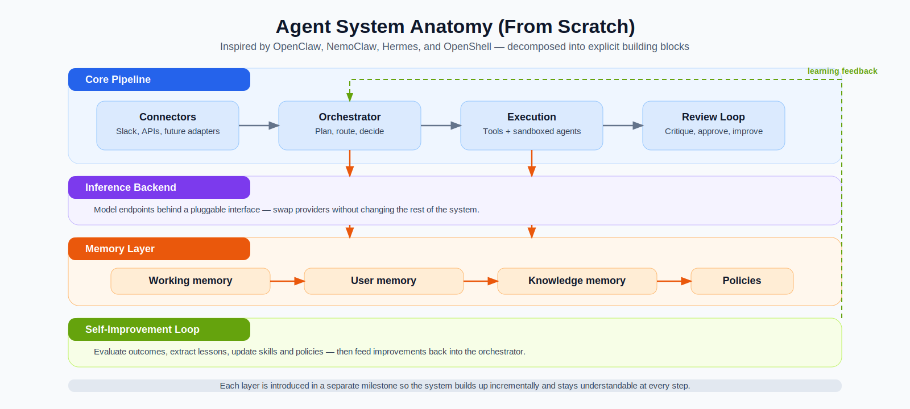
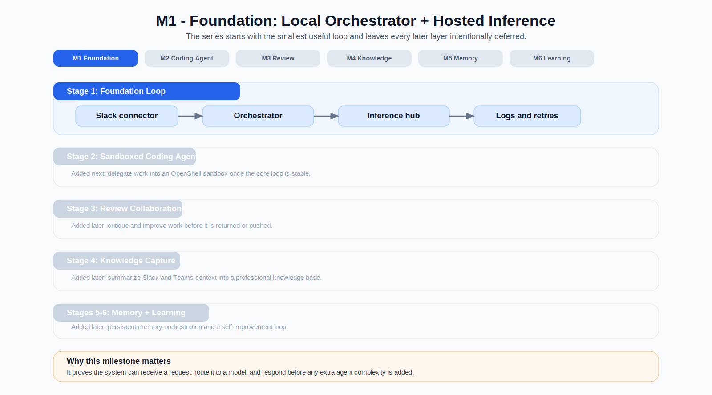
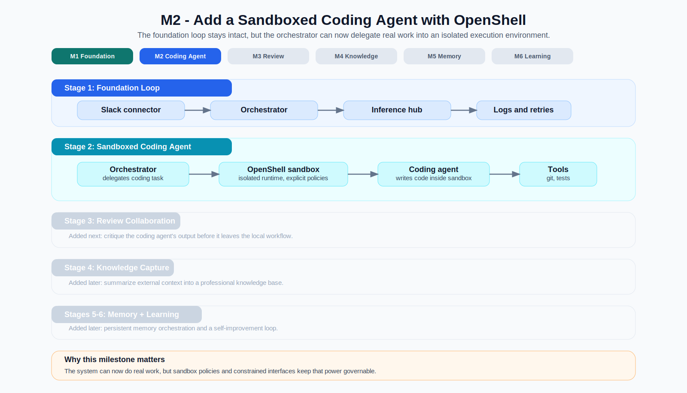
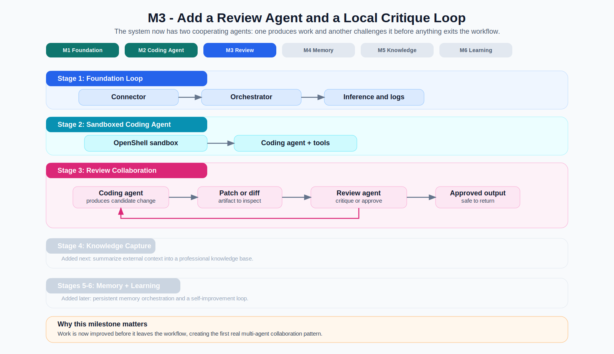
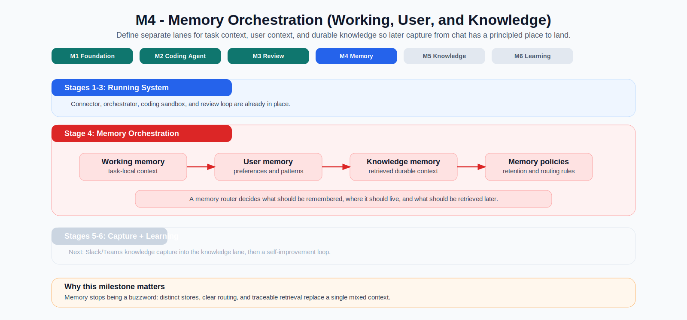
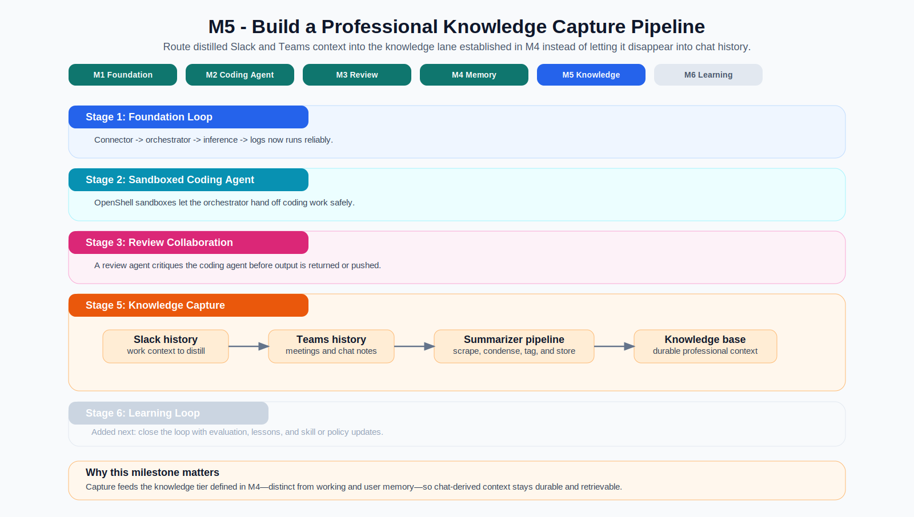
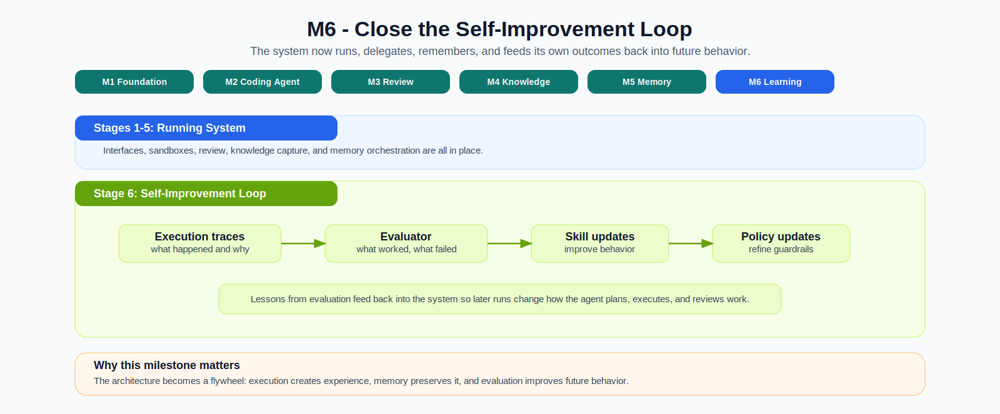

# Building Agents from Scratch — Series Introduction

## The Short Version

This post kicks off a series about building agent systems the hard way on
purpose.

OpenClaw, Hermes, NemoClaw / OpenShell, and most recently Claude Code are all useful reference points, but they can also make modern agents feel more mysterious and overwhelming than they need to be. If you drop into those repos cold, you see a lot of moving parts at once: connectors, orchestration, tools, sandboxes, memory, policies, deployment, and sometimes multi-agent routing on top of all of that. It is easy to admire the system and still not understand where the actual "agent" begins and ends.

This series is an attempt to make that architecture legible. We are going to build our own agent stack from scratch, borrowing the best ideas from those projects without treating any of them as a black box. The point is not to clone an existing stack but to understand agent systems by rebuilding their core pieces ourselves.

This series also has two practical goals as part of this learning exercise:

1. Build toward a more enterprise-oriented multi-agent system on top of OpenShell and NemoClaw, with hardened interfaces, explicit policy boundaries, and a more constrained, governable shape than a wide-open OpenClaw-style runtime.
2. Provide step-by-step tutorials for how to use OpenShell and NemoClaw to build a real system. In that sense, the series is also extended documentation: concrete use-case-driven guidance instead of only abstract reference material. I want to make this part a more engaging read than the just dry design docs.

This series of posts is set up in such a way that each new post layers on additional functionality on our previously built multi-agent system. A simplified version of what we are trying to build is shown in the image below.

## Why This Series Exists

There are already strong examples to learn from, open source and otherwise:

- **OpenClaw** shows what a capable, tool-using agent system can look like. This was the first personal assistant-style system that popularized multi-agent systems and gave the public an idea of what is possible today
- **Hermes** shows how skills, memory, and self-improvement loops can compound.
- **Claude Code** shows what a deeply integrated, agentic coding assistant can look like in a day-to-day development loop.
- **NemoClaw** shows how a harness can package policy and infrastructure around an agent runtime.
- **OpenShell** shows how to run powerful agents inside constrained sandboxes.

Taken together, those systems show what is possible and which building blocks matter, but they can still feel opaque when you are trying to understand how the whole system fits together. Finished agent stacks - while being great references - hide the questions that actually matter when you are trying to learn how these systems work:

- What is the difference between a connector, an agent loop, and a sandbox?
- Which parts are infrastructure and which parts are "the agent"?
- When is a single-agent system enough, and when does multi-agent delegation
  actually help?
- How do you move from something that works on a laptop to something that can
  run continuously on managed infrastructure?

Rather than only studying those questions from diagrams and source dives, we are going to answer them by building the system ourselves. I was tempted to describe this project as a simplified version of the above open source implementations. But I want to clarify at this point that I fully intend to use the outcome of this project for my day-to-day tasks at work - so for all practical purposes this system should become fully functional and fairly feature-complete.

## What We Are Intending to Build

The project behind this series, `nemoclaw_escapades`, is aiming at a production-oriented personal agent system: an always-on "super IC" that can accept work through Slack, route tasks through an orchestrator, delegate to sandboxed sub-agents, and eventually learn from outcomes over time.

At the same time, it is also a vehicle for exploring a more enterprise-oriented shape for agent systems built on top of OpenShell and NemoClaw: hardened interfaces, explicit policies that shape what agents can do, and tighter operational constraints than a general-purpose, anything-goes agent runtime.

We are starting small on purpose. The first version is not a swarm of agents. It is a clean single-agent baseline with explicit boundaries. From there, the series layers in the pieces that make more advanced systems work in practice.

That makes the series useful in two ways. It is a build log for one concrete system, and it is also a tutorial track for people who want to learn how to use OpenShell and NemoClaw step by step through a real use case.

| Layer | Role in the system | Why it matters |
|---|---|---|
| Connector | Receives requests from Slack and returns results | This is the layer that routes user messages to the orchestrator
| Orchestrator | Owns the main loop, policy, routing, and delegation | This is **the main brain** of the system |
| Inference backend | Talks to model endpoints through a stable interface | This is layer that provides the reasoning power and intelligence to the orchestrator (through external or local LLMs) |
| Execution layer | Runs tools and delegated sub-agents—shell, files, processes, APIs—so model output becomes real work | Separates *doing* (execute) from the orchestrator’s *routing* and the inference layer’s *reasoning*. |
| Sandbox infrastructure | Hosts the execution layer inside OpenShell: isolated / containerized workspace, constrained network, and policy-enforced boundaries | Tool runs and delegated agents still need a real environment; the sandbox is *where* that environment lives so work stays scoped away from your host home, unrelated repos, and broad network access—subject to policy. |
| Memory and knowledge | Keeps durable state the orchestrator can load later: preferences, decisions, project facts, plus retrievable docs or embeddings (RAG-style) | The context window is small and resets; this is what still exists after the Slack thread ends—so the agent can recognize standing instructions, avoid re-asking, and pull relevant background instead of stuffing every file into every prompt. |
| Review and reflection | Checks finished work against expectations—tests, linters, policies, a second model pass, or human sign-off—and writes durable takeaways back into memory or runbooks | Intuition: a self-correcting loop. Without a review step, mistakes repeat; with one, failures become labeled examples, tightened prompts, or updated policy instead of vanishing when the session closes. |

One of the recurring confusions in agent discussions is that the runtime, the harness, the tool layer, and the agent loop get blurred together. A major goal of this series is to provide clarity to each of those concepts and provide a disentangled example implementations.

## Why Build It From Scratch?

In my opinion "from scratch" is the best way to build lasting understanding of new concepts (though the depth of "from scratch" has certainly changed since the advent of AI assistants). Sebastian Raschka’s books—[Build a Large Language Model (From Scratch)](https://www.manning.com/books/build-a-large-language-model-from-scratch) and [Build a Reasoning Model (From Scratch)](https://www.manning.com/books/build-a-reasoning-model-from-scratch)—are the clearest precedent for that approach applied to models. This series tries to do something analogous for a personal-assistant-style agent stack.

On the agent side, Raschka’s recent post [Components of a Coding Agent](https://magazine.sebastianraschka.com/p/components-of-a-coding-agent) is worth a read. It is explicitly about *coding* harnesses—how tools, memory, and repo context sit around an LLM in products like Claude Code or Codex—and it walks through six practical pieces: live workspace context, prompt shape and cache reuse, structured tools and permissions, context reduction, session memory and transcripts, and bounded subagents. This project is not a second take on that same narrow problem; our first milestones center on Slack, orchestration, and inference behind a connector rather than a terminal-first coding loop. Still, many of those coding-harness ideas (stable prefixes, tool boundaries, compaction, delegation) show up again when we add sandboxed coding agents and review later in the roadmap (you can think of the sandboxed coding agent as Raschka's "Mini Coding Agent" in a sandbox).

If you only interact with a finished framework, it is easy to miss which abstractions are fundamental and which were just convenient implementation choices, which features are core functionality and which are nice-to-haves. Rebuilding the stack forces us to answer where responsibilities *belong* and how the shape of the system should evolve:

- Which boundaries between connector, orchestrator, inference, execution, sandbox, and memory are worth keeping explicit—and what do we lose if we merge them to ship faster?
- What should stay swappable and generic from day one—connectors, inference backends—versus what we are willing to hard-code until the boundaries are clear?
- Where does safety actually live: prompts only, or policy and infrastructure that still holds when the model misbehaves?
- What deserves to stay local first, and what should move to managed infrastructure once reliability and operations become the constraint?
- When do additional agents add leverage, and when do they mostly add coordination cost and failure modes?

That is the educational motivation behind this series. I do want to end up with a working system (that scales my impact at work), but the deeper goal is to understand why the system has the shape it does.

## Single-Agent First, Multi-Agent When Earned

Adding agents means more processes, more handoffs, and more state that has to stay consistent across them. Failures often show up at boundaries between agents, which makes observability, reproduction, and debugging slower than in a single loop in a single agent.

For that reason this series begins with a single orchestrator-based system that can accept a request, build context, call an LLM, and return a useful response. We add further agents and the capabilities below only after that baseline is reliable, with an explicit rationale for each step:

- additional sandboxed sub-agents (coding agent, review agent, etc.)
- a knowledge and memory layer,
- and eventually a self-improvement loop.

That progression matches the design document: prove the core loop, then add delegation, then collaboration, then memory, then learning. Multi-agent behavior is something the system earns, not something we assume on day one.

## Local First, Then Real Deployment

Another goal of the series is to make deployment part of the story instead of an afterthought.  A lot of agent demos quietly assume a laptop, an API key, and an interactive terminal. That is useful for prototyping, but it hides the practical questions:

- What runs locally?
- What runs remotely?
- How do you keep long-running agents alive (for local agents you have to keep the laptop awake)?
- How do you observe them?
- How do you scale from one process on a laptop to managed infrastructure?

So the series follows a deliberate deployment arc:

1. Build a local-first baseline that is easy to reason about (and easy to run).
2. Use hosted inference where it makes sense.
3. Introduce sandboxed execution for stronger isolation.
4. Move toward always-on hosting on managed infrastructure when the architecture deserves it.

This series is just as much about agent logic as it is about deployment and productionization.

## What the Series Will Cover - a Roadmap

Each post will focus on one design step, one concrete artifact, and one clear definition of done. The roadmap below is how the philosophy above turns into a working system.

| Post | Focus | What readers should get |
|---|---|---|
| Series introduction | Motivation, vocabulary, and system decomposition | A mental model for what an agent system is made of |
| M1 | Slack connector, (sandboxed) orchestrator, and NVIDIA Inference Hub | A working end-to-end baseline |
| M2 | Sandboxed coding agent with OpenShell | Safe delegated execution |
| M3 | Review agent collaboration | A concrete multi-agent workflow |
| M4 | SecondBrain plus Honcho-style memory orchestration | Separation of working, user, and knowledge memory—so later capture has a clear destination |
| M5 | Slack and Teams note-taking plus professional knowledge capture | Durable professional context routed into the knowledge lane from M4 |
| M6 | Self-improvement loop and skill evolution | How the system learns from outcomes |

This roadmap is incremental on purpose. Each milestone layers on a fairly self-contained additional capability - taken together though, the system will evolve into a fully functional personal / work assistant.

### M1 - Foundation

Start with the minimum useful loop: connector, orchestrator, hosted inference, and enough observability to understand what is happening. The orchestrator already runs inside a local OpenShell sandbox so we exercise OpenShell’s isolation and operational path early.

### M2 - Sandboxed Coding Agent

Once the control loop is stable, add delegated execution (in the form of a coding agent) inside an `OpenShell` sandbox so the system can do real work under explicit constraints.

### M3 - Review Agent

Add a second agent that critiques the coding agent locally before results are returned or pushed, creating the first real multi-agent workflow. This milestone will be the first that requires a communication mechanism between agents (for which we will build the [NemoClaw Message Bus (NMB)](../../nmb_design.md)).

### M4 - Memory Orchestration

Layer in explicit memory management first: working context, user context, and durable knowledge are routed and stored in separate lanes (SecondBrain- and Honcho-style patterns). That gives Slack/Teams capture in M5 a defined *knowledge* tier to write into instead of conflating chat dumps with session state.

### M5 - Knowledge Capture

Add a note-taking and summarization pipeline so useful context from Slack and Teams is distilled and stored in the professional knowledge plane you set up in M4, rather than disappearing into chat history or overloading working memory.

### M6 - Self-Improvement

Close the loop by evaluating outcomes, preserving lessons, and updating skills or policies so the system changes how it behaves over time.

## Learning objectives

If you work through the builds alongside the posts, you should be able to:

- identify the usual parts of a single-agent or multi-agent stack and what each one does,
- separate the core loop (prompting, tools, delegation decisions) from connectors, sandboxes, policies, and hosting,
- run a small orchestrator with real I/O—for example a chat surface and an inference backend—without hiding the wiring,
- tell when adding delegation, review, memory tiers, or a feedback loop is worth the extra failure modes, and when it is not,
- describe, at a high level, what has to change when the same code moves from your laptop to something that stays up without you.

## Sources and References

- [`docs/design.md`](../../design.md)
- [`docs/deep_dives/openclaw_deep_dive.md`](../../deep_dives/openclaw_deep_dive.md)
- [`docs/deep_dives/nemoclaw_deep_dive.md`](../../deep_dives/nemoclaw_deep_dive.md)
- [`docs/deep_dives/hermes_deep_dive.md`](../../deep_dives/hermes_deep_dive.md)
- [`docs/deep_dives/hermes_vs_openclaw_vs_claude_code_comparison.md`](../../deep_dives/hermes_vs_openclaw_vs_claude_code_comparison.md)
- [`docs/deep_dives/openshell_deep_dive.md`](../../deep_dives/openshell_deep_dive.md)
