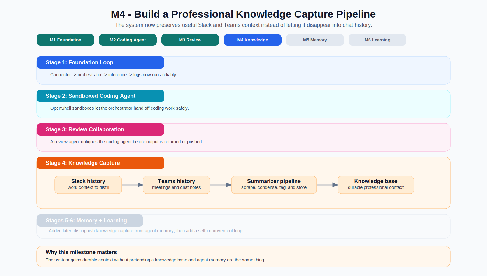
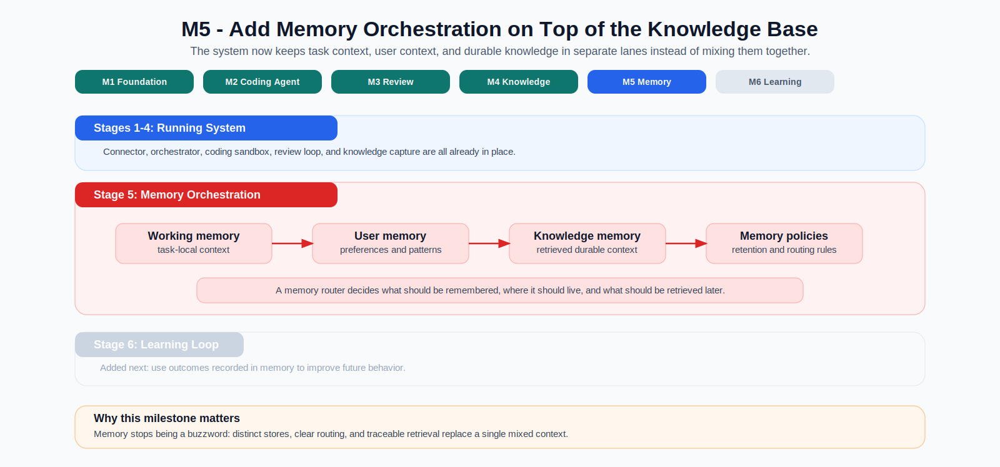

# Building Agents from Scratch — Series Introduction

## The Short Version

This post kicks off a series about building agent systems the hard way on
purpose.

OpenClaw, NemoClaw, Hermes, and OpenShell are all useful reference points, but
they can also make modern agents feel more mysterious than they need to be. If
you drop into those repos cold, you see a lot of moving parts at once:
connectors, orchestration, tools, sandboxes, memory, policies, deployment, and
sometimes multi-agent routing on top of all of that. It is easy to admire the
system and still not understand where the actual "agent" begins and ends.

This series is an attempt to make that architecture legible. We are going to
build our own agent stack from scratch, borrowing the best ideas from those
projects without treating any of them as a black box. The point is not to clone
an existing stack. The point is to understand agent systems by rebuilding their
core pieces ourselves.

This series also has two practical goals beyond the learning exercise itself:

1. Build toward a more enterprise-oriented multi-agent system on top of
  OpenShell and NemoClaw, with hardened interfaces, explicit policy boundaries,
  and a more constrained, governable shape than a wide-open OpenClaw-style
  runtime.
2. Provide step-by-step tutorials for how to use OpenShell and NemoClaw to build
  a real system. In that sense, the series is also extended documentation:
  concrete use-case-driven guidance instead of only abstract reference material.

## Why This Series Exists

There are already strong open-source examples to learn from:

- **OpenClaw** shows what a capable, tool-using agent system can look like.
- **Hermes** shows how skills, memory, and self-improvement loops can compound.
- **OpenShell** shows how to run powerful agents inside constrained sandboxes.
- **NemoClaw** shows how a harness can package policy and infrastructure around an
  agent runtime.

Taken together, those projects show what is possible and which building blocks
matter, but they can still feel opaque when you are trying to understand how
the whole system fits together. Finished agent stacks - while being great references -
hide the questions that actually matter when you are trying to learn how these systems work:

- What is the minimum viable orchestrator?
- What is the difference between a connector, an agent loop, and a sandbox?
- Which parts are infrastructure and which parts are "the agent"?
- When is a single-agent system enough, and when does multi-agent delegation
  actually help?
- How do you move from something that works on a laptop to something that can
  run continuously on managed infrastructure?

Rather than only studying those questions from diagrams and source dives, we
are going to answer them by building the system ourselves.

## What We Are Intending to Build

The project behind this series, `nemoclaw_escapades`, is aiming at a
production-oriented personal agent system: an always-on "super IC" that can
accept work through Slack, route tasks through an orchestrator, delegate to
sandboxed sub-agents, and eventually learn from outcomes over time.

At the same time, it is also a vehicle for exploring a more enterprise-oriented
shape for agent systems built on top of OpenShell and NemoClaw: hardened
interfaces, explicit policies that shape what agents can do, and tighter
operational constraints than a general-purpose, anything-goes agent runtime.

We are starting small on purpose. The first version is not a swarm of agents.
It is a clean single-agent baseline with explicit boundaries. From there, the
series layers in the pieces that make more advanced systems work in practice.

That makes the series useful in two ways. It is a build log for one concrete
system, and it is also a tutorial track for people who want to learn how to use
OpenShell and NemoClaw step by step through a real use case.

| Layer | Role in the system | Why it matters |
|---|---|---|
| Connector | Receives requests from Slack and returns results | Keeps channel-specific code out of core logic |
| Orchestrator | Owns the main loop, policy, routing, and delegation | This is the main brain of the system |
| Inference backend | Talks to model endpoints through a stable interface | Prevents lock-in to one provider or runtime (This is the LLM that completes the reasoning and coding) |
| Execution layer | Runs tools and sub-agents in constrained environments | Adds real capability without discarding safety (think of Claude Code in an isolated container) |
| Sandbox infrastructure | Isolates workflows with OpenShell | Separates agent behavior from runtime enforcement (and most importantly from the host and all your files) |
| Memory and knowledge | Stores durable context and retrieval state | Enables continuity, personalization, and learning |
| Review and reflection | Evaluates outputs and feeds lessons back | Turns one-off runs into a system that improves |

One of the recurring confusions in agent discussions is that the runtime, the
harness, the tool layer, and the agent loop get blurred together. A major goal
of this series is to unblur them.

## Why Build It From Scratch?

Because "from scratch" is the fastest way to stop treating agents as magic.

If you only interact with a finished framework, it is easy to miss which
abstractions are fundamental and which were just convenient implementation
choices. Rebuilding the stack forces us to answer concrete design questions:

- What should be generic from day one, such as connectors and inference
  backends?
- Where should safety live?
- What deserves to stay local first?
- What should eventually move onto managed infrastructure?
- When do additional agents add leverage, and when do they just add complexity?

That is the educational motivation behind this series. I do want to end up with
a working system (that scales my impact at work), but the deeper goal is to understand why the
system has the shape it does.

## Single-Agent First, Multi-Agent When Earned

A lot of agent writing jumps quickly to multi-agent systems as if multiple
agents are automatically better. This series takes the opposite approach.

We will start with a single orchestrator-based system that can accept a
request, build context, call an LLM, and return a useful response. Only after
that baseline is reliable and legible will we add:

- a sandboxed coding agent,
- a review agent,
- a knowledge and memory layer,
- and eventually a self-improvement loop.

That progression matches the design document: prove the core loop, then add
delegation, then collaboration, then memory, then learning. Multi-agent
behavior is something the system earns, not something we assume on day one.

## Local First, Then Real Deployment

Another goal of the series is to make deployment part of the story instead of
an afterthought.

A lot of agent demos quietly assume a laptop, an API key, and an interactive
terminal. That is useful for prototyping, but it hides the practical questions:

- What runs locally?
- What runs remotely?
- How do you keep long-running agents alive (for local agents you have to keep the laptop awake)?
- How do you observe them?
- How do you scale from one process on a laptop to managed infrastructure?

So the series follows a deliberate deployment arc:

1. Build a local-first baseline that is easy to reason about (and easy to run).
2. Use hosted inference where it makes sense.
3. Introduce sandboxed execution for stronger isolation.
4. Move toward always-on hosting on managed infrastructure such as Brev when
   the architecture deserves it.

This is not just a series about agent logic but just as much about deployment and productionization.

## What the Series Will Cover

Each post will focus on one design step, one concrete artifact, and one clear
definition of done. The roadmap below is how the philosophy above turns into a
working system.

| Post | Focus | What readers should get |
|---|---|---|
| Series introduction | Motivation, vocabulary, and system decomposition | A mental model for what an agent system is made of |
| M1 | Slack connector, orchestrator, and NVIDIA Inference Hub | A working end-to-end baseline |
| M2 | Sandboxed coding agent with OpenShell | Safe delegated execution |
| M3 | Review agent collaboration | A concrete multi-agent workflow |
| M4 | Slack and Teams note-taking plus professional knowledge capture | Durable external knowledge capture |
| M5 | SecondBrain plus Honcho-style memory orchestration | Separation of working, user, and knowledge memory |
| M6 | Self-improvement loop and skill evolution | How the system learns from outcomes |

## Visual Roadmap

The table above summarizes the milestones. The diagrams below show the same
roadmap as an architecture build-up, where each step keeps the earlier layers
and adds one major new capability.

### M1 - Foundation

Start with the minimum useful loop: connector, orchestrator, hosted inference,
and enough observability to understand what is happening.

### M2 - Sandboxed Coding Agent

Once the control loop is stable, add delegated execution inside an
`OpenShell` sandbox so the system can do real work under explicit constraints.

### M3 - Review Agent

Add a second agent that critiques the coding agent locally before results are
returned or pushed, creating the first real multi-agent workflow.

### M4 - Knowledge Capture

Add a note-taking and summarization pipeline so useful context from Slack and
Teams becomes a professional knowledge base instead of disappearing into chat
history.

### M5 - Memory Orchestration

Layer in explicit memory management so working context, user context, and
durable knowledge are routed and stored differently.

### M6 - Self-Improvement

Close the loop by evaluating outcomes, preserving lessons, and updating skills
or policies so the system changes how it behaves over time.

## What This Series Is Not

To keep the scope honest, a few things are intentionally out of scope for now:

- shipping the fastest possible bot by reusing a black-box stack unchanged,
- pretending NemoClaw itself is the agent,
- building a full enterprise platform before the core loop is understandable,
- solving long-horizon memory science in the first pass,
- or treating benchmarks and hype as more important than architectural clarity.

The point is to build something real enough to matter and simple enough to
understand.

## Learning Objectives for the Full Series

By the end of the series, readers should be able to:

- name the major components of a single-agent or multi-agent system,
- explain the difference between the agent loop and the infrastructure around
  it,
- build a minimal orchestrator that can actually run,
- reason about when to add delegation, review, memory, and learning,
- and understand how to move a local prototype toward a managed, always-on
  deployment.

If that happens, the series will have done its job.

## Sources and References

- [`docs/design.md`](../../design.md)
- [`docs/deep_dives/openclaw_deep_dive.md`](../../deep_dives/openclaw_deep_dive.md)
- [`docs/deep_dives/nemoclaw_deep_dive.md`](../../deep_dives/nemoclaw_deep_dive.md)
- [`docs/deep_dives/hermes_deep_dive.md`](../../deep_dives/hermes_deep_dive.md)
- [`docs/deep_dives/hermes_vs_openclaw_comparison.md`](../../deep_dives/hermes_vs_openclaw_comparison.md)
- [`docs/deep_dives/openshell_deep_dive.md`](../../deep_dives/openshell_deep_dive.md)
