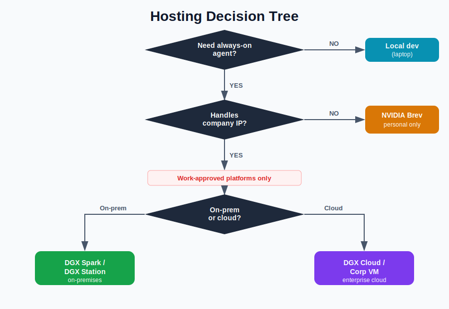

# Hosting & Infrastructure — Deep Dive

> Where to run the NemoClaw Escapades agent loop, and what NVIDIA
> infrastructure exists for always-on agent workloads.
>
> **Last reviewed:** 2026-03-31

---

## Table of Contents

1. [Overview](#1--overview)
2. [Security Classification — Personal vs. Work Deployments](#2--security-classification--personal-vs-work-deployments)
3. [Requirements for Always-On Agent Hosting](#3--requirements-for-always-on-agent-hosting)
4. [Option 1: DGX Spark (Best Local / Work-Approved)](#4--option-1-dgx-spark-best-local--work-approved)
5. [Option 2: DGX Station (Enterprise On-Premises)](#5--option-2-dgx-station-enterprise-on-premises)
6. [Option 3: DGX Cloud (Enterprise Cloud)](#6--option-3-dgx-cloud-enterprise-cloud)
7. [Option 4: NVIDIA Brev (Personal Only)](#7--option-4-nvidia-brev-personal-only)
8. [Option 5: Remote SSH (Any Linux VM)](#8--option-5-remote-ssh-any-linux-vm)
9. [Option 6: Local Development (Laptop/Desktop)](#9--option-6-local-development-laptopdesktop)
10. [Comparison Matrix](#10--comparison-matrix)
11. [Recommended Architecture](#11--recommended-architecture)
12. [Cost Analysis](#12--cost-analysis)
13. [Where the Core Agent Loop Runs](#13--where-the-core-agent-loop-runs)
14. [Decision Framework](#14--decision-framework)

---

## 1  Overview

The NemoClaw Escapades project needs an **always-on** runtime — the agent
should work around the clock, responding to Slack messages, running cron jobs,
and autonomously executing tasks even while the user is asleep or away.

This deep dive evaluates where to host this workload within the NVIDIA
ecosystem and beyond. See [§2](#2--security-classification--personal-vs-work-deployments)
for the hosting decision tree.

---

## 2  Security Classification — Personal vs. Work Deployments

When choosing where to host an agent that interacts with work-related data,
the key question is whether the platform's infrastructure is under corporate
IT control. Hosting platforms fall into two tiers:

| Classification | Meaning | Platforms |
|---|---|---|
| **Work-approved** | Infrastructure under corporate IT control — may handle internal code, proprietary data, credentials for internal services | DGX Spark, DGX Station, DGX Cloud, corporate-managed VMs |
| **Personal only** | Shared / multi-tenant infrastructure — suitable for personal projects, open-source work, and experimentation — **must not process company IP** | NVIDIA Brev, personal cloud VMs |

**Why Brev is personal-only:** Brev instances run on shared multi-tenant
cloud infrastructure not managed by corporate IT. Data at rest and network
egress are not governed by enterprise security policy. This makes Brev
excellent for personal AI assistants and open-source experimentation but
unsuitable for workloads that touch internal repos, proprietary code,
internal Slack workspaces, or work credentials.

**Implications for NemoClaw Escapades:** If the agent needs to interact with
internal services (Gerrit, internal GitLab, Jira, Confluence, internal Slack
channels, etc.), it **must** run on a work-approved platform. If the agent
only handles personal/open-source tasks, Brev remains a convenient option.



---

## 3  Requirements for Always-On Agent Hosting

| Requirement | Priority | Notes |
|-------------|----------|-------|
| **24/7 uptime** | Critical | Agent must run continuously, not just when laptop is open |
| **Docker support** | Critical | OpenShell requires Docker |
| **Network access** | Critical | Must reach Slack API, inference endpoints, GitHub/GitLab |
| **SSH access** | High | For `openshell gateway start --remote` |
| **GPU access** | Medium | Needed for local inference; optional if using cloud inference (build.nvidia.com) |
| **Persistent storage** | High | Skills, memory files, session databases must survive restarts |
| **Low latency to Slack** | Medium | Agent should respond quickly to messages |
| **Cost efficiency** | Medium | Avoid paying for idle GPU if using cloud inference |
| **Security classification** | Critical | Must be work-approved if handling company IP (see §2) |

---

## 4  Option 1: DGX Spark (Best Local / Work-Approved)

**[NVIDIA DGX Spark](https://www.nvidia.com/en-us/products/workstations/dgx-spark/)**
is a desktop AI supercomputer with the Grace Blackwell GB10 Superchip.
It is **work-approved** — data stays on physical hardware you control.

```
┌──────────────────────────────────────────────────────────────────────┐
│                    DGX Spark Deployment                              │
│                                                                      │
│  ┌─────────────────────────────────────────────────────────────────┐ │
│  │  DGX Spark (always-on, on desk)               🔒 WORK-APPROVED │ │
│  │                                                                 │ │
│  │  ┌─────────────────────────────────────────────────────────┐    │ │
│  │  │  Grace Blackwell GB10 Superchip                         │    │ │
│  │  │  • 128 GB unified memory                                │    │ │
│  │  │  • ~3,000 tok/s prompt processing (Nemotron 120B)       │    │ │
│  │  │  • Supports 128K+ context windows                       │    │ │
│  │  │  • 4–8 concurrent subagents without degradation         │    │ │
│  │  └─────────────────────────────────────────────────────────┘    │ │
│  │                                                                 │ │
│  │  ┌──────────────┐  ┌──────────────┐  ┌──────────────────────┐   │ │
│  │  │  OpenShell   │  │  Orchestrator│  │  Local Inference     │   │ │
│  │  │  Gateway     │  │  Sandbox     │  │  (Nemotron 120B,     │   │ │
│  │  │              │  │  (always-on) │  │   Qwen3 Coder 80B)   │   │ │
│  │  └──────────────┘  └──────────────┘  └──────────────────────┘   │ │
│  │                                                                 │ │
│  │  Pros: No recurring cost, fully on-prem, local inference,       │ │
│  │        work-approved for company IP                             │ │
│  │  Cons: Requires physical hardware (~$3,000?), not portable      │ │
│  └─────────────────────────────────────────────────────────────────┘ │
└──────────────────────────────────────────────────────────────────────┘
```

### DGX Spark Setup

```bash
# 1. Run Spark-specific setup (cgroup v2, Docker)
sudo nemoclaw setup-spark

# 2. Standard onboard
nemoclaw onboard

# 3. Connect
nemoclaw my-assistant connect
```

### DGX Spark Performance for Agent Workloads

| Metric | 1 Subagent | 4 Subagents |
|--------|-----------|-------------|
| Prompt processing (Nemotron 120B NVFP4) | ~2,855 tok/s | N/A |
| Token generation | ~18 tok/s | N/A |
| End-to-end latency (128K/1K) | 99s | N/A |
| Prompt throughput (Qwen3 80B, 32K/1K) | ~3,261 tok/s | ~9,616 tok/s |
| Token generation (Qwen3 80B) | ~38 tok/s | ~53 tok/s |

### Multi-Node Scaling (Advanced)

DGX Spark supports up to 4-node clusters for larger models:

| Topology | Memory | Use Case |
|----------|--------|----------|
| 1 node | 128 GB | Standard agent workloads, models up to 120B |
| 2 nodes (ring) | 256 GB | Larger models up to 400B, faster fine-tuning |
| 3 nodes (ring) | 384 GB | Fine-tuning larger models |
| 4 nodes (switch) | 512 GB | Models up to 700B, local AI factory |

---

## 5  Option 2: DGX Station (Enterprise On-Premises)

**[NVIDIA DGX Station](https://www.nvidia.com/en-us/products/workstations/dgx-station/)**
is a workstation-class AI computer with GB300 GPUs. It is **work-approved**
and purpose-built for enterprise on-premises agent deployments.

```
┌──────────────────────────────────────────────────────────────────────┐
│                    DGX Station Deployment              🔒 WORK-APPROVED│
│                                                                      │
│  ┌─────────────────────────────────────────────────────────────────┐ │
│  │  DGX Station (always-on, data center or office)                 │ │
│  │                                                                 │ │
│  │  ┌─────────────────────────────────────────────────────────┐    │ │
│  │  │  GB300 GPU(s)                                           │    │ │
│  │  │  • Large GPU memory pool                                │    │ │
│  │  │  • Handles 200B+ models locally                         │    │ │
│  │  │  • Enterprise-grade reliability                         │    │ │
│  │  └─────────────────────────────────────────────────────────┘    │ │
│  │                                                                 │ │
│  │  ┌──────────────┐  ┌──────────────┐  ┌──────────────────────┐   │ │
│  │  │  OpenShell   │  │  Orchestrator│  │  Local NIM           │   │ │
│  │  │  Gateway     │  │  Sandbox     │  │  Inference Server    │   │ │
│  │  │              │  │  (always-on) │  │  (Nemotron, Llama)   │   │ │
│  │  └──────────────┘  └──────────────┘  └──────────────────────┘   │ │
│  │                                                                 │ │
│  │  Pros: Enterprise-grade, high GPU memory, work-approved,        │ │
│  │        supports NIM for on-prem inference                       │ │
│  │  Cons: High upfront cost, requires physical space + power       │ │
│  └─────────────────────────────────────────────────────────────────┘ │
└──────────────────────────────────────────────────────────────────────┘
```

### Key Features

| Feature | Details |
|---------|---------|
| **Work-approved** | On-premises hardware under IT control — safe for company IP |
| **OpenShell native** | `openshell gateway start` runs directly; one-click Launchable via [build.nvidia.com/station/openshell](https://build.nvidia.com/station/openshell) |
| **NIM inference** | Run NVIDIA NIM microservices locally — data never leaves the machine |
| **Always-on** | Designed for 24/7 unattended operation |
| **GPU memory** | Enough to run 200B+ parameter models locally |
| **Enterprise support** | NVIDIA AI Enterprise license includes support |

### DGX Station Setup

```bash
# 1. Install OpenShell on DGX Station
# (follow build.nvidia.com/station/openshell instructions)

# 2. Start gateway
openshell gateway start

# 3. Deploy NemoClaw orchestrator sandbox
nemoclaw onboard

# 4. (Optional) Deploy NIM for local inference
docker run -d --gpus all nvcr.io/nim/meta/llama-3.3-70b-instruct:latest

# 5. Connect from laptop
openshell gateway start --remote user@dgx-station-host
```

### When to Choose DGX Station over DGX Spark

| Factor | DGX Spark | DGX Station |
|--------|-----------|-------------|
| Form factor | Desktop (compact) | Workstation (larger) |
| GPU class | GB10 (128 GB unified) | GB300 (more GPU memory) |
| Max local model | ~120B parameters | 200B+ parameters |
| Target user | Individual developer | Team / shared infrastructure |
| Price range | ~$3,000 | Higher (enterprise pricing) |

---

## 6  Option 3: DGX Cloud (Enterprise Cloud)

**[NVIDIA DGX Cloud](https://www.nvidia.com/en-us/data-center/dgx-cloud/)**
provides enterprise-managed GPU cloud infrastructure. When deployed through
NVIDIA's enterprise agreements, it is **work-approved** for company IP.

```
┌──────────────────────────────────────────────────────────────────────┐
│                    DGX Cloud Deployment                🔒 WORK-APPROVED│
│                                                                      │
│  ┌───────────┐      HTTPS       ┌─────────────────────────────┐      │
│  │  Laptop   │─────────────────▶│  DGX Cloud Instance         │      │
│  │  (local)  │                  │  (enterprise-managed)        │      │
│  │           │◀────────────────│                               │      │
│  └───────────┘                 │  ┌─────────────────────┐      │      │
│                                │  │  OpenShell Gateway   │     │      │
│  ┌───────────┐                 │  └──────────┬──────────┘      │      │
│  │  Slack    │◀────────────── │  ┌──────────┴──────────┐      │      │
│  │  (cloud)  │                │  │ Orchestrator Sandbox │     │      │
│  └───────────┘                │  │ (always-on)          │     │      │
│                                │  │ • Agent loop         │     │      │
│  ┌───────────┐                │  │ • Slack connector    │     │      │
│  │  NIM      │◀───────────── │  │ • Cron scheduler     │     │      │
│  │  (on-     │                │  └─────────────────────┘      │      │
│  │  cluster) │                │                               │      │
│  └───────────┘                │  GPU: A100/H100 (enterprise)  │      │
│                                └─────────────────────────────┘       │
└──────────────────────────────────────────────────────────────────────┘
```

### Key Features

| Feature | Details |
|---------|---------|
| **Work-approved** | Enterprise-managed cloud under NVIDIA security policies |
| **NIM on-cluster** | Deploy NIM microservices on your DGX Cloud allocation — inference stays within NVIDIA infra |
| **GPU options** | A100, H100 — enterprise-grade GPUs |
| **Always-on** | Persistent instances with enterprise SLAs |
| **Kubernetes-native** | Managed via Run:ai / Kubernetes for workload scheduling |
| **Scalable** | Scale GPU allocation up/down based on workload |

### Considerations

- Requires enterprise agreement / allocation through your team's DGX Cloud
  subscription.
- Higher cost than Brev, but the infrastructure is governed by NVIDIA IT
  policy.
- Best suited for teams that already have DGX Cloud access through their
  org.
- More operational overhead than Brev (Kubernetes, Run:ai scheduling).

---

## 7  Option 4: NVIDIA Brev (Personal Only)

> **⚠️ Security classification: PERSONAL ONLY.** Brev runs on shared
> multi-tenant cloud infrastructure outside the corporate security perimeter.
> **Do not use Brev for workloads that handle company IP, internal repos,
> or work credentials.**

**[NVIDIA Brev](https://brev.nvidia.com/)** is NVIDIA's GPU-accelerated
development platform providing streamlined access to GPU instances across
multiple cloud providers. It remains an excellent choice for personal projects,
open-source experimentation, and learning.

```
┌──────────────────────────────────────────────────────────────────────┐
│                    Brev Deployment Architecture       ⚠️ PERSONAL ONLY│
│                                                                      │
│  ┌───────────┐      HTTPS       ┌─────────────────────────────┐      │
│  │  Laptop   │─────────────────▶│  Brev Instance              │      │
│  │  (local)  │                  │                             │      │
│  │           │◀────────────────│  ┌─────────────────────┐     │      │
│  └───────────┘  SSH/Secure Link │  │  OpenShell Gateway  │    │      │
│                                 │  └──────────┬──────────┘    │      │
│  ┌───────────┐                  │             │               │      │
│  │  Slack    │◀────────────────│  ┌──────────┴──────────┐     │      │
│  │  (cloud)  │                 │  │ Orchestrator Sandbox│     │      │
│  └───────────┘                  │  │ (always-on)         │    │      │
│  │           │                  │                             │      │
│  ┌───────────┐                  │  │ • Agent loop        │    │      │
│  │build.     │◀─────────────────│  │ • Slack connector   │    │      │
│  │nvidia.com │                  │  │ • Cron scheduler    │    │      │
│  │(inference)│                  │  │ • Sub-agent spawner │    │      │
│  └───────────┘                  │  └─────────────────────┘    │      │
│                                 │                             │      │
│                                 │  GPU: Optional (for local   │      │
│                                 │  inference or coding tasks) │      │
│                                 └─────────────────────────────┘      │
└──────────────────────────────────────────────────────────────────────┘
```

### Key Features

| Feature | Details |
|---------|---------|
| **NemoClaw native support** | `nemoclaw deploy <instance>` directly provisions a Brev VM |
| **OpenShell Launchable** | One-click OpenShell gateway deployment via [brev.nvidia.com/launchable](https://brev.nvidia.com/launchable) |
| **Always-on** | Instances run 24/7 as long as billing continues |
| **GPU options** | L4 ($0.17/hr), T4 ($0.40/hr), A100 ($1.10/hr), H100 ($1.99/hr) |
| **CPU-only option** | Can run without GPU if using cloud inference (build.nvidia.com) |
| **Persistent storage** | `/home/ubuntu/workspace` persists across stops/restarts |
| **Multi-IDE support** | Cursor, VS Code, Jupyter integration |
| **Secure Links** | HTTPS URLs for gateway access without VPN |
| **Pre-configured** | Python, CUDA, Docker, Jupyter pre-installed |

### Brev Deployment Steps

```bash
nemoclaw deploy my-agent

# Reconnect later
nemoclaw deploy my-agent    # reconnects to existing instance

# Monitor from host
ssh my-agent 'cd ~/nemoclaw && openshell term'
```

### Always-On Configuration

```
┌───────────────────────────────────────────────────────────────┐
│  Brev Always-On Options                                       │
│                                                               │
│  Option A: Standard Instance (recommended)                    │
│  • Instance runs 24/7                                         │
│  • Per-hour billing (GPU or CPU)                              │
│  • Data persists in /home/ubuntu/workspace                    │
│  • Stop instance to pause billing (data preserved)            │
│                                                               │
│  Option B: Serverless Deployment                              │
│  • min_workers: 1 for always-on (no cold starts)              │
│  • min_workers: 0 for scale-to-zero (30-60s cold start)       │
│  • Per-second billing while workers active                    │
│                                                               │
│  Recommendation: Standard instance for the orchestrator       │
│  (always-on, needs persistent state), serverless for          │
│  ephemeral coding sandboxes (scale-to-zero OK)                │
└───────────────────────────────────────────────────────────────┘
```

### Estimated Monthly Cost

| Configuration | Hourly | Monthly (730h) |
|--------------|--------|----------------|
| CPU-only (cloud inference) | ~$0.05–0.10 | ~$36–73 |
| L4 GPU | $0.17 | ~$124 |
| T4 GPU | $0.40 | ~$292 |
| L4 spot | $0.05 | ~$37 |
| A100 (overkill for orchestrator) | $1.10 | ~$803 |

### What Brev Is Still Good For

- Prototyping and learning NemoClaw/OpenShell before committing to hardware
- Personal AI assistants that don't touch NVIDIA internal services
- Open-source development and experimentation
- Demos and proof-of-concept work with public data

---

## 8  Option 5: Remote SSH (Any Linux VM)

Any Linux machine with Docker can host the agent via SSH. Security
classification depends on who manages the VM — a corporate-managed VM behind
the NVIDIA firewall is work-approved; a personal cloud VM is not.

```
┌───────────────────────────────────────────────────────────────────────┐
│                    Remote SSH Deployment                              │
│                                                                       │
│  ┌──────────┐      SSH        ┌──────────────────────────────────┐    │
│  │  Laptop  │───────────────▶ │  Linux VM (cloud or on-prem)     │    │
│  │  (CLI)   │                 │                                  │    │
│  └──────────┘                │  Requirements:                     │   │
│                               │  • Docker installed              │    │
│                               │  • SSH access                    │    │
│                               │  • 8+ GB RAM                     │    │
│                               │  • 20+ GB disk                   │    │
│                               │                                  │    │
│                               │  Setup:                          │    │
│                               │  $ openshell gateway start \     │    │
│                               │      --remote user@host          │    │
│                               │  $ openshell sandbox create \    │    │
│                               │      --from openclaw             │    │
│                               └──────────────────────────────────┘    │
│                                                                       │
│  Work-approved sources:                                               │
│  • Corporate-managed VMs (behind NVIDIA firewall)                     │
│  • DGX Cloud instances                                                │
│                                                                       │
│  Personal-only sources:                                               │
│  • AWS EC2 (t3.medium ~$30/mo)                                        │
│  • GCP Compute Engine                                                 │
│  • DigitalOcean ($5-24/mo droplets)                                   │
│  • Hetzner ($4-10/mo)                                                 │
└───────────────────────────────────────────────────────────────────────┘
```

---

## 9  Option 6: Local Development (Laptop/Desktop)

Good for development and testing, but not suitable for always-on operation.
Security classification depends on whether the laptop is corporate-managed.

```
┌───────────────────────────────────────────────────────────────┐
│  Local Development                                            │
│                                                               │
│  Setup:                                                       │
│  $ nemoclaw onboard    # one-time setup                       │
│  $ nemoclaw my-assistant connect                              │
│                                                               │
│  Pros:                                                        │
│  • Zero cost                                                  │
│  • Fastest iteration cycle                                    │
│  • Full control                                               │
│                                                               │
│  Cons:                                                        │
│  • Not always-on (sleeps when laptop sleeps)                  │
│  • macOS needs Colima/Docker Desktop                          │
│  • Limited by laptop resources                                │
│                                                               │
│  Verdict: Use for development, not for production agent.      │
│  Deploy to DGX Spark, DGX Station, or DGX Cloud for          │
│  always-on work-approved operation.                           │
└───────────────────────────────────────────────────────────────┘
```

---

## 10  Comparison Matrix

| Feature | DGX Spark | DGX Station | DGX Cloud | Brev | Remote VM | Local |
|---|---|---|---|---|---|---|
| **Security class** | 🔒 Work | 🔒 Work | 🔒 Work | ⚠️ Personal | Depends† | Depends† |
| **Always-on** | ✅ | ✅ | ✅ | ✅ | ✅ | ❌ |
| **NemoClaw native** | ✅ (spark) | ✅ | ✅ | ✅ (deploy) | ✅ (SSH) | ✅ (onboard) |
| **GPU** | ✅ | ✅ | ✅ | ✅ | Optional | Optional |
| **Local inference** | ✅ | ✅ | ✅ (NIM) | ❌ | ❌ | ❌ |
| **Persistent storage** | ✅ | ✅ | ✅ | ✅ | ✅ | ✅ |
| **Cost/month** | $0* | $0* | Enterprise | $37–292 | $4–73 | $0 |
| **Setup effort** | Medium | Medium | High | Low | Medium | Low |

\* DGX Spark/Station have upfront hardware cost but no recurring fees.
† Corporate-managed VMs/laptops are work-approved; personal ones are not.

---

## 11  Recommended Architecture

### Phase 1: Development (Now)

```
┌───────────────────────────────────────────────────────────────┐
│  Development Phase                                            │
│                                                               │
│  ┌──────────────┐         ┌────────────────────────────────┐  │
│  │  Laptop      │────────▶│  Local OpenShell               │  │
│  │  (macOS)     │         │  + Docker Desktop / Colima     │  │
│  │              │         │                                │  │
│  │  nemoclaw    │         │  Sandbox with orchestrator     │  │
│  │  onboard     │         │  prototype                     │  │
│  └──────────────┘         └────────────────────────────────┘  │
│                                     │                         │
│                                     ▼                         │
│                            ┌───────────────────┐              │
│                            │  build.nvidia.com │              │
│                            │  (cloud inference)│              │
│                            └───────────────────┘              │
│                                                               │
│  Cost: $0                                                     │
│  Uptime: When laptop is awake                                 │
│  Security: OK for prototyping (corp laptop)                   │
└───────────────────────────────────────────────────────────────┘
```

### Phase 2: Always-On (Milestone 1+)

Two paths depending on whether the agent handles company IP:

```
┌───────────────────────────────────────────────────────────────────────┐
│  Always-On Phase — WORK (handles company IP)        🔒 WORK-APPROVED  │
│                                                                       │
│  ┌──────────┐                ┌─────────────────────────────────┐      │
│  │  Laptop  │── SSH ───────▶ │  DGX Spark / DGX Station        │      │
│  │  (dev &  │                │  (on-premises, under IT control) │      │
│  │  monitor)│                │                                 │      │
│  └──────────┘               │  ┌────────────────────────────┐  │      │
│                             │  │  OpenShell Gateway         │  │      │
│  ┌──────────┐               │  └───────────┬────────────────┘  │      │
│  │  Slack   │◀─────────────│               │                   │      │
│  │(internal)│               │  ┌───────────┴────────────────┐  │      │
│  └──────────┘               │  │  ORCHESTRATOR SANDBOX      │  │      │
│                             │  │  (always-on)               │  │      │
│  ┌──────────┐               │  │                            │  │      │
│  │  NIM /   │◀───────────── │  │  • Agent loop              │  │      │
│  │  build.  │               │  │  • Slack connector         │  │      │
│  │nvidia.com│               │  │  • Cron scheduler          │  │      │
│  └──────────┘               │  │  • Memory & skills         │  │      │
│                             │  └───────────┬────────────────┘  │      │
│                             │              │ spawns             │     │
│                             │  ┌───────────┴────────────────┐  │      │
│                             │  │  EPHEMERAL CODING SANDBOXES│  │      │
│                             │  │  (created on demand)       │  │      │
│                             │  └────────────────────────────┘  │      │
│                             └─────────────────────────────────┘       │
│                                                                       │
│  Cost: $0/month (DGX Spark after HW) or enterprise (DGX Cloud)       │
│  Uptime: 24/7                                                         │
└───────────────────────────────────────────────────────────────────────┘

┌───────────────────────────────────────────────────────────────────────┐
│  Always-On Phase — PERSONAL (open-source / non-IP work) ⚠️ PERSONAL   │
│                                                                       │
│  ┌──────────┐                ┌─────────────────────────────────┐      │
│  │  Laptop  │── SSH ───────▶ │  NVIDIA Brev Instance           │      │
│  │  (dev &  │                │  (L4 GPU or CPU-only)           │      │
│  │  monitor)│                │                                 │      │
│  └──────────┘               │  ┌────────────────────────────┐  │      │
│                             │  │  OpenShell Gateway         │  │      │
│                             │  └───────────┬────────────────┘  │      │
│                             │  ┌───────────┴────────────────┐  │      │
│                             │  │  ORCHESTRATOR SANDBOX      │  │      │
│                             │  │  (always-on, personal only)│  │      │
│                             │  └────────────────────────────┘  │      │
│                             └─────────────────────────────────┘       │
│                                                                       │
│  Cost: ~$37-124/month (L4 spot → L4 on-demand)                        │
│  Uptime: 24/7                                                         │
└───────────────────────────────────────────────────────────────────────┘
```

### Phase 3: Full Production (Milestone 4+)

```
┌───────────────────────────────────────────────────────────────────────┐
│  Production Phase (with self-learning loop)           🔒 WORK-APPROVED │
│                                                                       │
│  ┌────────────────────────────────────────────────────────────┐       │
│  │  DGX Spark / DGX Station / DGX Cloud                      │       │
│  │                                                            │       │
│  │  ┌──────────────────────────────────────────────────────┐  │       │
│  │  │  ORCHESTRATOR SANDBOX                                │  │       │
│  │  │                                                      │  │       │
│  │  │  Agent Loop                                          │  │       │
│  │  │  ├── Slack Connector (inbound messages)              │  │       │
│  │  │  ├── Cron Scheduler (timed tasks)                    │  │       │
│  │  │  ├── Policy Engine (custom policies for sub-agents)  │  │       │
│  │  │  ├── Skills System (auto-created, self-improving)    │  │       │
│  │  │  ├── Memory System (MEMORY.md + USER.md + Honcho)    │  │       │
│  │  │  ├── Session Search (SQLite FTS5)                    │  │       │
│  │  │  └── Sub-Agent Manager                               │  │       │
│  │  │       ├── Coding Agent (OpenShell + Claude Code)     │  │       │
│  │  │       ├── Review Agent (OpenShell + custom)          │  │       │
│  │  │       ├── Research Agent (OpenShell + web tools)     │  │       │
│  │  │       └── Note-Taking Agent (OpenShell + scraper)    │  │       │
│  │  └──────────────────────────────────────────────────────┘  │       │
│  │                                                            │       │
│  │  Network Policy (orchestrator):                            │       │
│  │  • api.slack.com (Slack API)                               │       │
│  │  • NIM local / build.nvidia.com (inference)                │       │
│  │  • secondbrain-api.local (SecondBrain)                     │       │
│  │  • github.com, gitlab.com (code hosting)                   │       │
│  │  • honcho.dev (user modeling)                              │       │
│  └────────────────────────────────────────────────────────────┘       │
│                                                                       │
│  Cost: $0/month (DGX Spark/Station) or enterprise (DGX Cloud)         │
│  Uptime: 24/7                                                         │
└───────────────────────────────────────────────────────────────────────┘
```

---

## 12  Cost Analysis

### Monthly Hosting Cost Estimates

| Scenario | Platform | Security | Cost/Month |
|----------|----------|----------|------------|
| **Development** | Local (laptop) | Depends | $0 |
| **Work always-on (recommended)** | DGX Spark (after HW) | 🔒 Work | $0 (electricity) |
| **Work always-on (cloud)** | DGX Cloud | 🔒 Work | Enterprise pricing |
| **Work always-on (station)** | DGX Station (after HW) | 🔒 Work | $0 (electricity) |
| **Personal always-on (budget)** | Brev L4 spot | ⚠️ Personal | ~$37 |
| **Personal always-on (standard)** | Brev L4 on-demand | ⚠️ Personal | ~$124 |
| **Personal cheap VM** | Hetzner / DigitalOcean | ⚠️ Personal | ~$5–24 |
| **Personal NVIDIA cloud** | Brev CPU-only + cloud inference | ⚠️ Personal | ~$36–73 |

### Inference Cost (build.nvidia.com)

Using cloud inference via build.nvidia.com avoids the need for a local GPU.
The orchestrator and sub-agents make inference calls over the network, and
OpenShell handles the routing transparently.

| Model | Context | Use Case |
|-------|---------|----------|
| Nemotron 3 Super 120B | 131K | Default for NemoClaw |
| Nemotron 3 Nano 30B | 131K | Fast, cheap tasks |
| Nemotron Ultra 253B | 131K | Complex reasoning |

---

## 13  Where the Core Agent Loop Runs

The core agent loop is the always-on process that receives tasks, delegates to
sub-agents, and manages the self-learning cycle. Here's how it maps to the
hosting options.

### Why Does the Agent Loop Run in a Sandbox?

OpenShell's fundamental unit of execution is a **sandbox** (a policy-controlled
Docker container managed by the gateway). The orchestrator runs in a sandbox
not because it needs to be isolated from itself, but because:

1. **It's how OpenShell works.** The gateway manages all workloads as sandboxes
   — there is no "bare-metal" execution mode. If you want the gateway to manage
   your process (lifecycle, networking, credential injection, inference
   routing), it has to be in a sandbox.
2. **The orchestrator spawns child sandboxes.** Sub-agents (coding agent,
   review agent, research agent) each run in their own ephemeral sandbox with
   minimal, task-specific policies. The orchestrator creates these via the
   `openshell` CLI from within its own sandbox, through the gateway.
3. **Policy-controlled networking.** The sandbox model gives the orchestrator a
   declared network policy — it can only reach the endpoints it's authorized
   for (Slack API, inference endpoints, GitHub, etc.). Running directly on the
   host would bypass this and leave networking uncontrolled.
4. **Kernel-level isolation.** Each sandbox gets Landlock + seccomp + network
   namespace isolation. Even the orchestrator itself is constrained, not just
   its children.
5. **Portability.** Because it's a Docker container, the same orchestrator
   sandbox runs identically whether the host is a Brev instance, a DGX Spark,
   a Linux VM, or a laptop. The hosting option determines *where* the gateway
   runs, not *how* the agent runs.

### Agent Loop Hosting Map

```
┌───────────────────────────────────────────────────────────────────────┐
│                    Agent Loop Hosting Map                             │
│                                                                       │
│  The agent loop is a Python process that:                             │
│  • Listens for Slack messages                                         │
│  • Runs cron jobs on schedule                                         │
│  • Calls inference endpoints                                          │
│  • Spawns sub-agent sandboxes                                         │
│  • Manages skills and memory                                          │
│                                                                       │
│  It runs INSIDE an OpenShell sandbox on whatever host you choose:     │
│                                                                       │
│  ┌───────────────────────────────────────────────────────────────┐    │
│  │  Host Machine (DGX Spark / DGX Station / DGX Cloud / VM)      │    │
│  │                                                               │    │
│  │  ┌─────────────────────────────────────────────────────────┐  │    │
│  │  │  OpenShell Gateway                                      │  │    │
│  │  └───────────────────────────┬─────────────────────────────┘  │    │
│  │                              │                                │    │
│  │  ┌───────────────────────────┴─────────────────────────────┐  │    │
│  │  │  Orchestrator Sandbox (Docker container)                │  │    │
│  │  │                                                         │  │    │
│  │  │  ┌───────────────────────────────────────────────────┐  │  │    │
│  │  │  │  Python Agent Loop                                │  │  │    │
│  │  │  │                                                   │  │  │    │
│  │  │  │  while True:                                      │  │  │    │
│  │  │  │    check_slack_messages()                         │  │  │    │
│  │  │  │    check_cron_jobs()                              │  │  │    │
│  │  │  │    process_task_queue()                           │  │  │    │
│  │  │  │    run_self_learning_loop()                       │  │  │    │
│  │  │  │    sleep(poll_interval)                           │  │  │    │
│  │  │  └───────────────────────────────────────────────────┘  │  │    │
│  │  │                                                         │  │    │
│  │  │  Files:                                                 │  │    │
│  │  │  /sandbox/skills/     ← auto-created skills             │  │    │
│  │  │  /sandbox/memory/     ← MEMORY.md, USER.md              │  │    │
│  │  │  /sandbox/state.db    ← session history (SQLite)        │  │    │
│  │  │  /sandbox/config.yaml ← agent configuration             │  │    │
│  │  └─────────────────────────────────────────────────────────┘  │    │
│  └───────────────────────────────────────────────────────────────┘    │
└───────────────────────────────────────────────────────────────────────┘
```

### How Is Data Persisted?

The agent's state — skills, memory, session history, configuration — lives
inside the sandbox at `/sandbox/`. Since the sandbox is a Docker container,
this data is **only as durable as the container itself**. If the container is
deleted (`openshell sandbox delete`) or the host machine is wiped, anything not
backed up externally is lost.

This matters most on **Brev**, where the host is a cloud VM you don't
physically control.

#### What survives what?

| Event | Sandbox data (`/sandbox/`) | Host data (`/home/ubuntu/workspace`) |
|-------|---------------------------|--------------------------------------|
| Agent process crash | Survives (container still running) | Survives |
| Sandbox restart | Survives (Docker restart policy) | Survives |
| `openshell sandbox delete` | **Lost** | Survives |
| Brev instance **stop** (pause billing) | **Lost** (container removed) | Survives (EBS-backed) |
| Brev instance **restart** | **Lost** (container removed) | Survives |
| Brev instance **terminate** | **Lost** | **Lost** |
| DGX Spark reboot | Survives (Docker restart policy, local disk) | Survives |

The critical gap: on Brev, stopping and restarting the instance to save cost
(or a host-level crash) destroys all sandbox containers, but the host
filesystem at `/home/ubuntu/workspace` persists.

#### Mitigation strategies

**1. Volume-mount sandbox state to the gateway host's filesystem**

The most direct fix. Mount a directory from the gateway host into the sandbox
so writes go to the persistent Brev volume:

```bash
# Run from your laptop — but the mount path refers to the BREV VM's
# filesystem, not your laptop's. --mount is a Docker bind mount on
# the machine where the gateway runs.
openshell sandbox create \
  --mount /home/ubuntu/workspace/agent-state:/sandbox/state \
  --from nemoclaw-orchestrator
```

With this, `/sandbox/state/` inside the container is backed by
`/home/ubuntu/workspace/agent-state/` on the Brev VM. If the container dies,
the data is still on disk. On next `sandbox create` with the same mount, the
agent picks up where it left off.

> **Note:** `--mount` cannot reach your laptop's filesystem — it's a Docker
> bind mount local to the gateway host. For cross-host file transfer, use
> `openshell sandbox upload/download` (one-shot) or mirror mode (sync
> before/after execution). For continuous sync, use git or an external tool
> like rsync or Syncthing.

**Brev host access:** Brev instances are full Linux VMs — not serverless black
boxes. You get a regular `ubuntu` user with sudo and full SSH access:

```bash
# Direct SSH into the Brev host (bypassing OpenShell entirely)
ssh ubuntu@<brev-hostname>

# From there, you can:
ls /home/ubuntu/workspace/agent-state/   # verify mounted data
docker ps                                # inspect sandbox containers
docker logs <container-id>               # read container logs
```

You can also use the OpenShell CLI from your laptop, which tunnels through SSH
transparently (`openshell gateway start --remote ubuntu@brev-host`). Either
way, the host filesystem is fully accessible — you can inspect mounted data,
run manual backups, install packages, or manage Docker directly.

**2. Periodic backup to host or cloud storage**

Use `openshell sandbox download` (or a cron job inside the sandbox) to
periodically snapshot critical files to a durable location:

```bash
# From inside the sandbox (cron job every 15 minutes)
cp -r /sandbox/skills/ /sandbox/memory/ /sandbox/state.db /backup/

# From the host (or a monitoring script)
openshell sandbox download orchestrator /sandbox/state.db \
  /home/ubuntu/workspace/backups/
```

**3. Git-based persistence for skills and memory**

Commit skills (SKILL.md files) and memory (MEMORY.md, USER.md) to a git repo
periodically. This gives you versioned history and off-host durability:

```bash
# Inside the sandbox (cron or post-task hook)
cd /sandbox/skills && git add -A && git commit -m "auto-save" && git push
```

**4. External database for session history**

Instead of local SQLite, use a managed database (e.g., Turso for SQLite-over-
HTTP, or a cloud PostgreSQL instance). Session history is the hardest data to
reconstruct, so externalizing it gives the strongest durability guarantee.

#### Recommended approach

Combine strategies 1 and 3: volume-mount `/sandbox/` to the Brev host
filesystem for immediate durability, and push skills + memory to a git remote
for off-host redundancy. This means a Brev stop/restart only costs you a
`sandbox create` command — no data loss.

On **DGX Spark**, the risk is lower. Docker containers survive reboots (with
`restart: always`), and the local disk is under your physical control. Volume
mounts to the local filesystem are still recommended for defense in depth.

### Can We Use NemoClaw (OpenClaw inside sandbox) as the Agent Loop?

**Option A: OpenClaw as the agent loop (NemoClaw default)**

- OpenClaw is already a capable agent with skills, memory, multi-channel
  messaging, and tool use.
- `nemoclaw onboard` gives you this out of the box.
- Fastest path to Milestone 1.
- BUT: customizing the agent loop requires modifying OpenClaw internals. Pi
  (the agent runtime) is tightly coupled to the Gateway and cannot run
  without it.

**Option B: Hermes agent (direct or forked)**

- [Hermes](https://github.com/nousresearch/hermes-agent) is MIT-licensed and
  designed to run anywhere — including inside a Docker container / OpenShell
  sandbox.
- Unlike OpenClaw, `AIAgent` is a self-contained Python class that can run
  standalone (no mandatory daemon). Any entry point can instantiate one.
- Already has the subsystems this project needs: skills (SKILL.md),
  bounded memory (MEMORY.md / USER.md), cron scheduling, sub-agent
  delegation, session search (SQLite FTS5), and Honcho user modeling.
- Supports any OpenAI-compatible inference endpoint via `base_url` config,
  so pointing it at build.nvidia.com is configuration-only.
- Two sub-options:
  - **Run Hermes directly** — install inside an OpenShell sandbox, configure
    providers and a Slack gateway adapter, and use it as-is. Gives you the
    full self-learning loop immediately.
  - **Fork / lift components** — take the specific pieces you need and
    integrate them into a custom orchestrator. The most liftable components:

  | Component | Liftability | Notes |
  |-----------|-------------|-------|
  | Skills system (SKILL.md format) | High | File-based, standard [agentskills.io](https://agentskills.io) format |
  | Memory system (MEMORY.md / USER.md) | High | Simple file-based, bounded, well-designed |
  | Provider resolver (`base_url` config) | High | Pluggable backends, any OpenAI-compatible endpoint |
  | Self-learning loop logic | Medium | Emergent from skills + memory + nudges; needs prompt engineering |
  | Agent loop (`AIAgent`) | Medium | Tightly coupled to Hermes internals, but the pattern is replicable |
  | Gateway platform adapters | Low | Platform-specific; better to build a dedicated Slack adapter |

- See [Hermes Deep Dive §19](hermes_deep_dive.md#19--what-to-lift-for-nemoclaw-escapades)
  for a per-milestone breakdown of what to lift.

**Option C: Custom agent loop from scratch in OpenShell sandbox**

- Use `openshell sandbox create --from base` for a minimal sandbox.
- Install Python + dependencies.
- Build a fully custom orchestrator (Hermes-inspired but not derived).
- Full control over skills, memory, self-learning.
- Most work but most flexibility — no upstream dependencies.

**Option D: Hybrid (recommended)**

- Start with NemoClaw (OpenClaw) for M1–M2 — fastest way to a working
  always-on agent.
- Lift Hermes patterns (skills format, memory system, self-learning prompts)
  into a custom orchestrator layer for M3–M6.
- Use OpenClaw as a "sub-agent runtime" (it already supports agents and
  tools) while the orchestrator handles scheduling, delegation, and the
  learning loop.
- Alternatively, if Hermes proves sufficient at M1, skip the OpenClaw
  dependency and evolve the Hermes fork directly.

---

## 14  Decision Framework

### Recommended Path (Work — Handles Company IP)

```
┌──────────────────────────────────────────────────────────────────────┐
│              Recommended Hosting Strategy (Work)      🔒 WORK-APPROVED│
│                                                                      │
│  NOW (Development & M1 prototype)                                    │
│  ┌──────────────────────────────────────────────────────────────┐    │
│  │  Local development (corporate laptop + Docker)               │    │
│  │  • nemoclaw onboard locally                                  │    │
│  │  • Cloud inference via build.nvidia.com                      │    │
│  │  • Iterate fast on agent loop design                         │    │
│  │  • Cost: $0                                                  │    │
│  └──────────────────────────────────────────────────────────────┘    │
│                              │                                       │
│                              ▼                                       │
│  M1 COMPLETE (Deploy for always-on)                                  │
│  ┌──────────────────────────────────────────────────────────────┐    │
│  │  DGX Spark (on desk, always-on)                              │    │
│  │  • nemoclaw onboard + setup-spark                            │    │
│  │  • 24/7 operation, zero recurring cost                       │    │
│  │  • Local inference (Nemotron 120B) or cloud inference         │    │
│  │  • Slack connector always listening                          │    │
│  │  • Cost: $0/month (after ~$3,000 HW)                         │    │
│  │                                                              │    │
│  │  OR: DGX Station / DGX Cloud (if available through org)      │    │
│  └──────────────────────────────────────────────────────────────┘    │
│                              │                                       │
│                              ▼                                       │
│  M3+ (Coding agents need more resources)                             │
│  ┌──────────────────────────────────────────────────────────────┐    │
│  │  DGX Spark (single or multi-node) or DGX Station             │    │
│  │  • Orchestrator sandbox (always-on)                          │    │
│  │  • Ephemeral coding sandboxes (created per-task)             │    │
│  │  • NIM local inference for coding tasks                      │    │
│  │  • Cost: $0/month (Spark/Station) or enterprise (DGX Cloud)  │    │
│  └──────────────────────────────────────────────────────────────┘    │
│                                                                      │
│  ⚠️  Do NOT use Brev for work-related agent deployments.             │
│  See §2 for security classification details.                         │
└──────────────────────────────────────────────────────────────────────┘
```

### Alternative Path (Personal — No Company IP)

```
┌──────────────────────────────────────────────────────────────────────┐
│              Hosting Strategy (Personal)              ⚠️ PERSONAL ONLY│
│                                                                      │
│  Brev remains the easiest path for personal/open-source agents:      │
│                                                                      │
│  ┌──────────────────────────────────────────────────────────────┐    │
│  │  NVIDIA Brev (L4 spot or CPU-only)                           │    │
│  │  • nemoclaw deploy my-agent                                  │    │
│  │  • 24/7 operation                                            │    │
│  │  • Cost: ~$37-124/month                                      │    │
│  │  • ⚠️  No company IP, internal repos, or credentials           │    │
│  └──────────────────────────────────────────────────────────────┘    │
└──────────────────────────────────────────────────────────────────────┘
```

---

### Sources

- [NVIDIA Brev Documentation](https://docs.nvidia.com/brev/latest/)
- [Brev Pricing](https://brev.dev/pricing)
- [Brev GPU Instances](https://docs.nvidia.com/brev/concepts/gpu-instances)
- [Brev Serverless Deployments](https://docs.nvidia.com/brev/latest/guides/inference-deployment/serverless-deployments)
- [NemoClaw Deploy to Remote GPU](https://docs.nvidia.com/nemoclaw/latest/deployment/deploy-to-remote-gpu.html)
- [DGX Spark + Autonomous Agents Blog](https://developer.nvidia.com/blog/scaling-autonomous-ai-agents-and-workloads-with-nvidia-dgx-spark/)
- [OpenShell on DGX Station](https://build.nvidia.com/station/openshell) — work-approved agent deployment
- [OpenShell on DGX Spark](https://build.nvidia.com/spark/openshell/instructions)
- [NVIDIA DGX Cloud](https://www.nvidia.com/en-us/data-center/dgx-cloud/) — enterprise cloud GPU infrastructure
- [NIM Secure Deployment](https://developer.nvidia.com/blog/securely-deploy-ai-models-with-nvidia-nim/) — on-premises inference
- [OpenShell Deployment Modes](https://docs.nvidia.com/openshell/latest/about/architecture.html)