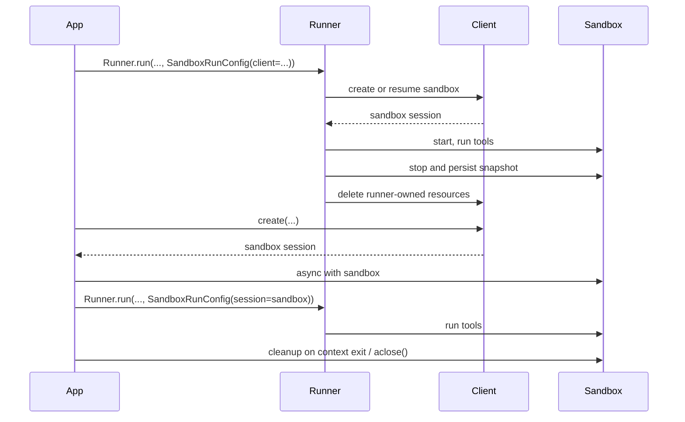

# OpenAI Agents SDK — Deep Dive

> **Source:** [openai/openai-agents-python](https://github.com/openai/openai-agents-python)
> (25.2k stars, MIT license, version 0.14.6 at time of review)
>
> **Official docs:** [openai.github.io/openai-agents-python](https://openai.github.io/openai-agents-python/)
>
> **Local checkout:** `~/workspace/openai-agents-python`
>
> **Last reviewed:** 2026-04-25

---

## Table of Contents

1. [Overview](#1--overview)
2. [Why This Matters for NemoClaw](#2--why-this-matters-for-nemoclaw)
3. [Architecture at a Glance](#3--architecture-at-a-glance)
4. [Sandbox Agents — The Headline Feature](#4--sandbox-agents--the-headline-feature)
5. [Manifests: A First-Class Workspace Contract](#5--manifests-a-first-class-workspace-contract)
6. [Capabilities: Composable Sandbox-Native Tools](#6--capabilities-composable-sandbox-native-tools)
7. [Snapshots and Session State](#7--snapshots-and-session-state)
8. [Lazy Skills with `load_skill`](#8--lazy-skills-with-load_skill)
9. [Sandbox Agents as Tools and Handoffs](#9--sandbox-agents-as-tools-and-handoffs)
10. [Comparison Matrix: SDK vs. NemoClaw Today](#10--comparison-matrix-sdk-vs-nemoclaw-today)
11. [What to Adopt — Prioritized](#11--what-to-adopt--prioritized)
12. [What Not to Adopt](#12--what-not-to-adopt)
13. [Open Questions](#13--open-questions)

---

## 1  Overview

The OpenAI Agents SDK (`openai-agents`) is OpenAI's official Python framework for building multi-agent workflows.  At time of review it is on `v0.14.6`, has 25.2k GitHub stars, and is MIT-licensed.  The SDK is provider-agnostic — it speaks the OpenAI Responses API natively and supports 100+ other LLMs via LiteLLM and `any-llm`.

The SDK has nine core concepts (taken verbatim from the README):

1. **Agents** — LLMs configured with instructions, tools, guardrails, and handoffs.
2. **Sandbox Agents** — agents preconfigured to work with a container to perform work over long time horizons.
3. **Agents as tools / Handoffs** — delegating to other agents for specific tasks.
4. **Tools** — functions, MCP servers, and hosted tools.
5. **Guardrails** — configurable safety checks for input and output validation.
6. **Human in the loop** — built-in mechanisms for involving humans across agent runs.
7. **Sessions** — automatic conversation history management across agent runs.
8. **Tracing** — built-in tracking of agent runs.
9. **Realtime Agents** — voice agents with `gpt-realtime-1.5`.

For NemoClaw, **the second one — Sandbox Agents — is the prize.**  Almost every other concept has a working analog in our codebase already.  Sandbox Agents is the one feature where the SDK has done a year of work that we are about to repeat.  This deep dive is therefore weighted heavily toward that surface.

Repo size for context:

| Component | LOC | Notes |
|---|---|---|
| `src/agents/run.py` (Runner core) | 1861 | Core orchestration |
| `src/agents/tool.py` | 1938 | Function tools, MCP, hosted tools |
| `src/agents/sandbox/` (whole subtree) | ~9000 | Sandbox runtime + capabilities + clients |
| `src/agents/sandbox/sandbox_agent.py` | 57 | The `SandboxAgent` dataclass itself — surprisingly small |
| `src/agents/sandbox/manifest.py` | 258 | `Manifest` schema |
| `src/agents/sandbox/runtime_session_manager.py` | 959 | The heavy lifting (lifecycle, snapshot, archive) |
| `src/agents/sandbox/capabilities/skills.py` | 753 | Skills capability — biggest single file |
| `src/agents/sandbox/sandboxes/unix_local.py` | ~1100 | Unix-local sandbox client |
| `src/agents/sandbox/sandboxes/docker.py` | ~1500 | Docker sandbox client |

That's the proportion: the *interface* is tiny (~57 lines); the *plumbing* is what costs.

---

## 2  Why This Matters for NemoClaw

NemoClaw is currently in M2b, just after Phase 1 + Phase 2 (`ToolSearch` meta-tool) landed.  The Phase 1 follow-up shipped:

- `AppConfig.load()` with YAML overlay + secret-only env-var precedence (`config.py`).
- `detect_runtime_environment()` multi-signal sandbox health check (`runtime.py`).
- `gen_config.py` / `gen_policy.py` resolver pattern.
- Coding sub-agent process scaffolding (`agent/__main__.py`).
- Lazy `tool_search` meta-tool for prompt-size control (`tools/tool_search.py`).

What's still ahead in M2b–M3:

| Phase | Headline work | SDK overlap |
|---|---|---|
| **M2b Phase 3** | Orchestrator delegation, NMB event loop, finalization tools (`task.assign` / `task.complete`) | **High** — `Runner.run()`, agents-as-tools, handoffs all map here |
| **M2b Phase 4** | At-least-once NMB delivery | Low — SDK has no broker concept |
| **M2b Phase 5** | Operational cron | Low |
| **M3** | Multi-sandbox delegation (separate sandbox per sub-agent) | **Very high** — this is exactly what `SandboxAgent.as_tool(run_config=...)` does |
| **M5** | Memory system (working / user / knowledge) | **Medium** — `Memory` capability covers the workspace-memory layer |

The SDK's `Sandbox Agent` design is the closest thing to a reference architecture for what NemoClaw needs in **M3**.  Specifically:

- A **Manifest** primitive that describes "what files / repos / mounts / users should exist when the sandbox starts" — declarative, validated, portable across local / Docker / hosted backends.
- A **Capability** primitive that bundles "instructions + manifest mutations + tools" together, so adding the shell, filesystem, skills, or memory to an agent is one line.
- **SDK-owned vs. developer-owned lifecycle** as an explicit distinction: a one-shot run that creates and destroys the sandbox, vs. a long-lived sandbox that survives multiple runs.
- **Snapshots** (local + remote) as a first-class persistence mechanism for the sandbox workspace.
- A `Skills` capability with **lazy loading via `load_skill`** that mirrors NemoClaw's M2a `SkillLoader` but with on-demand staging.

Adopting these primitives — even just as design vocabulary — will save us from inventing parallel concepts.

---

## 3  Architecture at a Glance

The SDK keeps a clean three-layer model:

```
┌────────────────────────────────────────────────────────────────────┐
│  Agent Definition Layer                                            │
│    Agent / SandboxAgent dataclass                                  │
│    (instructions, tools, model, handoffs, capabilities, manifest)  │
├────────────────────────────────────────────────────────────────────┤
│  Run Configuration Layer                                           │
│    RunConfig (model overrides, tracing, guardrails, ...)           │
│    SandboxRunConfig (client, session, manifest override, snapshot) │
├────────────────────────────────────────────────────────────────────┤
│  Runtime Layer                                                     │
│    Runner.run() / run_sync() / run_streamed()                      │
│    SandboxRuntime → SandboxRuntimeSessionManager                   │
│    BaseSandboxClient (Unix-local, Docker, E2B, Modal, Daytona)     │
└────────────────────────────────────────────────────────────────────┘
```

Three ideas to internalize from this layering:

1. **Agent definition is what travels.**  The agent dataclass — its instructions, tool list, default manifest, capabilities — is the durable artifact.  It does not know which sandbox client will run it.
2. **Per-run choices live in `RunConfig`, not on the agent.**  Whether to inject a live session, resume from snapshot, or create a fresh sandbox is a property of *this run*, not of the agent.  The same agent can run against `UnixLocalSandboxClient` in tests and `DockerSandboxClient` in prod with zero changes to the agent definition.
3. **Capabilities are the composition primitive.**  `Capabilities.default()` returns `[Filesystem(), Shell(), Compaction()]`.  Adding skills is `+ [Skills(...)]`.  Adding memory is `+ [Memory(...)]`.  Each capability owns: instruction fragment, manifest mutation, tool list, model-sampling tweaks.

NemoClaw's `AgentLoop` (`src/nemoclaw_escapades/agent/loop.py`) does the *runtime layer*'s job, and our `tool_registry_factory.py` does the *agent definition* job, but we don't have a clean equivalent of the *run configuration layer* — that's where some of the design tension between orchestrator and coding sub-agent currently lives.

### 3.1 Sandbox Lifecycle (from `docs/sandbox/guide.md`)



The split between **SDK-owned** (top) and **developer-owned** (bottom) lifecycle is the most important architectural choice in the whole sandbox subsystem.  SDK-owned is "one-shot, runner manages everything"; developer-owned is "you create the sandbox, we run agents inside it, you decide when to close it."  NemoClaw will need both.

---

## 4  Sandbox Agents — The Headline Feature

`SandboxAgent` is a `@dataclass` extension of the regular `Agent` with four extra fields (from `~/workspace/openai-agents-python/src/agents/sandbox/sandbox_agent.py`):

```python
@dataclass
class SandboxAgent(Agent[TContext]):
    """An `Agent` with sandbox-specific configuration."""

    default_manifest: Manifest | None = None
    base_instructions: str | Callable | None = None
    capabilities: Sequence[Capability] = field(default_factory=Capabilities.default)
    run_as: User | str | None = None
```

That's it.  Everything else is plumbing in capabilities and the runner.  This minimalism is the lesson worth internalizing: **the agent class is a config object, not an execution engine.**  All the work happens in `SandboxRuntime` and the per-capability bindings.

The four sandbox-specific fields, in order of importance:

### 4.1 `default_manifest`

The default workspace contract for fresh sandboxes created by the runner.  Workspace-relative paths only; no absolute paths, no `..` escapes (validated in `Manifest._validate_rel_path`).  The same agent can override it per-run via `SandboxRunConfig.manifest=...`.

This is the primitive NemoClaw is currently inventing piecewise: the workspace seeding lives in `setup_workspace.sh` (per the existing M2b design), the host allowlist lives in `coding.git_clone_allowed_hosts` (resolved YAML), and the skills directory lives in `skills.skills_dir` (resolved YAML).  A `Manifest`-style declarative bundle would replace all three with one validated dataclass.

### 4.2 `capabilities`

A list of `Capability` instances.  Each capability can:

- Add tools (`tools()`).
- Mutate the manifest (`process_manifest()`).
- Append instruction fragments to the system prompt (`instructions()`).
- Adjust model sampling parameters (`sampling_params()`).
- Transform the input context before sampling (`process_context()`).

`Capabilities.default()` returns `[Filesystem(), Shell(), Compaction()]`.  Pass `capabilities=[...]` to *replace* the default list (not extend it — there's no implicit merge).

The capability surface is small (~150 LOC of base class + protocol) and clean.  Compare:

```python
# OpenAI SDK
agent = SandboxAgent(
    name="Coding Agent",
    instructions="...",
    default_manifest=Manifest(entries={"repo": GitRepo(repo="org/foo", ref="main")}),
    capabilities=Capabilities.default() + [
        Skills(lazy_from=LocalDirLazySkillSource(source=LocalDir(src=HOST_SKILLS_DIR))),
    ],
)
```

vs. NemoClaw's current factory pattern:

```python
# NemoClaw (today)
registry = build_coding_tool_registry(
    backend=backend,
    workspace_root=cfg.coding.workspace_root,
    skill_loader=SkillLoader(cfg.skills.skills_dir),
    ...
)
loop = AgentLoop(backend=backend, tools=registry, config=cfg.agent_loop, ...)
```

Both work.  The SDK's version composes better when you want to add a new behavior bundle (memory, compaction, vision) — it's a list of capabilities, not a list of factory args.

### 4.3 `run_as`

The sandbox user identity that model-facing tools (shell, file reads, patches) execute as.  Mostly relevant when the manifest declares multiple users with different file permissions — the SDK's `examples/sandbox/sandbox_agents_as_tools.py` uses this to give a "pricing reviewer" sub-agent read-only access to one directory and a "rollout reviewer" read-only access to another, with the orchestrator running as the coordinator user with write access to the output directory.

NemoClaw doesn't currently model multiple users inside a single sandbox.  This is a *future* concern, not an immediate one — but worth noting for the M3 multi-agent design where the same sandbox might host multiple sub-agents (or where a sub-agent's tools should be unable to write outside its task workspace).

### 4.4 `base_instructions`

The escape hatch that *replaces* the SDK's default sandbox prompt.  Most callers never set it — the default prompt knows about the manifest, the capabilities, and the run-as user.  This is OpenAI's equivalent of NemoClaw's `prompts/coding_agent.md`, but with the framework taking over the boilerplate (workspace tree, available tools, capability instructions) and the developer only providing the role-and-success-criteria layer in `instructions`.

---

## 5  Manifests: A First-Class Workspace Contract

The `Manifest` class in `src/agents/sandbox/manifest.py` is one of the cleanest pieces of design in the SDK.  It's a Pydantic model with the following shape (simplified):

```python
class Manifest(BaseModel):
    version: Literal[1] = 1
    root: str = "/workspace"
    entries: dict[str | Path, BaseEntry] = {}
    environment: Environment = ...                 # env vars for the sandbox
    users: list[User] = []                         # sandbox user identities
    groups: list[Group] = []                       # sandbox groups
    extra_path_grants: tuple[SandboxPathGrant, ...] = ()  # allow access outside root
    remote_mount_command_allowlist: list[str] = [...]     # safe commands for mounts
```

`BaseEntry` is a tagged union of:

| Entry type | What it materializes |
|---|---|
| `File`, `Dir` | Synthetic content (string/bytes), output dirs |
| `LocalFile`, `LocalDir` | Copy from the SDK host into the sandbox |
| `GitRepo` | Clone into the sandbox |
| `S3Mount`, `GCSMount`, `R2Mount`, `AzureBlobMount`, `BoxMount`, `S3FilesMount` | Mount external storage |

Each entry has a `Permissions` (rwx triplets per owner/group/other) and a `group` field for ACL-style sharing.  Validation runs at model construction: absolute paths are rejected (`InvalidManifestPathError(reason="absolute")`), `..`-escapes are rejected (`reason="escape_root"`), and Windows-absolute paths are caught explicitly so cross-platform manifests don't silently break.

### 5.1 Why This Matters for NemoClaw

NemoClaw has three places today where workspace-shape information lives:

1. `config.coding.workspace_root` — the root directory inside the sandbox.
2. `config.coding.git_clone_allowed_hosts` — the host allowlist.
3. `setup_workspace.sh` — the actual seeding script.

The first is a path string, the second is a list of strings, the third is shell.  A `Manifest`-style dataclass would unify them:

```python
# Hypothetical NemoClaw adaptation
manifest = Manifest(
    root="/workspace",
    entries={
        "repo": GitRepo(
            repo="https://gitlab.example.com/team/foo",
            ref="main",
            allowed_hosts=cfg.coding.git_clone_allowed_hosts,
        ),
        "skills": LocalDir(src=cfg.skills.skills_dir),
        "notes": Dir(),                     # output dir for the scratchpad skill
    },
    environment={
        "GITLAB_TOKEN": "${GITLAB_TOKEN}",  # provider placeholder
    },
)
```

Three things this buys us:

- **Validation up front.**  Today, an invalid `workspace_root` (absolute path? escapes a parent? doesn't exist?) is detected when the bash tool first tries to run.  Pydantic-level validation moves that detection to startup.
- **Multi-sandbox delegation in M3.**  Each sub-agent gets its own `Manifest`; the orchestrator can compose them rather than spawning shell scripts.
- **Snapshots become typed.**  `Manifest` + workspace tar = restorable session.  This is exactly what the SDK's `LocalSnapshotSpec` uses.

### 5.2 The `extra_path_grants` Idea

`extra_path_grants` lets a manifest grant access to absolute paths *outside* the workspace root — e.g. `/tmp` for temporary tool output, or `/opt/toolchain` for a read-only system runtime.  Read-only flag is a per-grant property.

NemoClaw currently solves this differently: the OpenShell *policy* file (`policies/orchestrator.yaml`) decides what filesystem paths the sandboxed process can touch.  The SDK's design is the same idea but expressed as data inside the manifest, validated by Pydantic, and applied by the sandbox client.  The two layers are not equivalent — OpenShell's policy is enforced *outside* the agent process and survives a compromised agent, which is its whole point — but the manifest's `extra_path_grants` field is a useful *intent* declaration that downstream tooling can read.

Adoption recommendation: when (and if) we adopt `Manifest`, keep the OpenShell policy as the enforcement layer of record.  The manifest expresses intent; the policy enforces it.  The two should agree, and a startup check that diffs them would catch drift.

---

## 6  Capabilities: Composable Sandbox-Native Tools

The `Capability` base class is small enough to quote in full (from `~/workspace/openai-agents-python/src/agents/sandbox/capabilities/capability.py`):

```python
class Capability(BaseModel):
    type: str
    session: BaseSandboxSession | None = None
    run_as: User | None = None

    def clone(self) -> "Capability": ...
    def bind(self, session: BaseSandboxSession) -> None: ...
    def bind_run_as(self, user: User | None) -> None: ...
    def required_capability_types(self) -> set[str]: ...
    def tools(self) -> list[Tool]: ...
    def process_manifest(self, manifest: Manifest) -> Manifest: ...
    async def instructions(self, manifest: Manifest) -> str | None: ...
    def sampling_params(self, sampling_params: dict) -> dict: ...
    def process_context(self, context: list) -> list: ...
```

Five built-in capabilities ship with the SDK:

| Capability | Tools added | Instruction fragment | When to use |
|---|---|---|---|
| `Filesystem` | `apply_patch`, `view_image` | None (tools self-document) | Editing files, inspecting images |
| `Shell` | `exec_command`, optionally `write_stdin` (PTY-aware) | "Use `exec_command` for shell execution.  Prefer `rg`/`rg --files` for text/file discovery..." | Any shell access |
| `Skills` | `load_skill` (only when `lazy_from=...`) | Lists indexed skills with frontmatter, plus a "how to use skills" guide | Skill discovery + lazy materialization |
| `Memory` | None (the capability shapes the prompt and reads memory files) | Renders `memory_summary.md` content into the prompt | Continuity across runs |
| `Compaction` | None | Adjusts model sampling parameters for context-management mid-run | Long-running conversations |

### 6.1 The Capability Lifecycle

When `Runner.run()` starts a turn for a `SandboxAgent`:

1. `clone_capabilities(agent.capabilities)` — each capability is cloned per-run so per-run state doesn't bleed across calls.
2. `prepare_sandbox_input(capabilities, current_input)` — capabilities transform the model input (e.g. `Compaction` injects context-management metadata).
3. For each capability: `bind(session)` and `bind_run_as(user)` so the capability knows which sandbox session it's operating against.
4. `prepare_sandbox_agent(...)` builds the final agent for this turn:
   - `process_manifest(manifest)` is called for each capability to mutate the workspace contract.
   - `instructions(manifest)` is awaited for each capability to assemble the system prompt.
   - `tools()` is called to register sandbox-bound tools.

The order is important: the system prompt is assembled in this order — `base_instructions` (or default sandbox prompt), then `instructions`, then capability fragments, then any remote-mount policy text, then a rendered filesystem tree.

### 6.2 Lesson for NemoClaw

NemoClaw's prompt builder (`agent/prompt_builder.py`) and tool registry factory (`tools/tool_registry_factory.py`) are doing parts of this work, but they don't share a vocabulary.  The "system prompt fragment for the skill tool" lives in one place; the "tool spec for the skill tool" lives in another.  Bundling them under a `Capability` interface would:

- Make adding a new behavior bundle (e.g. Confluence, Jira, web search) a single class change.
- Allow per-capability `is_core` defaults — `Skills` is core, `Jira` isn't.
- Open a clean place to attach *audit policy* (which capability owns this tool call?) which we don't have today.

This is more invasive than adopting `Manifest` alone.  It's also where the SDK's design is most likely to inform M3+ refactors.

---

## 7  Snapshots and Session State

Snapshots in the SDK are typed and pluggable:

```python
class SnapshotBase(BaseModel, abc.ABC):
    type: str
    id: str

    async def persist(self, data: io.IOBase, *, dependencies: ...) -> None: ...
    async def restore(self, *, dependencies: ...) -> io.IOBase: ...
    async def restorable(self, *, dependencies: ...) -> bool: ...
```

Three concrete implementations ship:

- `LocalSnapshot` — atomic write via temp-file + `replace()` to a base path on the SDK host.
- `RemoteSnapshot` — delegates `upload`/`download`/`exists` to a session-injected client (e.g. S3, custom provider).
- `NoopSnapshot` — used as a fallback when local snapshot setup is unavailable, or when a caller explicitly opts out of snapshot persistence.

Three things to take from this:

1. **Snapshots are workspace-state-only**, not session-state.  The serialized RunState (turn counter, conversation history, pending interruptions) is separate (`SandboxRunConfig.session_state`).  Workspace snapshot = the tar of files; session state = the agent's mid-flight conversation.
2. **`RemoteSnapshot` is dependency-injection-shaped.**  The actual storage backend is looked up at runtime via `Dependencies.require(client_dependency_key, ...)`.  This is how you wire up an S3 client that gets credentials at request time, rather than baking them into the snapshot definition.
3. **Snapshots are restored *before* manifest application** when a fresh session is created with a snapshot.  The contract is: "workspace contents from the snapshot replace the manifest's entries; mounted and ephemeral paths are not snapshotted."

For NemoClaw, this points at a clean design for **M2b's coding-sub-agent crash recovery** and **M5's memory persistence**:

- The orchestrator can serialize the sub-agent's workspace as a snapshot when `task.complete` arrives.  If the orchestrator restarts mid-flight, it can restore that snapshot rather than re-running the whole task.
- Long-term memory (M5) becomes a `RemoteSnapshot` against an S3 bucket — reuse the same primitive.

The current design (`docs/design_m2b.md` §4.3) collects artifacts via direct filesystem reads.  That's fine for the same-sandbox case.  For M3 multi-sandbox delegation, the snapshot pattern is the right abstraction.

---

## 8  Lazy Skills with `load_skill`

The `Skills` capability (`src/agents/sandbox/capabilities/skills.py`, ~750 LOC) is the most directly applicable feature for NemoClaw because we already have a `SkillLoader` (`agent/skill_loader.py`, 290 LOC) and a `skill` tool (`tools/skill.py`).

### 8.1 What the SDK Does

The SDK supports three skill source modes, of which **`lazy_from`** is the new one:

```python
Skills(skills=[Skill(name="...", description="...", content=...)])
# or
Skills(from_=LocalDir(src=HOST_SKILLS_DIR))
# or — the lazy case
Skills(lazy_from=LocalDirLazySkillSource(source=LocalDir(src=HOST_SKILLS_DIR)))
```

In lazy mode:

1. At prompt-assembly time, the capability scans the host directory for `<name>/SKILL.md` files and parses their frontmatter (`name`, `description`).
2. The instruction fragment lists the skills as **metadata only** — name + description + workspace path — but does **not** copy any skill bodies into the sandbox.
3. A `load_skill` tool is exposed.  When the model calls `load_skill(skill_name="$credit-note-fixer")`, the host directory for that skill (including `SKILL.md`, `scripts/`, `references/`, `assets/`) is copied into the sandbox at the configured `skills_path` (default `.agents`).
4. A second call to `load_skill` for the same skill is a no-op — the capability checks for an existing `SKILL.md` first.

The model-facing instruction fragment teaches the agent to (paraphrased):

- Trigger on `$SkillName` mentions or task descriptions matching a skill description.
- Call `load_skill(...)` first before opening `SKILL.md`.
- Practice **progressive disclosure** — load only the files needed (`references/`, `scripts/`, `assets/`).
- Keep context small — summarize, don't paste; don't bulk-load everything.

### 8.2 What NemoClaw Does Today

NemoClaw's `SkillLoader` scans `cfg.skills.skills_dir` at startup and exposes every `SKILL.md` via the `skill` tool.  The tool takes a `skill_id` enum and returns the *full contents* of `SKILL.md` to the model.  No lazy materialization; no `references/` / `scripts/` / `assets/` distinction.

This works for our current skill set (small, all read at once), but doesn't scale.  As we add skills with large reference bundles (e.g. a 50-page coding-style guide, or a directory of test-corpus examples), we'll either:

- Ship the whole bundle in the prompt every turn (token cost), or
- Refuse to ship reference/asset directories at all (capability gap).

The SDK's lazy pattern solves both: skill metadata in the prompt (cheap), bodies on demand (expensive only when needed).

### 8.3 Adoption Recommendation

This is the easiest, highest-value adoption.  The SDK's `LocalDirLazySkillSource` is ~90 LOC, and the `_LoadSkillTool` is another ~30.  We could port this in a single afternoon:

1. Add `Skill.scripts` / `Skill.references` / `Skill.assets` directories alongside `SKILL.md`.
2. Change the `skill` tool to surface metadata only, and add a new `load_skill` tool that copies the requested directory into the sub-agent's workspace.
3. Update the system prompt fragment to teach progressive disclosure.
4. Keep the existing `SkillLoader` API for the orchestrator (which doesn't have a workspace).

The SDK's frontmatter parser (`_parse_frontmatter`) is a 30-line YAML-light parser that handles the `name: ... \n description: ...` shape.  We already have a richer YAML parser (`yaml.safe_load`) in `agent/skill_loader.py`, so the substitution is direct.

---

## 9  Sandbox Agents as Tools and Handoffs

The SDK supports two composition patterns that map directly onto NemoClaw's M2b / M3 delegation design:

### 9.1 Pattern A — Sandbox Agent as a Tool

`Agent.as_tool(...)` exposes another agent as a callable tool.  When the parent's model invokes the tool, the runner starts a *nested run* for the inner agent.  The nested run has its own turn loop, max_turns, approvals, and — critically — its own `SandboxRunConfig`.

```python
orchestrator = SandboxAgent(
    name="Coordinator",
    instructions="...",
    run_as=coordinator,
    tools=[
        pricing_explorer.as_tool(
            tool_name="review_pricing_packet",
            tool_description="Inspect the pricing packet and summarize commercial risk.",
            run_config=shared_run_config,    # share the parent's sandbox
            max_turns=2,
        ),
        rollout_agent.as_tool(
            tool_name="review_rollout_risk",
            tool_description="Inspect the rollout packet and summarize implementation risk.",
            run_config=RunConfig(             # OR get an isolated sandbox
                sandbox=SandboxRunConfig(
                    client=DockerSandboxClient(docker_from_env()),
                    options=DockerSandboxClientOptions(image="python:3.14-slim"),
                ),
            ),
        ),
    ],
)
```

The two patterns shown here — sharing the parent's sandbox vs. spawning a fresh isolated one — are exactly the M2b vs. M3 split that NemoClaw's design doc calls out:

> M2b: coding agent runs as a separate process **in the same sandbox** as the orchestrator.  M3: coding agent runs in a **separate sandbox** spawned by `openshell sandbox create`.

The SDK's API expresses that choice as a per-tool `run_config` parameter.  The agent definition is unchanged.

### 9.2 Pattern B — Handoffs

`Agent.handoffs=[other_agent]` creates a handoff: the parent emits a tool call that *transfers control* to the inner agent for the next turn.  Unlike `as_tool`, there's still one top-level run — only the active agent changes.  Handoffs preserve the conversation; agents-as-tools do not (the nested run gets its own conversation).

For NemoClaw, handoffs map onto the M3 review-agent design (`docs/design.md#milestone-3--review-agent`): the orchestrator hands off to the review agent after the coding agent finishes, and the review agent owns the next user message.

### 9.3 Lesson for NemoClaw

The orchestrator-vs-sub-agent split in NemoClaw's M2b is conceptually `as_tool` — the coding agent gets a fresh task workspace, runs to completion, and returns a result string.  The current design uses NMB messages (`task.assign` / `task.complete`) instead of tool calls because we want the orchestrator and sub-agent in *separate processes* for at-least-once delivery and crash isolation.

That's still the right call for NemoClaw — NMB gives us ordered delivery, durable buffering, and a clean process boundary that the SDK's in-process `as_tool` can't.  But the **semantic** model is the same, and there are two specific things from the SDK pattern worth lifting:

1. **`max_turns` per sub-task.**  The SDK puts `max_turns=N` on every `as_tool(...)` call.  NemoClaw's `AgentLoopConfig.max_tool_rounds` is a process-wide cap, not a per-task cap.  Adding a per-`task.assign` `max_turns` field is a one-line protocol extension.
2. **Structured tool output (`output_type=PricingPacketReview`).**  The SDK's `output_type` parameter lets a sub-agent return a typed Pydantic model that the parent's model receives as JSON.  NemoClaw's coding sub-agent currently returns free-form text in `task.complete`.  A typed-output contract (or even just a JSON schema in the protocol) would catch malformed responses earlier and make the finalization step's parsing logic disappear.

---

## 10  Comparison Matrix: SDK vs. NemoClaw Today

| Concept | OpenAI Agents SDK | NemoClaw Escapades | Gap / Adoption |
|---|---|---|---|
| Agent dataclass | `Agent` / `SandboxAgent` (small, declarative) | Implicit — `AgentLoop(...)` constructor + tool registry + prompt | Medium gap.  Adopting an `AgentSpec` dataclass would clarify the orchestrator-vs-sub-agent boundary. |
| Workspace contract | `Manifest` (Pydantic, validated, portable) | Split across `config.coding.*`, `setup_workspace.sh`, OpenShell policy | **High value.**  Adopting `Manifest`-style declarative workspace seeding is the biggest design win available. |
| Sandbox client abstraction | `BaseSandboxClient` (Unix-local, Docker, E2B, Modal, Daytona, hosted) | OpenShell sandbox only (good — that's the production runtime) | **Don't adopt.**  Our security story depends on OpenShell's out-of-process policy enforcement.  But understanding the SDK's interface helps when M3 needs multi-sandbox spawn. |
| Tool registry | `tools=[...]` on agent + per-capability `tools()` | `ToolRegistry` with `is_core` / `tool_search` for non-core | **Different tradeoffs.**  NemoClaw's lazy `tool_search` is sharper than the SDK's eager `tools=[...]`.  Don't regress. |
| Skills | `Skills` capability with `lazy_from` + `load_skill` tool | `SkillLoader` + `skill` tool (eager, full content per call) | **High value.**  Lazy `load_skill` is a one-day port that pays off as soon as we add skills with large reference bundles. |
| Snapshots | `LocalSnapshotSpec` / `RemoteSnapshotSpec` | None | **Medium value.**  Becomes important in M3 (multi-sandbox crash recovery) and M5 (memory persistence). |
| Sub-agent dispatch | `Agent.as_tool(run_config=...)` (in-process nested run) | NMB `task.assign` / `task.complete` (separate process) | **Different by design.**  Don't substitute — NemoClaw's NMB gives crash isolation and at-least-once delivery the SDK doesn't try to provide.  But borrow the `max_turns` per-task and typed-output ideas. |
| Handoffs | `agent.handoffs=[other_agent]` | NMB delegation only | **Low priority.**  Handoffs are useful for M3+ (review agent), but the NMB-based delegation already covers the multi-agent flow. |
| Capabilities composition | List of capability instances, each owning instructions+manifest+tools | Factory function `build_X_tool_registry(...)` + system prompt template | **Medium value.**  Capability-style bundling would let us add (e.g.) Confluence as one class instead of touching three files. |
| Memory | `Memory` capability (read/generate workspace memory files) | None (M5 deferred) | **Reuse for M5.**  When we get to M5, lift the `Memory` capability's read+generate split — it's a clean separation between "what the agent reads at startup" and "what it writes back at shutdown." |
| Config | YAML + env defaults + dataclass | YAML + secret env + dataclass (`AppConfig.load`) | NemoClaw is ahead.  No adoption needed. |
| Tracing | Built-in trace spans (`custom_span("sandbox.prepare_agent", ...)`) | Audit DB + structured logging | Different audiences.  SDK's tracing is for OpenAI-platform debugging; NemoClaw's audit DB is for compliance / replay.  Don't swap. |
| Streaming | `Runner.run_streamed()` returns `RunResultStreaming` with `stream_events()` | Connector-level chunked text | Low priority.  Slack connector doesn't benefit from token-level streaming. |

The two highest-value adoptions: **`Manifest` (workspace contract)** and **lazy `Skills`**.  The two highest-leverage *design vocabulary* adoptions: **`Capability` composition** and **`SandboxRunConfig` per-run config**.

---

## 11  What to Adopt — Prioritized

### 11.1 Tier 1 — Adopt now (low cost, high value)

#### 11.1.1 Lazy skill loading (`load_skill`)

**Cost:** ~1 day.

**Where it goes:** New tool `tools/load_skill.py`; updates to `agent/skill_loader.py` to scan for `SKILL.md` *plus* `scripts/` / `references/` / `assets/` siblings.

**What it does:**

- Skill metadata (name + description) ships in the system prompt (cheap).
- Skill bodies are copied into the sub-agent's workspace on demand via a `load_skill` tool.
- Subsequent reads use the existing file tools — no special skill-content tool needed.

**What it unblocks:** Adding skills with large reference material (e.g. a 50-page style guide) without paying the prompt cost on every turn.

#### 11.1.2 `max_turns` per task

**Cost:** ~1 hour.

**Where it goes:** Add `max_turns: int | None = None` to the NMB `task.assign` payload; have `agent/__main__.py` pass it through to `AgentLoop.run()` overriding the global `max_tool_rounds`.

**What it does:** Lets the orchestrator say "this is a small task, give it 5 rounds" or "this is a complex refactor, give it 30 rounds" without changing the global config.

**What it unblocks:** M2b Phase 3's finalization flow becomes more predictable — the orchestrator gets a hard upper bound on how long any sub-agent task can run.

#### 11.1.3 Structured `task.complete` output

**Cost:** ~2 hours.

**Where it goes:** Define a Pydantic model for `task.complete` payload (e.g. `summary: str`, `diff: str`, `notes_path: str | None`, `suggested_next_step: str | None`); validate at receive time in the orchestrator.

**What it does:** Catches malformed sub-agent responses at the protocol layer instead of letting them propagate into the finalization flow.

**What it unblocks:** Cleaner finalization-tool implementations.  The orchestrator doesn't have to parse free-form text to find the diff.

### 11.2 Tier 2 — Adopt when M3 starts (multi-sandbox)

#### 11.2.1 `Manifest`-style workspace contract

**Cost:** ~1 week (refactor + tests).

**Where it goes:** New module `src/nemoclaw_escapades/sandbox/manifest.py`; `setup_workspace.sh` becomes a thin shell wrapper around a Python `materialize_manifest(...)` helper.

**What it does:** Replace `config.coding.*` + `setup_workspace.sh` + ad-hoc seeding with one validated dataclass.  Each sub-agent gets its own `Manifest` for its task workspace.

**What it unblocks:** M3 multi-sandbox delegation, where each sub-agent's sandbox needs its own workspace contract.  The current shell-based seeding doesn't compose for that case.

**Caveat:** Keep the OpenShell policy as the enforcement layer.  The manifest expresses *intent*; the policy *enforces*.  A startup check that diffs the two would catch drift.

#### 11.2.2 Snapshots for crash recovery

**Cost:** ~3 days.

**Where it goes:** New module `src/nemoclaw_escapades/sandbox/snapshot.py`; `agent/__main__.py` snapshots its workspace before `task.complete`; orchestrator stores the snapshot for replay.

**What it does:** If the orchestrator crashes between `task.complete` arriving and the audit DB flushing, restart can restore the sub-agent's workspace from snapshot rather than re-running the task.

**What it unblocks:** M3 reliability story.  Combined with at-least-once NMB, this gives us at-least-once *task completion*.

### 11.3 Tier 3 — Adopt when refactoring (M3+ design vocabulary)

#### 11.3.1 `Capability`-style behavior bundles

**Cost:** ~2 weeks (touches every existing tool).

**Where it goes:** New module `src/nemoclaw_escapades/agent/capabilities/`; gradual migration of tools into capabilities (`FilesystemCapability`, `ShellCapability`, `JiraCapability`, `ConfluenceCapability`, etc.).

**What it does:** Bundles "tools + system-prompt fragment + manifest mutations + audit policy" under one class.  Replaces the current `tool_registry_factory.py` factory pattern with a list of capability instances.

**What it unblocks:** Adding new behavior bundles (Confluence, Jira, web search) becomes a single class change.  Per-capability `is_core` defaults are natural.

**Caveat:** This is a *substantial* refactor.  Worth it only if M3 needs more than 2-3 new behavior bundles.  If we don't need that, skip it.

#### 11.3.2 `Memory` capability (M5 reuse)

**Cost:** ~3 days when M5 starts.

**Where it goes:** When we get to M5, port the SDK's `Memory` capability shape — split into `read` (load `memory_summary.md` at startup) + `generate` (write back at shutdown) + `live_update` (mid-run).

**What it does:** Provides a clean separation between session-level memory (the SDK's domain) and user-level / knowledge memory (Honcho / SecondBrain in NemoClaw's M5 design).

**What it unblocks:** M5's working-memory layer.

---

## 12  What Not to Adopt

### 12.1 `BaseSandboxClient`

The SDK's pluggable sandbox-client abstraction (`UnixLocalSandboxClient`, `DockerSandboxClient`, hosted providers) is the wrong abstraction for NemoClaw.  Our security story depends on OpenShell's out-of-process policy enforcement — Docker isolation is necessary but not sufficient.  Replacing OpenShell with a Docker-only client would regress security.

**Verdict:** Keep OpenShell as the only sandbox runtime.  The SDK's sandbox-client interface is informative (it shows the surface area: `create`, `start`, `stop`, `aclose`, `read`, `write`, `exec`, `ls`) but we should bind to OpenShell's CLI directly, not abstract over it.

### 12.2 `Runner.run()` and the OpenAI Responses-API runner

The SDK's `Runner` is built around the OpenAI Responses API conventions: `previous_response_id` chaining, server-managed conversations, `RunState` schema versioning.  NemoClaw uses chat-completions-style messages and our own thread history.  The two models don't compose — they're alternative ways of doing the same thing.

**Verdict:** Don't adopt.  Our `AgentLoop` is the equivalent and is a better fit for our backend abstraction layer (`backends.base.BackendBase`).

### 12.3 SDK Tracing

The SDK's `custom_span("sandbox.prepare_agent", ...)` tracing integrates with OpenAI's platform UI.  We have an audit DB (M1) and structured logging that serve a different audience: compliance, replay, debugging by humans.  The two are not substitutes.

**Verdict:** Don't adopt.  Our audit DB is what it is for good reasons.

### 12.4 Realtime Voice Agents

`gpt-realtime-1.5` voice agents are a Slack-bot-irrelevant feature.

**Verdict:** Don't adopt unless someone wants Slack voice DMs (which they don't).

### 12.5 Server-Managed Conversations (`conversation_id`, `previous_response_id`)

The SDK leans on OpenAI's server-side conversation storage to avoid resending history.  We can't use this — the inference proxy in OpenShell strips/rewrites these IDs, and we want history under our control for audit.

**Verdict:** Don't adopt.

---

## 13  Open Questions

1. **Is the `Manifest` adoption worth doing before M3?**  M2b's same-sandbox sub-agent doesn't strictly need it — the sub-agent runs in the orchestrator's already-set-up workspace.  Adopting now is upfront cost; deferring to M3 means doing the refactor while the M3 multi-sandbox design is also in motion.  My current best answer: defer.  Land M2b Phase 3-5 with the existing seeding script, adopt `Manifest` as part of M3.

2. **Should `Capability` adoption wait for the Confluence / Jira / web-search service tools, or precede them?**  Adopting first is a bigger up-front cost but means each new service tool is a single capability class.  Adopting after means three rounds of `tool_registry_factory.py` touch points, then a refactor.  My guess: adopt after Phase 3 lands but before M3 — there's a natural cleanup window.

3. **Is lazy `load_skill` worth doing now if we don't yet have skills with large reference bundles?**  Tier 1 above lists it as "adopt now" because the cost is genuinely tiny (~1 day) and it derisks the next skill's review cycle.  But there's a defensible alternative read: the value is zero until a skill exceeds (say) 500 lines, so defer to a "first skill exceeds N tokens" trigger and ship the eager version until then.  Pick one; both are reasonable.

4. **Could `tool_search` and lazy `load_skill` share infrastructure?**  Both surface metadata-first and load on demand.  `tool_search` surfaces tool *definitions*; `load_skill` surfaces skill *bodies*.  The patterns are similar but the data plane is different (tool defs are JSON Schema; skill bodies are Markdown + scripts + assets).  Worth a brief design sketch to see if a common "lazy resource" abstraction shakes out.

5. **What happens to `agent/skill_loader.py` if we adopt the SDK's `Skills` capability?**  The orchestrator (which doesn't have a workspace) still needs metadata to render in the system prompt.  The sub-agent (which does have a workspace) wants the lazy-load path.  The cleanest split: `SkillLoader` becomes the metadata source for both; the `load_skill` tool only registers in the sub-agent's tool registry.  No code duplication.

---

## Appendix A — Useful SDK Code Pointers

For when we do adopt one or more of these patterns, here are the key files to read first:

| Pattern | File | LOC |
|---|---|---|
| `SandboxAgent` itself | `src/agents/sandbox/sandbox_agent.py` | 57 |
| `Manifest` schema + validation | `src/agents/sandbox/manifest.py` | 258 |
| `BaseEntry` types (`File`, `Dir`, `LocalDir`, `GitRepo`, mounts) | `src/agents/sandbox/entries/artifacts.py` | ~700 |
| `Capability` base class | `src/agents/sandbox/capabilities/capability.py` | 100 |
| `Skills` capability (`load_skill` lazy path) | `src/agents/sandbox/capabilities/skills.py` | 753 |
| `Memory` capability | `src/agents/sandbox/capabilities/memory.py` | 89 |
| `LocalSnapshot` / `RemoteSnapshot` | `src/agents/sandbox/snapshot.py` | 261 |
| `SandboxRuntime` (orchestration glue) | `src/agents/sandbox/runtime.py` | 293 |
| `SandboxRunConfig` | `src/agents/run_config.py` | 303 |
| Reference example: capabilities smoke test | `examples/sandbox/sandbox_agent_capabilities.py` | 475 |
| Reference example: agents-as-tools | `examples/sandbox/sandbox_agents_as_tools.py` | 207 |

## Appendix B — Mapping NemoClaw Files to SDK Equivalents

| NemoClaw file | SDK equivalent | Notes |
|---|---|---|
| `src/nemoclaw_escapades/agent/loop.py` | `src/agents/run.py` + `run_internal/` | NemoClaw's `AgentLoop` is the single-file equivalent of the SDK's split `Runner` + `run_internal` modules.  At ~800 LOC vs. the SDK's combined ~6000, ours is leaner because we don't try to support multiple inference APIs. |
| `src/nemoclaw_escapades/orchestrator/orchestrator.py` | `src/agents/sandbox/runtime.py` + `Runner` | The orchestrator combines runtime preparation, agent loop dispatch, and connector glue.  The SDK splits these. |
| `src/nemoclaw_escapades/tools/registry.py` | `src/agents/tool.py` + per-capability `tools()` | Our `ToolSpec` + `is_core` / `tool_search` design is sharper than the SDK's; we're ahead here. |
| `src/nemoclaw_escapades/agent/skill_loader.py` | `src/agents/sandbox/capabilities/skills.py` | Theirs has lazy materialization; ours doesn't (yet — see Tier 1). |
| `src/nemoclaw_escapades/runtime.py` | None (the SDK assumes the Python process is the right environment) | OpenShell-aware runtime detection is unique to NemoClaw — the SDK has no analog. |
| `src/nemoclaw_escapades/config.py` | `src/agents/_config.py` (small) | NemoClaw has full YAML + secret-env config loading; the SDK leans on env vars + per-call `RunConfig`.  We're ahead. |

---

## Appendix C — Glossary Differences

| SDK term | NemoClaw term | Notes |
|---|---|---|
| Sandbox session | OpenShell sandbox | Same idea, different runtime |
| Manifest | (workspace seeding script + config) | NemoClaw doesn't have a single name for this concept yet |
| Capability | (tool bundle + prompt fragment + manifest mutation) | Closest is `tool_registry_factory.py` |
| `RunState` | (orchestrator's per-thread message history) | Different scope: SDK's `RunState` is per-`Runner.run()` call; ours is per-Slack-thread |
| Snapshot | (M3+ TBD) | NemoClaw has no current snapshot concept |
| Handoff | (M3+ review-agent transition) | NemoClaw will have an analog at M3 |
| Run-as user | (sandbox process identity) | NemoClaw uses one user per sub-agent; SDK supports multi-user manifests |
| Compaction (capability) | `agent/compaction.py` | Same idea, similar implementation |

---

**Adoption summary:** Lift lazy `Skills` (1 day) and `max_turns` per task (1 hour) now.  Adopt `Manifest` and snapshots when M3 multi-sandbox design starts.  Treat `Capability` composition as design vocabulary — adopt only if we hit 3+ new service-tool bundles to add.  Don't adopt `Runner`, sandbox-client abstractions, tracing, realtime, or server-managed conversations — those represent different design choices that don't compose with NemoClaw's existing architecture.
