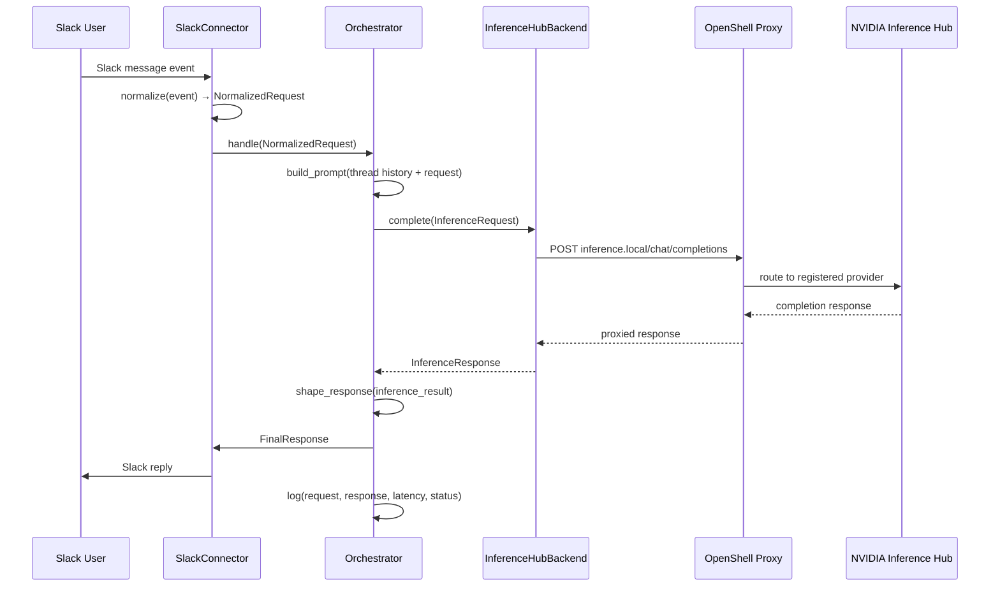

# Milestone 1 — Design Document: Foundation Loop

> **Milestone:** M1 &nbsp;|&nbsp; **Status:** In Progress
>
> **Parent:** [NemoClaw Escapades Design Document](design.md)
>
> **Companion:** [Orchestrator Agent Design](orchestrator_design.md) — detailed
> agent loop, streaming tool execution, compaction, permission model, and
> behavioral contract architecture (applies to M1 and beyond).
>
> **Blog Post:** [M1 — Building Our Own Agent](blog_posts/m1/m1_setting_up_nemoclaw.md)

---

## Table of Contents

1. [Goal](#1--goal)
2. [Scope](#2--scope)
3. [Architecture](#3--architecture)
   - [3.1 Component Diagram](#31--component-diagram)
   - [3.2 Request Flow](#32--request-flow)
4. [Component Specifications](#4--component-specifications)
   - [4.1 Connector Layer](#41--connector-layer)
   - [4.2 Orchestrator](#42--orchestrator)
   - [4.3 Inference Backend](#43--inference-backend)
   - [4.4 Observability](#44--observability)
5. [Deployment Model](#5--deployment-model)
6. [Configuration and Secrets](#6--configuration-and-secrets)
7. [Error Handling](#7--error-handling)
8. [Project Structure](#8--project-structure)
9. [What We Can Reuse from nv-claw](#9--what-we-can-reuse-from-nv-claw)
   - [9.1 Reuse Map](#91--reuse-map)
   - [9.2 Concrete Reuse Plan](#92--concrete-reuse-plan)
   - [9.3 What nv-claw Does Not Have](#93--what-nv-claw-does-not-have-new-work-for-m1)
   - [9.4 Estimated Reuse](#94--estimated-reuse)
10. [Design Decisions and Tradeoffs](#10-design-decisions-and-tradeoffs)
11. [Deliverables](#11--deliverables)
12. [Acceptance Criteria](#12--acceptance-criteria)
13. [Open Questions (M1-Scoped)](#13--open-questions-m1-scoped)
14. [Out of Scope](#14--out-of-scope)
15. [M2 Readiness Checklist](#15--m2-readiness-checklist)
16. [References](#16--references)

---

## 1  Goal

Establish the first production-oriented runtime loop for `nemoclaw_escapades`:
a Slack message enters a connector, an orchestrator builds context and calls a
hosted model, and the response returns to Slack with basic observability around
failures and retries.

This milestone is deliberately narrow. It proves the system can receive a
request, route it through a model, and respond before any additional agent
complexity is introduced. If this loop is not reliable, inspectable, and easy
to explain, every later milestone will be built on sand.

## 2  Scope

| In Scope | Out of Scope |
|----------|--------------|
| OpenShell gateway setup and lifecycle | Multi-gateway federation or remote gateway management |
| OpenShell provider registration (NVIDIA Inference Hub via `inference.local`) | Local model serving, multi-provider routing |
| Orchestrator running inside an always-on OpenShell sandbox | Ephemeral per-task sandboxes (M2 concern) |
| Sandbox policy for the orchestrator (network, filesystem, credentials) | Auto-generated policies from skill metadata (M2+) |
| Slack connector (first implementation of a generic connector base class) | Other connectors (Telegram, Discord, etc.) |
| Orchestrator agent loop with multi-turn conversation (in-memory thread history) | Parallel tasks, sub-agent delegation |
| Defensive model output handling (transcript repair) | Cache-aware system prompt with static/dynamic boundary (M2+) |
| Tiered auto-approval for safe operations + async Slack escalation | Three-tier context compaction (M2+) |
| Structured logging and retry logic | Distributed tracing, metrics dashboards, alerting |
| Local-machine deployment (gateway + sandbox on same host) | Hosted deployment (Brev, DGX Spark) — stretch goal for late M1 |
| Architecture diagrams that match the running code | Documentation for milestones beyond M1 |

## 3  Architecture

### 3.1  Component Diagram

```
┌─────────────────────────────────────────────────────────────────┐
│                        Slack User                               │
└──────────────────────────────┬──────────────────────────────────┘
                               │ sends message
                               ▼
┌─────────────────────────────────────────────────────────────────┐
│  OpenShell Gateway  (Docker, runs on host)                      │
│  - sandbox lifecycle, provider registry, credential injection   │
│  - routes inference.local → NVIDIA Inference Hub                │
└──────────────────────────────┬──────────────────────────────────┘
                               │
                               ▼
┌═════════════════════════════════════════════════════════════════┐
║  OpenShell Sandbox — Orchestrator  (always-on container)       ║
║                                                                 ║
║  ┌──────────────────────────────────────────────────────────┐   ║
║  │  Connector Layer                                          │   ║
║  │  ┌────────────────────────┐                               │   ║
║  │  │  ConnectorBase (ABC)   │ ◄── abstract interface        │   ║
║  │  └────────────┬───────────┘                               │   ║
║  │  ┌────────────▼───────────┐                               │   ║
║  │  │  SlackConnector        │ ◄── Bolt + socket mode        │   ║
║  │  └────────────────────────┘                               │   ║
║  └──────────────────────────────┬───────────────────────────┘   ║
║                                 │ NormalizedRequest              ║
║                                 ▼                                ║
║  ┌──────────────────────────────────────────────────────────┐   ║
║  │  Orchestrator                                             │   ║
║  │  - receive request, build context (thread history)        │   ║
║  │  - call inference backend (inference.local)               │   ║
║  │  - shape response, return through connector               │   ║
║  │  - log every step                                         │   ║
║  └──────────┬──────────────────────────────┬────────────────┘   ║
║             │ InferenceRequest             │ logs                ║
║             ▼                              ▼                     ║
║  ┌──────────────────────┐    ┌──────────────────────────────┐   ║
║  │  Inference Backend   │    │  Observability               │   ║
║  │  BackendBase (ABC)   │    │  - structured JSON logger    │   ║
║  │  └─ InferenceHub     │    │  - retry logging             │   ║
║  │     Backend           │    │  - error categorization      │   ║
║  │     (calls            │    └──────────────────────────────┘   ║
║  │     inference.local)  │                                       ║
║  └──────────────────────┘                                       ║
║                                                                 ║
╚═════════════════════════════════════════════════════════════════╝
             │ inference.local (intercepted by OpenShell proxy)
             ▼
   ┌────────────────────────┐
   │  NVIDIA Inference Hub  │
   │  (remote, hosted)      │
   └────────────────────────┘
```

### 3.2  Request Flow



## 4  Component Specifications

### 4.1  Connector Layer

**Purpose:** Translate platform-specific events into a normalized internal
representation and send responses back through the originating platform.

**Design pattern:** Abstract base class (`ConnectorBase`) with platform-specific
subclasses. The orchestrator works with platform-neutral rich response
primitives. The connector translates those primitives into platform-specific
representations (Block Kit for Slack, message components for Discord, etc.).

```python
class ConnectorBase(ABC):
    @abstractmethod
    async def start(self) -> None: ...

    @abstractmethod
    async def stop(self) -> None: ...

class NormalizedRequest:
    text: str
    user_id: str
    channel_id: str
    thread_ts: str | None
    timestamp: float
    source: str            # "slack", "telegram", etc.
    action: ActionPayload | None  # button click, form submission, etc.
    raw_event: dict        # preserved for debugging

class ActionPayload:
    action_id: str
    value: str
    metadata: dict         # platform-neutral action context

class RichResponse:
    """Platform-neutral response the orchestrator produces."""
    channel_id: str
    thread_ts: str | None
    blocks: list[ResponseBlock]

class ResponseBlock:
    """Union type — one of the block kinds below."""
    pass

class TextBlock(ResponseBlock):
    text: str
    style: str             # "plain", "markdown"

class ActionBlock(ResponseBlock):
    """Row of interactive buttons."""
    actions: list[ActionButton]

class ActionButton:
    label: str
    action_id: str
    value: str
    style: str | None      # "primary", "danger", or None

class ConfirmBlock(ResponseBlock):
    """Confirmation prompt before a destructive action."""
    title: str
    text: str
    confirm_label: str
    deny_label: str
    action_id: str

class FormBlock(ResponseBlock):
    """Structured input form (maps to Slack modals, etc.)."""
    title: str
    fields: list[FormField]
    submit_action_id: str

class FormField:
    label: str
    field_id: str
    field_type: str        # "text", "select", "multiline", etc.
    options: list[str] | None
    required: bool
```

The orchestrator builds `RichResponse` objects using these platform-neutral
blocks. The connector is responsible for translating them into the target
platform's native format:

- `TextBlock` → Slack `section` block with `mrkdwn`
- `ActionBlock` → Slack `actions` block with `button` elements
- `ConfirmBlock` → Slack `confirm` dialog object
- `FormBlock` → Slack modal via `views.open`

This means the orchestrator can request interactive features (confirmations,
buttons, forms) without importing `slack_sdk` or knowing that Block Kit
exists. If a future connector targets Telegram or Discord, it translates the
same `RichResponse` into that platform's interactive primitives.

**SlackConnector implementation:**

- Uses [Slack Bolt for Python](https://slack.dev/bolt-python/) in socket mode.
- Socket mode avoids exposing a public HTTP endpoint, which simplifies local
  development and removes the need for ngrok or a public URL.
- Listens for `message`, `app_mention`, and interactive action events
  (`block_actions`, `view_submission`).
- `normalize()` converts a Slack event dict into a `NormalizedRequest`,
  including `ActionPayload` for interactive callbacks.
- `render()` translates a `RichResponse` into Slack Block Kit JSON.
- `reply()` posts the rendered blocks to the correct channel/thread.
- Opens Slack modals for `FormBlock` responses via `views.open`.
- Handles Slack-specific concerns (rate limiting, retry headers, bot-message
  filtering) inside the connector so none of that leaks into the orchestrator.

**Required Slack configuration:**

| Item | Purpose |
|------|---------|
| Bot token (`SLACK_BOT_TOKEN`) | Authenticate as the bot user |
| App-level token (`SLACK_APP_TOKEN`) | Enable socket mode |
| Event subscriptions | `message.channels`, `message.groups`, `message.im`, `app_mention` |
| Interactivity | Enabled — required for button clicks (`block_actions`) and modal submissions (`view_submission`) |
| OAuth scopes | `chat:write`, `channels:history`, `groups:history`, `im:history`, `app_mentions:read` |

### 4.2  Orchestrator

**Purpose:** Own the agent loop. In M1 this is a multi-turn conversational
pipeline backed by in-memory thread history. Later milestones will add
planning, delegation, and persistent memory retrieval.

**M1 responsibilities:**

1. Receive a `NormalizedRequest` from the connector (including interactive
   action callbacks).
2. Build prompt context (system prompt + thread history + user message).
3. Call the inference backend with an `InferenceRequest`.
4. Shape the `InferenceResponse` into a `RichResponse` using platform-neutral
   blocks (text, buttons, confirmations, forms).
5. Return the response through the connector.
6. Log timing, token counts, and any errors.

**What the orchestrator must NOT do in M1:**

- Import or reference any platform SDK (`slack_sdk`, `slack_bolt`, etc.).
- Contain any inference-provider-specific logic.
- Manage persistent memory state (durable memory is an M4 concern).
- Delegate to sub-agents.

The orchestrator can and should use rich interactive features (confirmation
prompts, action buttons, structured forms), but it does so through the
platform-neutral `RichResponse` / `ResponseBlock` types defined in the
connector layer's contract. The connector handles all platform-specific
rendering.

```python
class Orchestrator:
    def __init__(self, backend: BackendBase, config: OrchestratorConfig): ...

    async def handle(self, request: NormalizedRequest) -> FinalResponse: ...
```

**Thread history (multi-turn conversation):**

M1 supports multi-turn conversation within Slack threads. The orchestrator
maintains an in-memory message history keyed by `thread_ts` (Slack's thread
identifier). When a new message arrives:

1. Look up existing history for this `thread_ts`.
2. Append the user message.
3. Build the prompt as: system prompt + full thread history + latest user
   message.
4. Send to the inference backend.
5. Append the assistant response to the thread history.

Implementation details:

- History is stored in a `dict[str, list[dict]]` on the orchestrator instance.
- Messages outside a thread (top-level channel messages) use the message's own
  `ts` as the key, so a reply starts a new thread context.
- History is lost on process restart. This is acceptable for M1 since the
  system runs as a single local process. Persistent conversation storage is
  deferred to M4.
- A configurable maximum history length (default: 50 messages per thread)
  prevents unbounded memory growth. When the limit is reached, the oldest
  messages are dropped.
- Thread history is independent of the persistent memory system designed for
  M4. It serves a narrower purpose: give the model enough recent context to
  hold a coherent conversation within a single Slack thread.

**System prompt design (M1):**

The system prompt in M1 is static and brief. Its job is to set the agent's
identity and basic behavioral constraints. It should include:

- A short identity statement.
- Instructions to be concise and direct.
- A note that the agent does not yet have tools or persistent memory.

The prompt is loaded from a configuration file so it can be changed without
modifying code. Cache-aware system prompt construction (static/dynamic
boundary for provider prompt caching) is deferred to M2+ — see
[Orchestrator Design §4](orchestrator_design.md#4--system-prompt-construction)
and [Future Work in design.md](design.md#10--future-work--features-inspired-by-claude-code).

**Context overflow handling (M1):**

Long-running Slack conversations can exceed the context window. M1 handles
this with **simple message-count truncation**: when the thread history exceeds
a configured limit (default: 50 messages), the oldest messages are dropped.

Three-tier compaction (micro/full/session memory, adopted from Claude Code)
is deferred to M2+ when tool outputs and multi-sandbox coordination produce
much larger transcripts. See
[Orchestrator Design §8](orchestrator_design.md#8--session-management--compaction)
for the full compaction architecture.

**Defensive model output handling (transcript repair):**

The orchestrator implements a **model behavioral contract** adopted from
Claude Code (see
[Orchestrator Design §9](orchestrator_design.md#9--model-behavioral-contract--defensive-llm-programming)).
Even in M1's simple conversational loop, the model can produce malformed
output that breaks the conversation flow:

| Violation | M1 Repair |
|-----------|-----------|
| Empty/whitespace-only response | Replace with `"I wasn't able to generate a response. Could you rephrase?"` |
| Malformed JSON (if structured output is requested) | Fall back to raw text extraction; log the malformed response |
| Response exceeds token limit (truncated) | Retry with "resume directly, no recap" continuation prompt (up to 2 retries) |
| Model returns error content | Log and surface a user-friendly error message via Slack |

This defensive layer is minimal in M1 but the pattern is established so M2's
tool-use loop can add: orphaned tool-call repair, duplicate ID dedup,
synthetic placeholder injection, and malformed tool-input fallback.

**Tiered auto-approval for operations:**

M1 is conversational only (no tools), so the approval system is simple. But
the pattern is scaffolded for M2:

| Tier | M1 Behavior | M2+ Behavior |
|------|-------------|--------------|
| **Fast-path** | All responses auto-approved (M1 has no side-effect tools) | Known-safe read operations auto-approve |
| **LLM classifier** | Not active | Evaluates ambiguous operations |
| **Slack escalation** | Not active | Dangerous operations pause and send Slack approval request |

The approval interface is defined in M1 so M2 can plug in the classifier and
Slack escalation without restructuring the orchestrator.

### 4.3  Inference Backend

**Purpose:** Provide one stable interface for model calls so the orchestrator
does not know or care which provider or model is being used.

**Design pattern:** Abstract base class (`BackendBase`) with provider-specific
subclasses.

```python
class BackendBase(ABC):
    @abstractmethod
    async def complete(self, request: InferenceRequest) -> InferenceResponse: ...

class InferenceRequest:
    messages: list[dict]   # OpenAI-format message list
    model: str
    temperature: float
    max_tokens: int

class InferenceResponse:
    content: str
    model: str
    usage: TokenUsage      # prompt_tokens, completion_tokens, total_tokens
    latency_ms: float
    raw_response: dict     # preserved for debugging
```

**InferenceHubBackend implementation:**

- NVIDIA Inference Hub exposes an OpenAI-compatible `/chat/completions`
  endpoint.
- The backend uses `httpx.AsyncClient` for async HTTP calls.
- Authentication via an API key (`NVIDIA_API_KEY`) passed as a Bearer token.
- The backend handles:
  - Retry with exponential backoff on 429 and 5xx responses.
  - Timeout enforcement (configurable, default 60 seconds).
  - Response parsing into `InferenceResponse`.
  - Structured error reporting for auth failures, rate limits, timeouts,
    and malformed responses.

**Model selection:**

The model name is configurable. Default for M1: a capable general-purpose
model available through NVIDIA Inference Hub. The specific model is set via
configuration, not hard-coded.

### 4.4  Observability

**Purpose:** Make the system's behavior visible and debuggable from the first
milestone, before the architecture becomes more complex.

**M1 scope:**

| Capability | Implementation |
|-----------|----------------|
| Structured logging | Python `logging` with JSON formatter; every log line includes request_id, timestamp, component, level |
| Request lifecycle logging | Log at: request received, prompt built, inference call start, inference call end, response sent |
| Error categorization | Distinct error types: `auth_error`, `rate_limit`, `timeout`, `model_error`, `connector_error`, `unknown` |
| Retry logging | Log each retry attempt with attempt number, wait duration, and error reason |
| Latency tracking | Log wall-clock time for: connector normalization, prompt building, inference call, total request |
| Token usage tracking | Log prompt_tokens, completion_tokens, total_tokens per request |

**What M1 does NOT include:**

- Metrics aggregation or dashboards.
- Distributed tracing (no spans or trace IDs beyond request_id).
- Alerting.
- Log shipping to an external system.

These are deferred to later milestones when the system has more moving parts
that justify the infrastructure investment.

## 5  Deployment Model

| Component | Where It Runs | Notes |
|-----------|---------------|-------|
| OpenShell gateway | Local machine (Docker) | Manages sandbox lifecycle, provider registry, credential injection |
| Orchestrator sandbox | OpenShell container (local) | Always-on; contains the connector, orchestrator, and backend code |
| Slack connector | Inside orchestrator sandbox | Socket mode — no public endpoint needed; outbound websocket to Slack |
| Inference routing | OpenShell proxy (`inference.local`) | Sandbox calls `inference.local`; the proxy routes to NVIDIA Inference Hub |
| NVIDIA Inference Hub | Remote (hosted) | Model endpoints; registered as an OpenShell provider |
| Logs | Inside sandbox (stdout) + host volume mount | JSON-structured logs accessible from host for post-hoc inspection |

**Why OpenShell from day one:**

- The orchestrator is the first sandbox. Running it inside OpenShell from M1
  means the gateway, provider registration, and sandbox policy patterns are
  proven before M2 adds ephemeral coding-agent sandboxes.
- The `inference.local` proxy pattern means the orchestrator code never
  contains a direct URL to NVIDIA Inference Hub. Switching providers or
  adding new ones is a gateway-level operation, not a code change.
- Credential injection via OpenShell keeps API keys out of the sandbox
  filesystem and out of the codebase.
- M2 adds more sandboxes, but the gateway and provider infrastructure are
  already in place and tested.

**Why local first:**

- Running the gateway and sandbox on the same local machine keeps the
  architecture easy to inspect, iterate, and debug.
- Preserves a clean path toward remote hosting: `openshell gateway start
  --remote user@brev-host` moves the entire setup to Brev without changing
  any application code.

**Deployment to managed infrastructure** (Brev, DGX Spark) is a stretch goal
for late M1. The [Hosting Deep Dive](deep_dives/hosting_deep_dive.md)
evaluates options; Brev is the recommended target.

### 5.1  OpenShell Infrastructure Setup

This section specifies the OpenShell setup steps that are part of M1.

**Gateway setup:**

```bash
openshell gateway start
```

The gateway runs as a Docker container on the local machine. It exposes a
control-plane API that the CLI uses to manage sandboxes and providers.

**Provider registration:**

```bash
openshell provider add nvidia-inference-hub \
  --base-url https://integrate.api.nvidia.com/v1 \
  --api-key-env NVIDIA_API_KEY
```

This registers NVIDIA Inference Hub as the inference provider. Inside any
sandbox, code that calls `inference.local` will be transparently routed to
this provider. The API key is injected by OpenShell at sandbox creation time
and never appears in the sandbox filesystem.

**Orchestrator sandbox creation:**

```bash
openshell sandbox create orchestrator \
  --image nemoclaw-orchestrator:latest \
  --policy policies/orchestrator.yaml \
  --always-on \
  --mount logs:/app/logs
```

The orchestrator sandbox is created as an always-on container. It runs the
main agent loop, the Slack connector, and the inference backend client.

**Sandbox policy (M1):**

The orchestrator sandbox policy defines what the orchestrator is allowed to do.
In M1 this is relatively permissive because the orchestrator is the only
sandbox and it needs outbound network access for Slack and inference.

```yaml
# policies/orchestrator.yaml
sandbox:
  name: orchestrator
  always_on: true

network:
  outbound:
    - host: "*.slack.com"
      ports: [443]
      reason: "Slack socket mode websocket"
    - host: "wss-primary.slack.com"
      ports: [443]
      reason: "Slack websocket fallback"
    - host: "inference.local"
      ports: [443]
      reason: "Model inference via OpenShell proxy"

filesystem:
  read_write:
    - /app/logs
    - /app/prompts
  read_only:
    - /app/src

credentials:
  - SLACK_BOT_TOKEN
  - SLACK_APP_TOKEN
  # NVIDIA_API_KEY is injected via inference.local, not directly
```

M2 will add ephemeral per-task sandboxes with much tighter policies. The
orchestrator policy will also tighten as the system gains sub-agent delegation
and no longer needs direct outbound access to Slack (that responsibility may
move to a dedicated connector sandbox).

## 6  Configuration and Secrets

All configuration is loaded from environment variables. A `.env` file is
supported for local development via `python-dotenv`.

| Variable | Required | Purpose |
|----------|----------|---------|
| `SLACK_BOT_TOKEN` | Yes | Slack bot OAuth token |
| `SLACK_APP_TOKEN` | Yes | Slack app-level token for socket mode |
| `NVIDIA_API_KEY` | Yes | Authentication for NVIDIA Inference Hub (injected by OpenShell, not set manually inside the sandbox) |
| `INFERENCE_MODEL` | No | Model name (default: configured in code) |
| `INFERENCE_TIMEOUT_S` | No | Timeout for inference calls in seconds (default: 60) |
| `INFERENCE_MAX_RETRIES` | No | Max retry attempts for transient failures (default: 3) |
| `LOG_LEVEL` | No | Logging level (default: INFO) |
| `LOG_FILE` | No | Path to log file (default: stdout only) |
| `SYSTEM_PROMPT_PATH` | No | Path to system prompt file (default: built-in) |

**Secrets handling:** No secrets are committed to the repository. The `.env`
file is listed in `.gitignore`. The README documents which variables are
required and how to obtain them.

### 6.1  Makefile-Based Setup and Lifecycle

All infrastructure setup, secret injection, and process lifecycle is driven
through a single `Makefile`. A new contributor should be able to go from a
fresh clone to a running system with:

```bash
cp .env.example .env   # fill in real values
make setup             # one-time: gateway + provider + sandbox
make start             # run the orchestrator
```

**Targets:**

| Target | What It Does | Idempotent? |
|--------|-------------|-------------|
| `make setup` | Runs `setup-gateway`, `setup-secrets`, `setup-sandbox` in order | Yes |
| `make setup-gateway` | Starts the OpenShell gateway if not already running (`openshell gateway start`) | Yes |
| `make setup-secrets` | Reads `.env` and registers each secret with the OpenShell gateway so they can be injected into sandboxes. Registers the NVIDIA Inference Hub provider with the API key. Registers Slack tokens as sandbox credentials. | Yes (re-registers are no-ops or overwrites) |
| `make setup-sandbox` | Builds the orchestrator container image and creates the always-on sandbox with the versioned policy | Yes (recreates if policy changed) |
| `make start` | Starts the orchestrator sandbox (or restarts if already running) | Yes |
| `make stop` | Stops the orchestrator sandbox | Yes |
| `make restart` | `stop` then `start` | Yes |
| `make status` | Prints gateway health, provider list, sandbox state, and recent log lines | — |
| `make logs` | Tails the orchestrator sandbox logs (from host volume mount) | — |
| `make logs-full` | Prints the full log file instead of tailing | — |
| `make clean` | Stops the sandbox and removes the container image (does NOT touch the gateway or provider registration) | — |
| `make clean-all` | `clean` + stops the gateway | — |
| `make test` | Runs the test suite (outside the sandbox, against mocked backends) | — |
| `make lint` | Runs linters and type checks | — |
| `make build` | Builds the orchestrator container image without creating a sandbox | — |

**`make setup-secrets` detail:**

This target reads the `.env` file and performs the following registrations
against the running OpenShell gateway:

```makefile
setup-secrets: .env
	@echo "Registering inference provider..."
	openshell provider add nvidia-inference-hub \
		--base-url $${INFERENCE_HUB_BASE_URL:-https://integrate.api.nvidia.com/v1} \
		--api-key "$$(grep NVIDIA_API_KEY .env | cut -d= -f2-)"
	@echo "Registering sandbox credentials..."
	openshell credential set SLACK_BOT_TOKEN \
		--value "$$(grep SLACK_BOT_TOKEN .env | cut -d= -f2-)"
	openshell credential set SLACK_APP_TOKEN \
		--value "$$(grep SLACK_APP_TOKEN .env | cut -d= -f2-)"
	@echo "Secrets registered."
```

The `.env` file never enters the sandbox. OpenShell injects the credentials
at sandbox creation time based on the policy's `credentials` list. This means:

- Secrets are stored in the gateway's credential store, not on the filesystem.
- The sandbox policy declares which credentials it needs.
- A leaked sandbox image contains no secrets.
- Rotating a secret is a `make setup-secrets` + `make restart` operation.

**`make setup` full sequence:**

```
make setup
  ├── make setup-gateway       # start gateway if needed
  ├── make setup-secrets       # register provider + credentials from .env
  └── make setup-sandbox       # build image, create sandbox with policy
```

**Design rationale:**

- One `Makefile` is the single source of truth for how the system is set up
  and run. No hidden scripts or manual steps.
- Every target is idempotent so `make setup` can be re-run safely after
  pulling new code or changing configuration.
- The `setup-secrets` target bridges the gap between a developer-friendly
  `.env` file and OpenShell's credential injection model, so the developer
  workflow stays simple while the runtime stays secure.
- The same `Makefile` targets will extend naturally in M2 when ephemeral
  coding-agent sandboxes are added (e.g. `make setup-coding-sandbox`).

## 7  Error Handling

M1 must handle errors gracefully rather than crashing silently. The strategy
is to categorize, log, retry where appropriate, and surface a user-visible
message when recovery is not possible.

| Failure Mode | Handling |
|-------------|----------|
| Slack connection lost | Bolt reconnects automatically in socket mode; log the disconnection and reconnection |
| Slack rate limit | Respect `Retry-After` header; queue the response and retry |
| Inference auth failure (401/403) | Log as `auth_error`; reply to user with "configuration issue" message; do not retry |
| Inference rate limit (429) | Retry with exponential backoff up to `INFERENCE_MAX_RETRIES`; log each attempt |
| Inference timeout | Log as `timeout`; reply to user with "model did not respond in time" |
| Inference server error (5xx) | Retry with backoff; if exhausted, reply with "temporary issue" message |
| Malformed model response | Log the raw response as `model_error`; reply with fallback message |
| Unhandled exception | Catch at the top of the handler; log full traceback; reply with generic error message |

Every error path must:
1. Log the error with enough context to diagnose it later.
2. Return a human-readable response to the Slack user (never leave them
   hanging with no reply).
3. Not crash the process.

## 8  Project Structure

```
nemoclaw_escapades/
├── src/
│   └── nemoclaw_escapades/
│       ├── __init__.py
│       ├── main.py                 # entry point
│       ├── config.py               # environment loading + validation
│       ├── connectors/
│       │   ├── __init__.py
│       │   ├── base.py             # ConnectorBase ABC
│       │   └── slack.py            # SlackConnector
│       ├── backends/
│       │   ├── __init__.py
│       │   ├── base.py             # BackendBase ABC
│       │   └── inference_hub.py    # InferenceHubBackend
│       ├── orchestrator/
│       │   ├── __init__.py
│       │   └── orchestrator.py     # Orchestrator
│       ├── models/
│       │   ├── __init__.py
│       │   └── types.py            # NormalizedRequest, FinalResponse, etc.
│       └── observability/
│           ├── __init__.py
│           └── logging.py          # structured logger setup
├── tests/
│   ├── test_connector_slack.py
│   ├── test_backend_inference_hub.py
│   ├── test_orchestrator.py
│   └── conftest.py
├── prompts/
│   └── system_prompt.md            # default system prompt
├── policies/
│   └── orchestrator.yaml           # OpenShell sandbox policy for M1
├── docker/
│   └── Dockerfile.orchestrator     # container image for the orchestrator sandbox
├── docs/                           # design docs, deep dives, blog posts
├── Makefile                        # setup, lifecycle, secrets, build, test
├── .env.example                    # template for required env vars
├── .gitignore
├── pyproject.toml
└── README.md
```

**Key conventions:**

- All components are async (built on `asyncio`).
- Abstract base classes live in `base.py` inside each package.
- Concrete implementations are separate files so adding a new connector or
  backend means adding one file, not modifying an existing one.
- Data classes for request/response types live in `models/types.py`.

## 9  What We Can Reuse from nv-claw

The `nv-claw` project is a working Slack bot with an LLM backend, memory
system, audit logging, and a YAML workflow engine. It runs in Slack socket
mode against NVIDIA Inference Hub — remarkably close to M1's target
architecture. Rather than starting from zero, M1 should lift proven patterns
from nv-claw and refactor them into the cleaner abstraction layer this project
requires.

### 9.1  Reuse Map

| M1 Component | nv-claw Equivalent | Reusable? | What to Lift vs. Rewrite |
|---|---|---|---|
| Slack connector | Bolt app setup, socket mode wiring, event handlers, message processing pipeline | Yes, heavily | The socket mode setup, event listening, and pipeline shape all work. Refactor into a `ConnectorBase` ABC + `SlackConnector` subclass instead of the current monolithic handler. Add `RichResponse` rendering for Block Kit. |
| Inference backend | OpenAI-compatible client with configurable `base_url` for Inference Hub | Yes, mostly | Already wraps the OpenAI SDK with a configurable endpoint. Needs: extract a `BackendBase` ABC, route through `inference.local` instead of a direct URL, add retry with exponential backoff, and return a structured `InferenceResponse`. |
| Configuration | `Config` dataclass loading from `.env` via `python-dotenv` | Yes, directly | Same env vars we need (`SLACK_BOT_TOKEN`, `SLACK_APP_TOKEN`, `INFERENCE_HUB_API_KEY`). Can be lifted almost as-is and extended with OpenShell and M1-specific fields. |
| Domain models | Slack context objects, LLM usage tracking, exchange records | Partially | The Slack context and usage types map well to M1's `NormalizedRequest` and `TokenUsage`. Intent classification types are nv-claw-specific and should not be carried over. |
| Audit / observability | SQLite audit DB logging every exchange with tokens, latency, and outcome | Yes, pattern | The audit pattern is exactly what M1 needs. Can be lifted as-is or simplified to structured JSON logging. |
| Embedding client | Batched embeddings client | Not for M1 | Useful for memory retrieval in M4. |
| Thread enrichment | User resolution, thread history fetching, link detection for Jira/Gerrit/GitLab | Partially | The thread history fetching is relevant now that M1 includes multi-turn. Link detection is useful for M2+. |
| Workflow engine | YAML manifest + executor for declarative task workflows | Not for M1 | Interesting reference for later milestones but M1 is a conversational loop, not a workflow system. |
| Memory system | Hybrid BM25 + embedding retrieval with MMR and decay scoring | Not for M1 | Directly relevant to M4 memory orchestration. |
| Permissions / tenancy | Tiered permissions and multi-tenant stubs | Not for M1 | Future concern. |
| Project scaffolding | `pyproject.toml`, `Makefile`, `uv`-based build, pytest layout | Yes | The build tooling, make targets, and test structure are directly portable. |

### 9.2  Concrete Reuse Plan

**Lift and refactor (high value, saves significant work):**

1. Bolt app creation, socket mode wiring, and event registration → refactor
   into `SlackConnector` behind `ConnectorBase` ABC.
2. OpenAI-compatible inference client → refactor into `InferenceHubBackend`
   behind `BackendBase` ABC; route through `inference.local`; add retry logic.
3. `Config` dataclass and `.env` loading → extend with OpenShell and
   M1-specific fields.
4. Audit logging pattern → simplify to structured JSON logging for M1; the
   SQLite audit DB is a bonus if we want persistence.

**Lift as-is (low effort):**

5. `pyproject.toml` dependency list → fork and trim to M1 dependencies.
6. `Makefile` start/stop/logs targets → extend with OpenShell setup targets.
7. `.env` pattern → same loading mechanism, same variable naming conventions.

**Study but don't lift yet:**

8. Thread enrichment → good reference for M2+ multi-turn context and link
   detection.
9. Memory system → good reference for M4 memory orchestration.
10. Workflow engine → good reference for declarative task execution in later
    milestones.

### 9.3  What nv-claw Does Not Have (New Work for M1)

| Gap | Why It Matters |
|-----|---------------|
| Abstract base classes (`ConnectorBase`, `BackendBase`) | nv-claw has no ABCs; everything is concrete. M1 needs pluggable seams from day one. |
| `RichResponse` block model | nv-claw builds Block Kit JSON directly in handlers. M1 needs platform-neutral response primitives. |
| Retry with exponential backoff | nv-claw has try/except fallbacks but no structured retry on 429/5xx. |
| Structured JSON logging | nv-claw uses basic `logging.basicConfig`. M1 needs JSON-formatted logs with request IDs. |
| Clean orchestrator separation | nv-claw's orchestration is mixed into the Slack handler. M1 needs a standalone `Orchestrator` class. |
| OpenShell integration | nv-claw runs as a bare-metal process. M1 runs inside an OpenShell sandbox with `inference.local` routing. |
| Async throughout | nv-claw is synchronous. M1 specifies async for future concurrency. This is the largest rewrite cost. |
| Transcript repair | nv-claw has basic try/except. M1 needs defensive model output handling with fallback messages. *(From Claude Code.)* |
| Approval interface | nv-claw has no approval gating. M1 needs a pluggable approval interface (auto-approve stub for now, classifier + Slack escalation for M2). *(From Claude Code.)* |

### 9.4  Estimated Reuse

About 60–70% of the M1 implementation can be derived from nv-claw. The Slack
connector, inference client, config loading, and audit pattern are all proven
and running in production. The main new work is extracting abstract interfaces,
adding the `RichResponse` model, adding retry logic, switching to async,
integrating OpenShell, and separating the orchestrator from the Slack handler.

## 10 Design Decisions and Tradeoffs

| Decision | Rationale | Alternative Considered |
|----------|-----------|----------------------|
| Orchestrator inside OpenShell from M1 | Proves gateway, provider, and sandbox patterns before M2 adds more sandboxes; keeps credentials out of the codebase via injection; makes `inference.local` the default from day one | Bare-metal local process — simpler initially but defers all OpenShell learning to M2 and forces a migration |
| Makefile as the single entry point | One file controls all setup, secrets, build, and lifecycle; idempotent targets mean `make setup` is always safe to re-run; extends naturally for M2 | Shell scripts per task — fragmentary and easy to forget which to run in which order |
| Socket mode for Slack | No public URL required; simplifies local dev; eliminates ngrok dependency; works from inside an OpenShell sandbox via outbound websocket | HTTP mode with ngrok — adds complexity for no M1 benefit |
| NVIDIA Inference Hub as first backend | Avoids local model serving; OpenAI-compatible API simplifies implementation | Direct OpenAI API — works but doesn't exercise the NVIDIA ecosystem we want to learn |
| Abstract base classes for connectors and backends | Enforces clean boundaries from day one; makes M2+ extension low-friction | Concrete classes only — faster initially but creates coupling that has to be broken later |
| Async throughout | The orchestrator will eventually manage concurrent tasks; building async from the start avoids a rewrite | Sync with threading — adequate for M1 but creates an async migration tax later |
| JSON structured logging | Machine-parseable from day one; makes future log shipping trivial | Plain text logging — easier to read in a terminal but harder to query programmatically |
| Static system prompt loaded from file | Separates prompt engineering from code; easy to iterate | Inline string — faster to start but mixes concerns |
| Multi-turn via in-memory thread history | Conversations feel natural from day one; nv_claw already proves this works | Persistent conversation store — deferred to M4 since in-memory is sufficient while the system runs as a single process |
| Transcript repair from M1 | Empty responses and truncation happen even in simple conversational loops; defensive handling prevents silent failures and user confusion | Trust model output — faster to ship but creates user-visible failures on edge cases |
| Approval interface stub from M1 | Defining the interface now (even as auto-approve) means M2 can add the tiered classifier without restructuring the orchestrator loop | Add approval in M2 — defers the interface design and may require orchestrator loop changes |
| Credential injection for Slack tokens (not a provider proxy) | Slack socket mode requires the Bolt SDK to hold the tokens directly to maintain a persistent websocket connection. Unlike inference — where `inference.local` proxies stateless HTTP requests and attaches the API key transparently — there is no simple intermediary that can sit between the sandbox and Slack. Both credential paths are managed by OpenShell (the `.env` file never enters the sandbox; a leaked image contains no secrets), but the mechanism differs: inference uses a proxy pattern (code never touches the key), Slack uses direct credential injection (code reads tokens as env vars). Building a bidirectional websocket proxy would add significant infrastructure for marginal M1 security benefit. The planned M2 mitigation is to move the connector into its own dedicated sandbox so the orchestrator stops needing Slack tokens entirely. | Slack provider proxy analogous to `inference.local` — architecturally cleaner but requires proxying a full websocket lifecycle; deferred in favor of the simpler M2 path of isolating the connector in its own sandbox |

## 11  Deliverables

| Deliverable | Description | Done When |
|-------------|-------------|-----------|
| Repo and docs baseline | Project structure, README, design docs, `.env.example` | A new contributor can understand the system boundaries quickly |
| OpenShell gateway and provider setup | Gateway running locally, NVIDIA Inference Hub registered as provider | `inference.local` routes to the hosted model endpoint |
| Orchestrator sandbox | Always-on OpenShell sandbox with a defined policy | Orchestrator runs inside the sandbox and survives restarts |
| Sandbox policy | `policies/orchestrator.yaml` defining network, filesystem, and credential rules | Policy is version-controlled and matches the running sandbox |
| Slack connector | `ConnectorBase` ABC + `SlackConnector` implementation | Messages can be received and replied to reliably in socket mode |
| Inference backend | `BackendBase` ABC + `InferenceHubBackend` (via `inference.local`) | Orchestrator calls model endpoints through one contract and the OpenShell proxy |
| Orchestrator loop | Multi-turn request → context → inference → response pipeline | Multi-turn Slack conversations work naturally within a thread |
| Transcript repair layer | Empty-response handling, truncation recovery, error surfacing | Malformed model output never crashes the loop or leaves the user hanging |
| Approval interface | Auto-approve-all stub; interface ready for M2 classifier + Slack escalation | Clean seam for M2 to plug in tiered approval without restructuring |
| Observability baseline | Structured JSON logger, request lifecycle logging, error categorization, prompt cache break detection | Failures are visible, diagnosable, and never silent |
| Makefile-based setup | `make setup` provisions gateway, secrets, and sandbox from `.env`; `make start/stop/logs` manage lifecycle | A new contributor goes from clone to running system with `cp .env.example .env && make setup && make start` |
| Local deployment | Gateway + orchestrator sandbox on local machine, inference hosted remotely | End-to-end flow runs from a local OpenShell sandbox |
| Architecture diagrams | Visual map of runtime responsibilities matching the actual code | Diagrams are reviewable and match the code path |
| Tests | Unit tests for connector normalization, backend retry logic, orchestrator flow | Core paths are covered; tests run in CI |

## 12  Acceptance Criteria

| Check | Validation Method |
|-------|-------------------|
| End-to-end loop works | Send a Slack message and receive a model-generated response |
| OpenShell gateway is running | `openshell gateway status` shows healthy gateway with registered provider |
| Orchestrator runs in sandbox | Verify the orchestrator process is inside an OpenShell container, not bare-metal |
| inference.local routing works | Orchestrator calls `inference.local`; verify the request reaches NVIDIA Inference Hub via the proxy |
| Sandbox policy is enforced | Confirm the orchestrator cannot reach hosts not listed in the policy |
| Pluggable boundaries exist | Confirm the orchestrator has no imports from `slack_sdk`/`slack_bolt` and no provider-specific logic; interactive features use `RichResponse` blocks |
| Error handling works | Simulate auth failure, network timeout, and rate limit; inspect logs and user-facing messages |
| Bot-message filtering | Verify the connector ignores its own messages and does not create loops |
| Retry logic works | Simulate a transient 429/5xx from inference hub; confirm retry and eventual success or graceful failure |
| Logs are useful | Review structured log output for a successful request and a failed request; confirm both are diagnosable |
| Transcript repair works | Simulate an empty model response and a truncated response; confirm the user receives a graceful fallback |
| Makefile setup works end-to-end | `make setup && make start` on a fresh clone with a valid `.env` results in a running orchestrator within 5 minutes |
| Makefile is idempotent | Running `make setup` twice in a row succeeds without errors or side effects |
| Secrets stay out of the sandbox | Verify `.env` values are not present in the sandbox filesystem; only injected via OpenShell credentials |
| M2 readiness | Documentation is clear enough for coding-agent milestone handoff |

## 13  Open Questions (M1-Scoped)

These are drawn from the [parent design document §5](design.md#5--open-questions)
and scoped to decisions that must be resolved during M1.

| # | Question | Status | Resolution |
|---|----------|--------|------------|
| 1 | Which NVIDIA Inference Hub model to use as the default? | Open | Depends on availability and cost; evaluate during implementation |
| 2 | Should the system prompt include any persona details or stay minimal? | Open | Start minimal; iterate based on response quality |
| 3 | Should M1 support multi-channel Slack (multiple workspaces) or single workspace only? | Resolved | Single workspace for M1; multi-workspace is a future extension |
| 4 | Should the orchestrator handle conversation history in M1? | Resolved | Yes; in-memory thread history keyed by Slack thread_ts. Cleared on restart; persistent storage deferred to M4 |
| 5 | Where should the orchestrator be hosted for always-on operation? | Resolved | Inside an OpenShell sandbox on the local machine for M1; move the gateway to Brev for always-on per [Hosting Deep Dive](deep_dives/hosting_deep_dive.md) |
| 6 | Should we include a health-check endpoint in M1? | Open | Low-cost addition; decide during implementation |
| 7 | Should the NMB broker ship with M1? | Deferred | NMB is most valuable for M2+ multi-sandbox coordination; not needed for M1 single-sandbox deployment |
| 8 | Should the orchestrator sandbox use `inference.local` or call Inference Hub directly? | Resolved | Use `inference.local` — keeps the sandbox code provider-agnostic and exercises the OpenShell routing pattern that M2 sandboxes will also use |
| 9 | How permissive should the M1 orchestrator sandbox policy be? | Open | Needs outbound Slack + inference.local; start permissive and tighten in M2 when the connector may move to its own sandbox |

## 14  Out of Scope

The following items are explicitly deferred to later milestones to keep M1
focused on the foundation loop:

- Cache-aware system prompt (static/dynamic boundary for prompt caching) — M2+.
- Three-tier context compaction (micro/full/session memory) — M2+.
- Ephemeral per-task sandboxes (OpenShell sandbox-per-workflow) — M2.
- Sub-agent delegation — M2.
- Review agent — M3.
- Persistent memory (Honcho, SecondBrain) — M4.
- Knowledge capture from Slack/Teams — M5.
- Self-improvement loop — M6.
- Web UI / Mission Control dashboard — M2+.
- NemoClaw Message Bus (NMB) — M2.
- Training data capture — M2+.
- Persistent conversation storage (in-memory thread history is in scope; durable storage is M4).
- Cron scheduling — M2+.

## 15  M2 Readiness Checklist

M1 is complete when the foundation is solid enough to support M2 without
refactoring core abstractions. This checklist defines that threshold:

- [ ] OpenShell gateway is running locally with NVIDIA Inference Hub registered
      as a provider. `inference.local` routing is verified.
- [ ] The orchestrator runs inside an always-on OpenShell sandbox with a
      version-controlled policy.
- [ ] `ConnectorBase` ABC is stable and `SlackConnector` proves the interface
      works end-to-end from inside the sandbox.
- [ ] `BackendBase` ABC is stable and `InferenceHubBackend` proves the
      interface works end-to-end via `inference.local`.
- [ ] The orchestrator has a clean `handle()` entry point that M2 can extend
      with planning, delegation, and memory retrieval without breaking the
      existing flow.
- [ ] Transcript repair layer handles empty responses and truncation;
      the interface is ready for M2 tool-call repair patterns.
- [ ] Approval interface is defined with an auto-approve stub; M2 can plug
      in the tiered classifier and Slack escalation without restructuring.
- [ ] Structured logging is in place and working for both success and failure
      paths, with logs accessible from the host via volume mount.
- [ ] The project structure supports adding new connectors, backends, and
      orchestrator capabilities by adding files rather than modifying existing
      ones.
- [ ] Architecture diagrams match the running code and are committed to the
      repository.
- [ ] `make setup && make start` takes a new contributor from a fresh clone
      to a running system with only a valid `.env` file.
- [ ] `make setup` is idempotent and safe to re-run after pulling new code.
- [ ] `make status` shows gateway health, provider list, and sandbox state
      in one command.

## 16  References

- [NemoClaw Escapades — Design Document](design.md)
- [Orchestrator Agent Design](orchestrator_design.md) — agent loop, streaming
  tool execution, system prompt construction, compaction, permission model,
  behavioral contract, task store
- [Claude Code Deep Dive](deep_dives/claude_code_deep_dive.md) — source for
  the system prompt cache boundary, three-tier compaction, transcript repair,
  and tiered auto-approval patterns adopted in M1
- [Hosting Deep Dive](deep_dives/hosting_deep_dive.md)
- [Hermes Deep Dive](deep_dives/hermes_deep_dive.md)
- [OpenClaw Deep Dive](deep_dives/openclaw_deep_dive.md)
- [OpenShell Deep Dive](deep_dives/openshell_deep_dive.md)
- [NemoClaw Deep Dive](deep_dives/nemoclaw_deep_dive.md)
- [NMB Design](nmb_design.md)
- [M1 Blog Post](blog_posts/m1/m1_setting_up_nemoclaw.md)
- [Slack Bolt for Python](https://slack.dev/bolt-python/)
- [NVIDIA Inference Hub](https://build.nvidia.com/)
