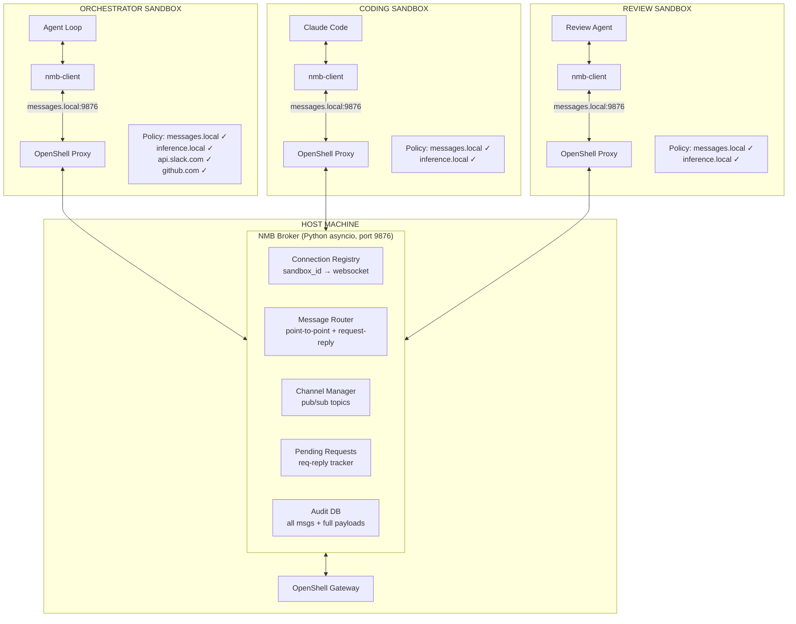
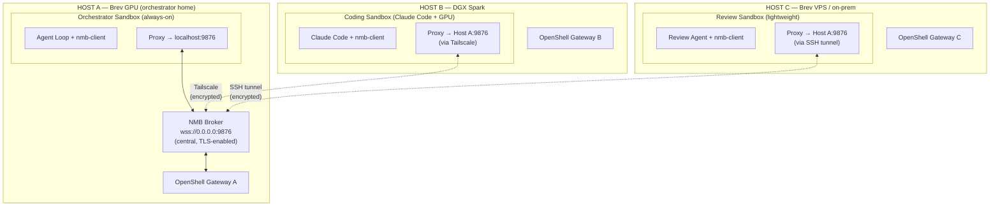
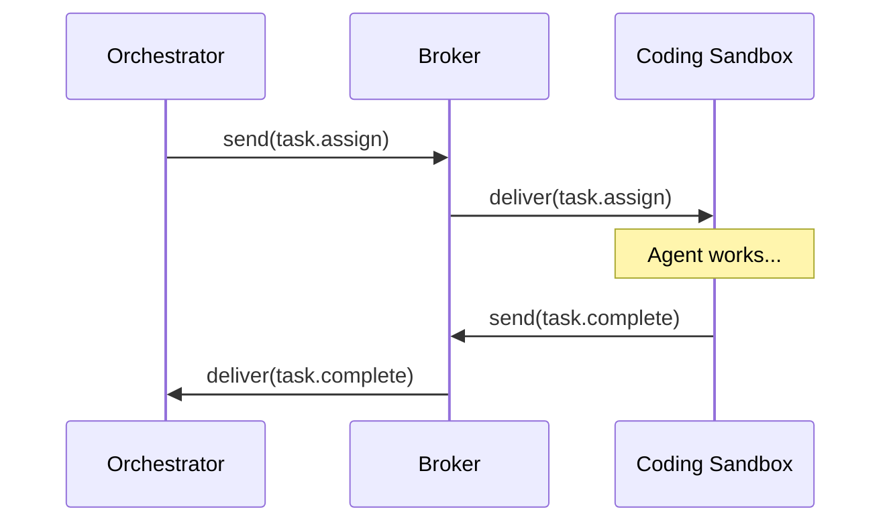
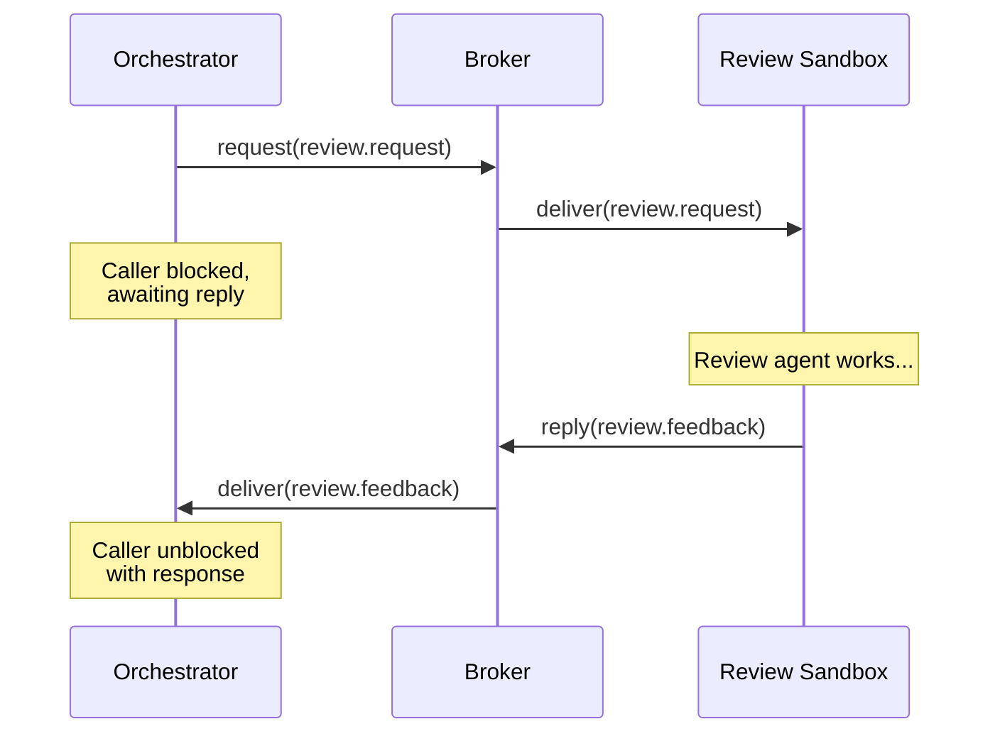
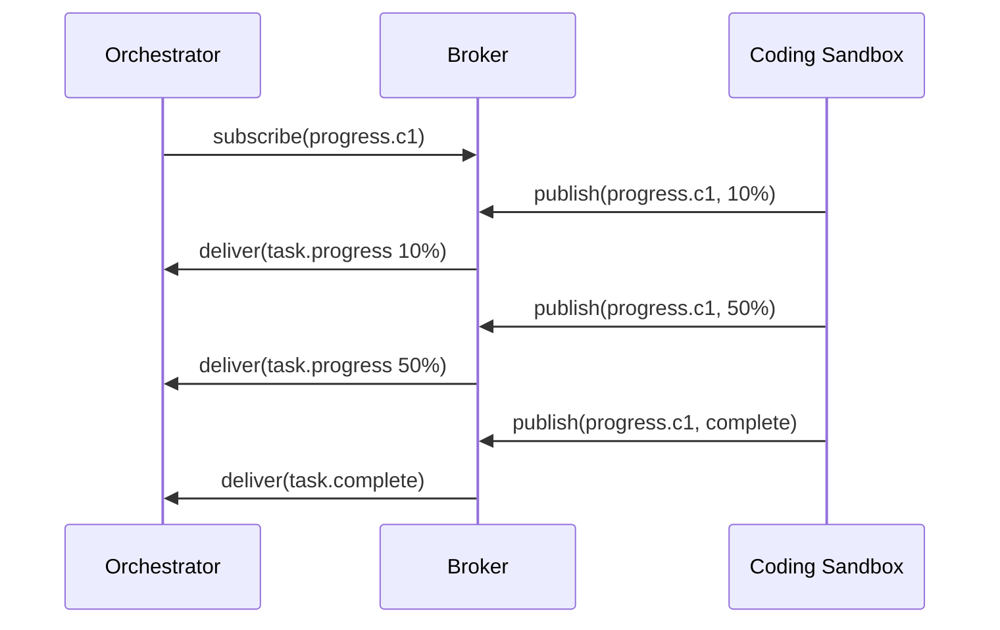
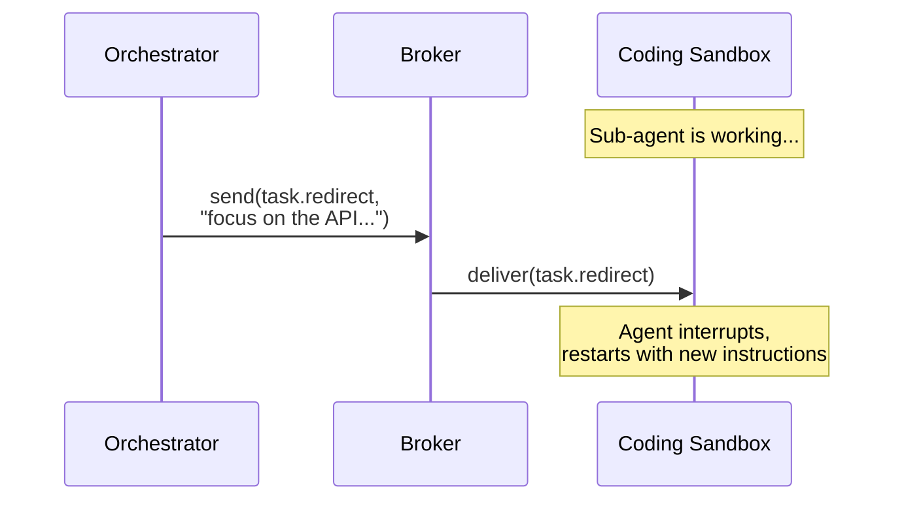
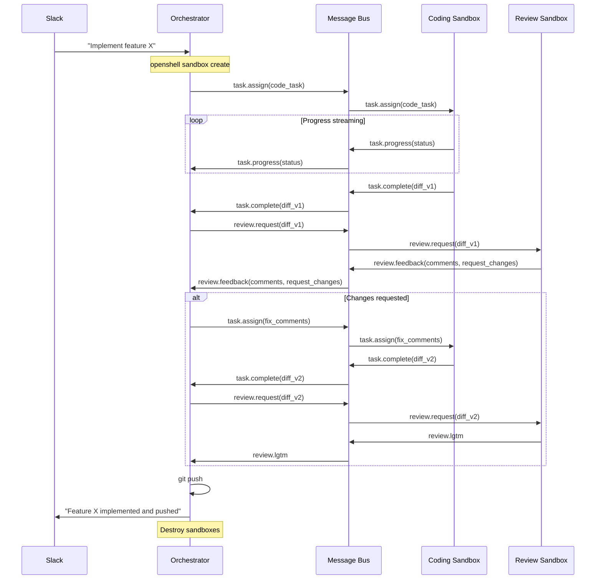
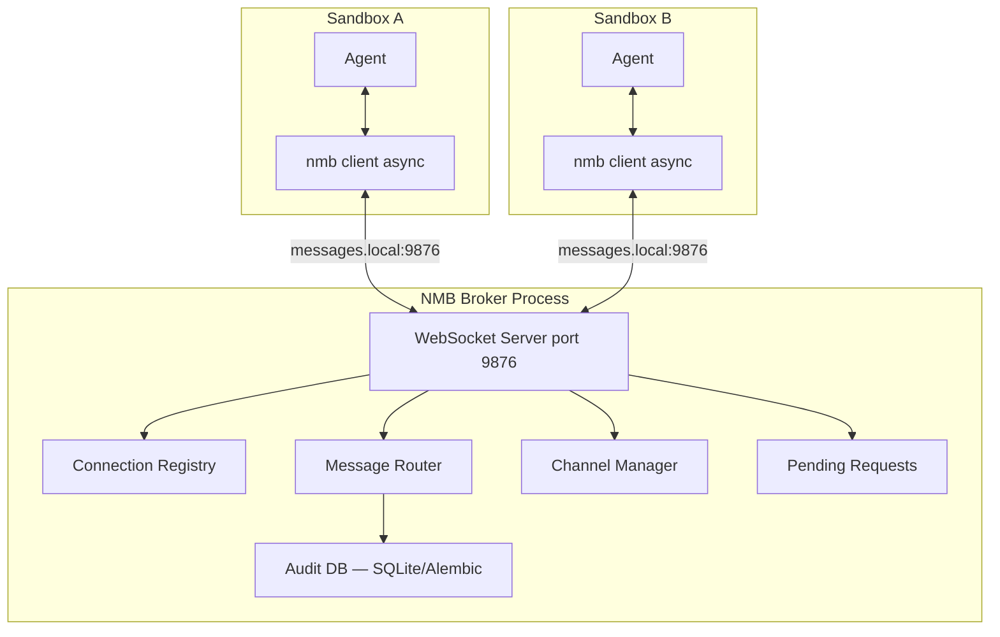

# NemoClaw Message Bus (NMB) — Design Document

> **Status:** Proposed
>
> **Last updated:** 2026-03-29
>
> **Related:**
> [Hermes Deep Dive §13](deep_dives/hermes_deep_dive.md#13--sub-agent-delegation) |
> [OpenShell Deep Dive §5](deep_dives/openshell_deep_dive.md#5--request-flow) |
> [Design Doc §3.1](../design.md#31--key-components) |
> [Audit DB Design](audit_db_design.md) |
> [Agent Trace Design](agent_trace_design.md) |
> [Inference Call Auditing](inference_call_auditing_design.md)

---

## Table of Contents

1. [Problem Statement](#1--problem-statement)
2. [Key Insight: The `inference.local` Pattern](#2--key-insight-the-inferencelocal-pattern)
3. [Architecture](#3--architecture)
4. [Message Broker](#4--message-broker)
5. [Wire Protocol](#5--wire-protocol)
6. [Message Types (NemoClaw Agent Protocol)](#6--message-types-nemoclaw-agent-protocol)
7. [Client Library](#7--client-library)
8. [Network Policy Integration](#8--network-policy-integration)
9. [Identity & Security Model](#9--identity--security-model)
10. [Communication Patterns](#10--communication-patterns)
11. [Revised Coding + Review Loop](#11--revised-coding--review-loop)
12. [Failure Modes & Recovery](#12--failure-modes--recovery)
13. [Audit Bandwidth and Capacity Estimates](#13--audit-bandwidth-and-capacity-estimates)
14. [Deployment](#14--deployment)
15. [Coordinator Integration & Extended Message Types](#15--coordinator-integration--extended-message-types)
16. [Comparison: File-Based vs NMB vs Hermes](#16--comparison-file-based-vs-nmb-vs-hermes)
17. [Future: Upstream Contribution to OpenShell](#17--future-upstream-contribution-to-openshell)
18. [Off-the-Shelf Library Evaluation](#18--off-the-shelf-library-evaluation)
19. [Implementation Plan](#19--implementation-plan)

---

## 1  Problem Statement

The current NemoClaw sub-agent delegation model (documented in
[Hermes Deep Dive §13.1–13.4](deep_dives/hermes_deep_dive.md#131--how-sub-agent-delegation-would-work-in-nemoclaw))
relies on `openshell sandbox upload/download` for cross-sandbox communication.
This is functionally correct but has severe latency and capability problems:

```
┌───────────────────────────────────────────────────────────────────────┐
│                    File-Based Coordination Bottlenecks                │
│                                                                       │
│  Per round-trip (one upload or download):                             │
│  ┌─────────────────────────────────────────────────────┐              │
│  │  SSH handshake         ~200ms                       │              │
│  │  File serialization    ~100ms (depends on size)     │              │
│  │  SCP transfer          ~500ms–2s                    │              │
│  │  File deserialization  ~100ms                       │              │
│  │  ─────────────────────────────                      │              │
│  │  Total                 ~1–3s per round-trip         │              │
│  └─────────────────────────────────────────────────────┘              │
│                                                                       │
│  Per coding+review iteration (4 round-trips):                         │
│  ┌─────────────────────────────────────────────────────┐              │
│  │  Upload task to coding sandbox       ~2s            │              │
│  │  Download diff from coding sandbox   ~2s            │              │
│  │  Upload diff to review sandbox       ~2s            │              │
│  │  Download review from review sandbox ~2s            │              │
│  │  ─────────────────────────────────                  │              │
│  │  Total overhead per iteration        ~8–12s         │              │
│  └─────────────────────────────────────────────────────┘              │
│                                                                       │
│  3-iteration review loop: ~24–36s of pure coordination overhead.      │
│                                                                       │
│  Missing capabilities:                                                │
│  ✗ No streaming — orchestrator blind during sub-agent execution       │
│  ✗ No interruption — can't redirect sub-agent mid-task                │
│  ✗ No heartbeat — can't tell if sub-agent is alive or stuck           │
│  ✗ No peer-to-peer — agents can't talk directly, always via files     │
└───────────────────────────────────────────────────────────────────────┘
```

Hermes solves this with `sessions_send` (in-process, <1ms), but that
sacrifices isolation — all sub-agents share a process, permissions, and
failure domain. We need the **Hermes-like API** with **OpenShell-like
isolation**.

---

## 2  Key Insight: The `inference.local` Pattern

OpenShell already has a working precedent for cross-boundary communication
that preserves isolation:

```
┌───────────────────────────────────────────────────────────────────────┐
│                    The inference.local Precedent                      │
│                                                                       │
│  Inside the sandbox:                                                  │
│  ┌───────────────────────────────────────────────────────────────┐    │
│  │  Agent calls inference.local (OpenAI-compatible API)          │    │
│  │  Agent has NO knowledge of where inference actually runs      │    │
│  │  Agent has NO credentials for the inference provider          │    │
│  └──────────────────────────────┬────────────────────────────────┘    │
│                                  │                                    │
│  At the proxy boundary:          ▼                                    │
│  ┌───────────────────────────────────────────────────────────────┐    │
│  │  OpenShell proxy intercepts the call                          │    │
│  │  • Identifies calling binary                                  │    │
│  │  • Strips sandbox-supplied credentials                        │    │
│  │  • Injects backend credentials (never visible to agent)       │    │
│  │  • Routes to configured provider                              │    │
│  └──────────────────────────────┬────────────────────────────────┘    │
│                                  │                                    │
│  On the host:                    ▼                                    │
│  ┌───────────────────────────────────────────────────────────────┐    │
│  │  NVIDIA NIM / Anthropic / OpenAI endpoint receives the call   │    │
│  └───────────────────────────────────────────────────────────────┘    │
│                                                                       │
│  KEY PROPERTIES:                                                      │
│  • Agent gets a capability (inference) without credentials            │
│  • Proxy provides authentication + routing                            │
│  • Policy engine controls who can call what                           │
│  • No new trust boundaries opened                                     │
│  • Zero changes to the agent code — just call a well-known endpoint   │
└───────────────────────────────────────────────────────────────────────┘
```

**The NMB proposal:** Apply the same pattern to messaging. Sandboxes call
`messages.local`, and the proxy routes to a message broker on the host. Each
sandbox is authenticated by identity (the proxy knows which sandbox is
calling). No new trust boundaries are opened.

---

## 3  Architecture

NMB supports two deployment topologies: **single-host** (all sandboxes on one
machine) and **multi-host** (sandboxes distributed across machines, gateways,
and cloud instances). The client library API is identical in both — sandboxes
always call `messages.local` regardless of where the broker physically runs.

### 3.1  Single-Host (all sandboxes co-located)



### 3.2  Multi-Host (sandboxes distributed across machines)

In production, sandboxes often run on different hosts: the orchestrator on a
local machine or Brev instance, GPU coding agents on DGX Spark, lightweight
review agents on a cheap VPS. The NMB must work transparently across these
boundaries.

**Design:** The NMB broker runs as a centrally reachable service. Remote
sandboxes connect to it over an encrypted transport (Tailscale, SSH tunnel, or
TLS over the public internet). From the sandbox's perspective nothing changes
— it still calls `messages.local`. The OpenShell proxy on each host routes
that call to the central broker's real address.



Client API is **identical** on all hosts — sandboxes always call
`messages.local`, and the proxy resolves it to the broker's real address.
Sandboxes never know whether the broker is local or remote.

### 3.3  How Remote Sandboxes Reach the Broker

The `messages.local` hostname is resolved by the OpenShell proxy, not by DNS.
On the broker's own host, it resolves to `localhost:9876`. On remote hosts, the
proxy routes it to the broker's reachable address. Three transport options:

```
┌───────────────────────────────────────────────────────────────────────┐
│              Remote Transport Options                                 │
│                                                                       │
│  Option 1: TAILSCALE (recommended)                                    │
│  ┌─────────────────────────────────────────────────────────────────┐  │
│  │  • All hosts on the same Tailscale tailnet                      │  │
│  │  • Broker binds to Tailscale IP (e.g., 100.x.y.z:9876)          │  │
│  │  • Sandbox network policy points to the Tailscale address       │  │
│  │  • Zero-config TLS via Tailscale; WireGuard encryption          │  │
│  │  • Latency: ~2-10ms (same region), ~30-80ms (cross-region)      │  │
│  │                                                                 │  │
│  │  Policy on remote host:                                         │  │
│  │    endpoints:                                                   │  │
│  │      - host: 100.x.y.z     # Tailscale IP of broker host        │  │
│  │        port: 9876                                               │  │
│  └─────────────────────────────────────────────────────────────────┘  │
│                                                                       │
│  Option 2: SSH TUNNEL                                                 │
│  ┌─────────────────────────────────────────────────────────────────┐  │
│  │  • Persistent SSH tunnel from remote host to broker host        │  │
│  │  • ssh -N -L 9876:localhost:9876 user@broker-host               │  │
│  │  • Sandbox sees messages.local → localhost:9876 (tunneled)      │  │
│  │  • Same policy as single-host (messages.local resolves local)   │  │
│  │  • Latency: ~5-15ms + SSH overhead                              │  │
│  │                                                                 │  │
│  │  Managed automatically if OpenShell gateway was started with    │  │
│  │  --remote: the same SSH session can carry the NMB tunnel.       │  │
│  └─────────────────────────────────────────────────────────────────┘  │
│                                                                       │
│  Option 3: TLS OVER PUBLIC INTERNET                                   │
│  ┌─────────────────────────────────────────────────────────────────┐  │
│  │  • Broker exposed via reverse proxy (Cloudflare, nginx)         │  │
│  │  • wss://nmb.example.com:443                                    │  │
│  │  • Broker authenticates connections via mTLS or token           │  │
│  │  • Sandbox proxy adds X-Sandbox-ID + auth token to upgrade      │  │
│  │  • Latency: ~20-100ms (internet RTT)                            │  │
│  │                                                                 │  │
│  │  Policy on remote host:                                         │  │
│  │    endpoints:                                                   │  │
│  │      - host: nmb.example.com                                    │  │
│  │        port: 443                                                │  │
│  │        tls: terminate                                           │  │
│  └─────────────────────────────────────────────────────────────────┘  │
│                                                                       │
│  Recommended progression:                                             │
│  • Dev / local: single-host (default, zero config)                    │
│  • Brev + Spark: Tailscale (all NVIDIA infra supports it)             │
│  • Fully distributed: TLS over internet (most general)                │
└───────────────────────────────────────────────────────────────────────┘
```

### 3.4  Multi-Host Latency Expectations

| Topology | Per-message latency | Per review iteration (4 msgs) |
|----------|--------------------|-----------------------------|
| Single-host (loopback) | ~20-50ms | ~80-200ms |
| Tailscale (same region) | ~25-60ms | ~100-240ms |
| Tailscale (cross-region) | ~50-130ms | ~200-520ms |
| SSH tunnel | ~30-70ms | ~120-280ms |
| TLS over internet | ~40-150ms | ~160-600ms |
| File-based (for comparison) | ~2-5s | ~8-20s |

Even in the worst case (TLS over internet, cross-region), NMB is still
**10-30x faster** than file-based coordination. In the common case (Tailscale,
same region), it's **40-100x faster**.

---

## 4  Message Broker

### Technology Choice

The NMB is a custom Python asyncio WebSocket server. Rationale:

| Alternative | Why Not |
|-------------|---------|
| Redis Pub/Sub | Heavier than needed; persistence features unused; another dependency |
| NATS | Excellent fit but adds a Go binary dependency; consider for v2 |
| RabbitMQ / Kafka | Massively over-provisioned for sandbox-to-sandbox messaging |
| gRPC | Harder to proxy through OpenShell (HTTP/2 framing complexity) |
| Custom asyncio WS | Tiny footprint, zero dependencies beyond Python stdlib + `websockets`, full control over protocol |

For v1 we use a custom broker. If NMB proves valuable, migrating to NATS for
production hardness is straightforward — the client library API stays the same.

### Broker Process

```
┌───────────────────────────────────────────────────────────────────────┐
│                    NMB Broker Internals                               │
│                                                                       │
│  ┌─────────────────────────────────────────────────────────────────┐  │
│  │  WebSocket Server (port 9876)                                   │  │
│  │                                                                 │  │
│  │  on_connect(ws, headers):                                       │  │
│  │    sandbox_id = headers["X-Sandbox-ID"]  # set by proxy         │  │
│  │    register(sandbox_id, ws)                                     │  │
│  │                                                                 │  │
│  │  on_message(ws, frame):                                         │  │
│  │    msg = parse(frame)                                           │  │
│  │    msg.from = lookup_sandbox_id(ws)  # enforced, not trusted    │  │
│  │    audit_log(msg)                                               │  │
│  │                                                                 │  │
│  │    match msg.type:                                              │  │
│  │      "send"      → route_to(msg.to, msg)                        │  │
│  │      "request"   → route_to(msg.to, msg); track_pending(msg)    │  │
│  │      "reply"     → route_to(pending[msg.reply_to].from, msg)    │  │
│  │      "subscribe" → add_to_channel(msg.channel, ws)              │  │
│  │      "publish"   → broadcast(msg.channel, msg)                  │  │
│  │      "stream"    → stream_to(msg.to, msg.chunks)                │  │
│  │                                                                 │  │
│  │  on_disconnect(ws):                                             │  │
│  │    unregister(sandbox_id)                                       │  │
│  │    notify_subscribers("system", sandbox.shutdown)               │  │
│  │    expire_pending_requests(sandbox_id)                          │  │
│  └─────────────────────────────────────────────────────────────────┘  │
│                                                                       │
│  State:                                                               │
│  • connections: dict[sandbox_id, WebSocket]       (in-memory)         │
│  • channels: dict[channel_name, set[WebSocket]]   (in-memory)         │
│  • pending_requests: dict[request_id, PendingRequest] (in-memory)     │
│  • audit_db: SQLite database (persisted to disk)                      │
│                                                                       │
│  Audit DB schema (SQLite):                                            │
│  ┌──────────────────────────────────────────────────────────────────┐ │
│  │  CREATE TABLE messages (                                         │ │
│  │    id            TEXT PRIMARY KEY,   -- message UUID             │ │
│  │    timestamp     REAL NOT NULL,      -- Unix epoch (seconds)     │ │
│  │    op            TEXT NOT NULL,      -- send/request/reply/...   │ │
│  │    from_sandbox  TEXT NOT NULL,      -- proxy-enforced identity  │ │
│  │    to_sandbox    TEXT,               -- target (null for pub)    │ │
│  │    type          TEXT NOT NULL,      -- task.assign, review.*    │ │
│  │    reply_to      TEXT,               -- for causal chain linking │ │
│  │    channel       TEXT,               -- for pub/sub messages     │ │
│  │    payload       TEXT NOT NULL,      -- full JSON payload        │ │
│  │    payload_size  INTEGER NOT NULL,   -- bytes, for quick stats   │ │
│  │    delivery_status TEXT NOT NULL     -- delivered/error/timeout  │ │
│  │  );                                                              │ │
│  │                                                                  │ │
│  │  CREATE INDEX idx_messages_timestamp ON messages(timestamp);     │ │
│  │  CREATE INDEX idx_messages_from ON messages(from_sandbox);       │ │
│  │  CREATE INDEX idx_messages_to ON messages(to_sandbox);           │ │
│  │  CREATE INDEX idx_messages_type ON messages(type);               │ │
│  │  CREATE INDEX idx_messages_reply_to ON messages(reply_to);       │ │
│  │                                                                  │ │
│  │  -- FTS5 for full-text search over payloads                      │ │
│  │  CREATE VIRTUAL TABLE messages_fts USING fts5(                   │ │
│  │    payload, content=messages, content_rowid=rowid                │ │
│  │  );                                                              │ │
│  │                                                                  │ │
│  │  CREATE TABLE connections (                                      │ │
│  │    sandbox_id    TEXT PRIMARY KEY,                               │ │
│  │    connected_at  REAL NOT NULL,                                  │ │
│  │    disconnected_at REAL,                                         │ │
│  │    disconnect_reason TEXT                                        │ │
│  │  );                                                              │ │
│  └──────────────────────────────────────────────────────────────────┘ │
│                                                                       │
│  Why SQLite (not JSONL):                                              │
│  • Queryable: filter by sandbox, type, time range, causal chain       │
│  • Indexed: fast lookups for training flywheel trace merger           │
│  • FTS5: full-text search across payloads (find all review comments)  │
│  • Atomic writes: no corruption from mid-write broker crash           │
│  • Single file: easy to back up, export, or ship to training infra    │
│  • WAL mode: concurrent reads (training pipeline) + writes (broker)   │
│  • Retention: indefinite — training data should never be discarded    │
│  • Same tech as Hermes session persistence (proven pattern)           │
│                                                                       │
│  Limits:                                                              │
│  • Max message size: 10 MB (covers most diffs and context)            │
│  • Max pending requests per sandbox: 100                              │
│  • Request timeout: configurable, default 300s                        │
│  • Max channels per sandbox: 50                                       │
│  • Audit DB: no automatic retention limit (retained for training)     │
│  • DB vacuum: manual or cron (PRAGMA auto_vacuum = INCREMENTAL)       │
└───────────────────────────────────────────────────────────────────────┘
```

### Broker Lifecycle

The broker runs as a systemd user service alongside the OpenShell gateway:

```bash
# Start (managed by systemd or run manually)
# Full payloads persisted to SQLite by default (feeds training flywheel)
nmb-broker --port 9876 --audit-db ~/.nemoclaw/audit.db

# Disable payload persistence if storage is a concern
nmb-broker --port 9876 --audit-db ~/.nemoclaw/audit.db --no-audit-payloads

# Health check
nmb-broker --health   # returns connected sandboxes, message stats, DB size

# Query audit log (useful for debugging and trace inspection)
nmb-broker --query "SELECT * FROM messages WHERE type='review.feedback' ORDER BY timestamp DESC LIMIT 10"

# Export to JSONL (for external tooling or backup)
nmb-broker --export-jsonl ~/.nemoclaw/audit_export.jsonl --since 2026-04-01
```

---

## 5  Wire Protocol

### Transport

WebSocket (RFC 6455) over TCP. Text frames with JSON payloads.

### Frame Format

Every frame is a JSON object with a required `op` field:

```
┌───────────────────────────────────────────────────────────────┐
│  Client → Broker                                              │
│                                                               │
│  SEND (point-to-point, fire-and-forget):                      │
│  {                                                            │
│    "op": "send",                                              │
│    "id": "uuid-v4",                                           │
│    "to": "coding-sandbox-1",                                  │
│    "type": "task.assign",                                     │
│    "payload": { ... }                                         │
│  }                                                            │
│                                                               │
│  REQUEST (expects a reply):                                   │
│  {                                                            │
│    "op": "request",                                           │
│    "id": "uuid-v4",                                           │
│    "to": "review-sandbox-1",                                  │
│    "type": "review.request",                                  │
│    "timeout": 300,                                            │
│    "payload": { ... }                                         │
│  }                                                            │
│                                                               │
│  REPLY (to a request):                                        │
│  {                                                            │
│    "op": "reply",                                             │
│    "id": "uuid-v4",                                           │
│    "reply_to": "original-request-uuid",                       │
│    "type": "review.feedback",                                 │
│    "payload": { ... }                                         │
│  }                                                            │
│                                                               │
│  SUBSCRIBE:                                                   │
│  { "op": "subscribe", "channel": "progress.coding-1" }        │
│                                                               │
│  UNSUBSCRIBE:                                                 │
│  { "op": "unsubscribe", "channel": "progress.coding-1" }      │
│                                                               │
│  PUBLISH (to a channel):                                      │
│  {                                                            │
│    "op": "publish",                                           │
│    "channel": "progress.coding-1",                            │
│    "type": "task.progress",                                   │
│    "payload": { "status": "running", "pct": 45 }              │
│  }                                                            │
│                                                               │
│  STREAM_CHUNK:                                                │
│  {                                                            │
│    "op": "stream",                                            │
│    "to": "orchestrator",                                      │
│    "stream_id": "uuid-v4",                                    │
│    "seq": 12,                                                 │
│    "done": false,                                             │
│    "payload": { "chunk": "partial output..." }                │
│  }                                                            │
└───────────────────────────────────────────────────────────────┘

┌───────────────────────────────────────────────────────────────┐
│  Broker → Client                                              │
│                                                               │
│  DELIVER (message from another sandbox):                      │
│  {                                                            │
│    "op": "deliver",                                           │
│    "id": "uuid-v4",                                           │
│    "from": "orchestrator",                                    │
│    "type": "task.assign",                                     │
│    "reply_to": null,                                          │
│    "timestamp": 1711750000.123,                               │
│    "payload": { ... }                                         │
│  }                                                            │
│                                                               │
│  ACK (send/publish accepted):                                 │
│  { "op": "ack", "id": "original-message-uuid" }               │
│                                                               │
│  ERROR:                                                       │
│  {                                                            │
│    "op": "error",                                             │
│    "id": "original-message-uuid",                             │
│    "code": "TARGET_OFFLINE",                                  │
│    "message": "Sandbox coding-sandbox-1 is not connected"     │
│  }                                                            │
│                                                               │
│  TIMEOUT (request timed out):                                 │
│  {                                                            │
│    "op": "timeout",                                           │
│    "id": "original-request-uuid",                             │
│    "message": "No reply within 300s"                          │
│  }                                                            │
└───────────────────────────────────────────────────────────────┘
```

### Error Codes

| Code | Meaning |
|------|---------|
| `TARGET_OFFLINE` | Destination sandbox not connected |
| `TARGET_UNKNOWN` | No sandbox with that name has ever connected |
| `REQUEST_TIMEOUT` | No reply received within timeout |
| `PAYLOAD_TOO_LARGE` | Message exceeds 10 MB limit |
| `RATE_LIMITED` | Sandbox exceeding message rate limit |
| `CHANNEL_FULL` | Too many subscribers on channel |
| `INVALID_FRAME` | Malformed JSON or missing required fields |

---

## 6  Message Types (NemoClaw Agent Protocol)

These are application-level types carried in the `type` field. The broker
routes based on `op` and `to`; it does not inspect `type` or `payload`.

### Orchestrator -> Sub-Agent

| Type | Purpose | Payload |
|------|---------|---------|
| `task.assign` | Assign a task to a sub-agent | `{ prompt, context_files[], workspace_snapshot? }` |
| `task.cancel` | Cancel the current task | `{ reason }` |
| `task.redirect` | Interrupt + reassign mid-flight | `{ new_prompt, keep_context }` |

### Sub-Agent -> Orchestrator

| Type | Purpose | Payload |
|------|---------|---------|
| `task.progress` | Intermediate status update | `{ status, pct?, tool_output?, tokens_used? }` |
| `task.complete` | Final result | `{ result, diff?, files_changed[], summary }` |
| `task.error` | Failure report | `{ error, traceback?, recoverable }` |
| `task.clarify` | Sub-agent needs clarification | `{ question, options[]? }` |

### Peer-to-Peer (Agent <-> Agent)

| Type | Purpose | Payload |
|------|---------|---------|
| `review.request` | Request a code review | `{ diff, original_source?, instructions }` |
| `review.feedback` | Structured review comments | `{ comments[], verdict: "approve"\|"request_changes" }` |
| `review.lgtm` | Approval | `{ summary }` |

### Audit (Sub-Agent → Orchestrator)

| Type | Purpose | Payload |
|------|---------|---------|
| `audit.flush` | Batch of tool-call and inference-call records from a sub-agent | `{ tool_calls[], inference_calls[] }` |

Sub-agents buffer audit records in memory and flush them to the orchestrator
at round boundaries or on task completion.  The orchestrator writes them to
the central audit DB.  See
[Audit DB Design §7](audit_db_design.md#7--sub-agent-tool-call-auditing) and
[Inference Call Auditing §4.2](inference_call_auditing_design.md#42--sub-agent-calls-nmb-batched-flush).

### Policy (Orchestrator ↔ Sub-Agent)

| Type | Purpose | Payload |
|------|---------|---------|
| `policy.request` | Orchestrator requests a policy change for a sandbox | `{ sandbox_id, endpoints[] }` |
| `policy.updated` | Policy change applied | `{ sandbox_id, new_policy }` |
| `policy.denied` | Policy change rejected | `{ sandbox_id, reason }` |

See [Design M2 §6.3](design_m2.md#63--comms-nmb-channels-and-protocol-extensions).

### System

| Type | Purpose | Payload |
|------|---------|---------|
| `heartbeat` | Alive check (broker → sandbox) | `{ timestamp }` |
| `sandbox.ready` | Sandbox initialization complete | `{ sandbox_id, capabilities[] }` |
| `sandbox.shutdown` | Sandbox shutting down | `{ sandbox_id, reason }` |
| `sandbox.spawn.request` | Orchestrator requests sandbox creation | `{ name, policy, role }` |
| `sandbox.spawn.started` | Sandbox creation succeeded | `{ sandbox_id }` |
| `sandbox.spawn.failed` | Sandbox creation failed | `{ name, error }` |
| `sandbox.spawn.terminated` | Sandbox terminated | `{ sandbox_id, reason }` |

---

## 7  Client Library

A thin Python library installed inside each sandbox. Agents import it and
use a Hermes-like API.

### API

```python
import asyncio
from nmb import MessageBus

async def main():
    bus = MessageBus()          # auto-connects to messages.local:9876
    await bus.connect()

    # --- Point-to-point (fire-and-forget) ---
    await bus.send("coding-sandbox-1", "task.assign", {
        "prompt": "Implement feature X",
        "context_files": [{"path": "src/main.py", "content": "..."}]
    })

    # --- Request-reply (blocks until response) ---
    response = await bus.request("review-sandbox-1", "review.request", {
        "diff": "--- a/src/main.py\n+++ b/src/main.py\n...",
        "instructions": "Check for security issues"
    }, timeout=300)
    print(response.type)     # "review.feedback"
    print(response.payload)  # {"comments": [...], "verdict": "approve"}

    # --- Subscribe to progress channel ---
    async for msg in bus.subscribe("progress.coding-1"):
        print(f"[{msg.type}] {msg.payload}")
        if msg.type == "task.complete":
            break

    # --- Publish progress (from inside sub-agent) ---
    await bus.publish("progress.coding-1", "task.progress", {
        "status": "running",
        "pct": 45,
        "tool_output": "Wrote 3 files..."
    })

    # --- Stream large output ---
    async def chunk_generator():
        for chunk in large_diff_chunks:
            yield {"chunk": chunk}

    await bus.stream("orchestrator", "task.complete", chunk_generator())

    # --- Listen for incoming messages (sub-agent mode) ---
    async for msg in bus.listen():
        if msg.type == "task.assign":
            result = await do_work(msg.payload)
            await bus.reply(msg, "task.complete", result)
        elif msg.type == "task.cancel":
            await cleanup()
            break

    await bus.close()
```

### Synchronous Wrapper

For agents that don't use asyncio (e.g., Claude Code integrations via
subprocess):

```python
from nmb.sync import MessageBus

bus = MessageBus()

bus.send("orchestrator", "task.complete", {"diff": "..."})

response = bus.request("review-sandbox-1", "review.request", {
    "diff": "..."
}, timeout=300)

for msg in bus.listen():
    handle(msg)
```

### CLI Tool

For shell-based interactions (useful for testing and Claude Code integration):

```bash
# Send a message
nmb-client send orchestrator task.complete '{"diff": "..."}'

# Request-reply
nmb-client request review-sandbox-1 review.request '{"diff": "..."}' --timeout 300

# Listen for messages (blocking)
nmb-client listen

# Subscribe to channel
nmb-client subscribe progress.coding-1

# Publish
nmb-client publish progress.coding-1 task.progress '{"status": "running"}'
```

---

## 8  Network Policy Integration

Each sandbox that participates in NMB messaging needs a single policy entry:

```yaml
version: 1

network_policies:
  nmb:
    name: nemoclaw-message-bus
    endpoints:
      - host: messages.local
        port: 9876
        protocol: rest
        tls: terminate
        enforcement: enforce
        access: full
    binaries:
      - path: /usr/local/bin/nmb-client
      - path: /usr/bin/python3
```

This is a standard OpenShell network policy — no modifications to OpenShell
itself. `messages.local` resolves to the host gateway address via the same DNS
mechanism used by `inference.local`.

### Policy Granularity Options

For stricter environments, restrict which message types a sandbox can send:

```yaml
network_policies:
  nmb:
    name: nemoclaw-message-bus
    endpoints:
      - host: messages.local
        port: 9876
        protocol: rest
        tls: terminate
        rules:
          - allow:
              method: POST
              path: "/send/**"
          - allow:
              method: POST
              path: "/publish/progress.*"
          - deny:
              method: "*"
              path: "/publish/system.*"
```

This prevents a coding sandbox from publishing system-level messages while
still allowing it to send task results and progress updates.

---

## 9  Identity & Security Model

```
┌───────────────────────────────────────────────────────────────────────┐
│                    Security Properties                                │
│                                                                       │
│  ┌─────────────────────────────────────────────────────────────────┐  │
│  │  1. IDENTITY IS PROXY-ENFORCED                                  │  │
│  │                                                                 │  │
│  │  The OpenShell proxy adds X-Sandbox-ID to every outbound        │  │
│  │  request. The broker trusts this header because it comes from   │  │
│  │  the proxy, not the agent. The agent cannot forge its identity. │  │
│  │                                                                 │  │
│  │  The broker overwrites msg.from with the authenticated          │  │
│  │  sandbox_id on every message, regardless of what the client     │  │
│  │  claimed.                                                       │  │
│  └─────────────────────────────────────────────────────────────────┘  │
│                                                                       │
│  ┌─────────────────────────────────────────────────────────────────┐  │
│  │  2. NO CREDENTIAL LEAKAGE                                       │  │
│  │                                                                 │  │
│  │  The bus carries application-level messages, not secrets.       │  │
│  │  Sandboxes cannot read each other's inference credentials,      │  │
│  │  API keys, or filesystem. The bus is a communication channel,   │  │
│  │  not a capability escalation path.                              │  │
│  └─────────────────────────────────────────────────────────────────┘  │
│                                                                       │
│  ┌─────────────────────────────────────────────────────────────────┐  │
│  │  3. POLICY-GATED PARTICIPATION                                  │  │
│  │                                                                 │  │
│  │  Only sandboxes with the NMB network policy entry can reach     │  │
│  │  the broker. Sandboxes without it are fully isolated — they     │  │
│  │  cannot send or receive messages.                               │  │
│  └─────────────────────────────────────────────────────────────────┘  │
│                                                                       │
│  ┌─────────────────────────────────────────────────────────────────┐  │
│  │  4. AUDIT TRAIL                                                 │  │
│  │                                                                 │  │
│  │  Every message is logged to the audit file with:                │  │
│  │  • timestamp, from, to, type, payload size                      │  │
│  │  • delivery status (delivered / target_offline / error)         │  │
│  │  • full payload content                                         │  │
│  │                                                                 │  │
│  │  Full payloads are logged by default. This is a deliberate      │  │
│  │  design choice: the audit log doubles as a training data        │  │
│  │  source for the training flywheel (see Training Flywheel        │  │
│  │  Deep Dive §5). Every logged message is a structured trace      │  │
│  │  of inter-sandbox coordination — task delegations, diffs,       │  │
│  │  review feedback — all of which feed into SFT and DPO data      │  │
│  │  generation. Disable with --no-audit-payloads if needed.        │  │
│  └─────────────────────────────────────────────────────────────────┘  │
│                                                                       │
│  ┌─────────────────────────────────────────────────────────────────┐  │
│  │  5. SCOPE LIMITATION                                            │  │
│  │                                                                 │  │
│  │  The broker has no filesystem access, no inference access, no   │  │
│  │  sandbox management capabilities. It is a message router only.  │  │
│  │  Compromising the broker yields message interception, not       │  │
│  │  sandbox control.                                               │  │
│  └─────────────────────────────────────────────────────────────────┘  │
│                                                                       │
│  Threat model:                                                        │
│  • Compromised sandbox → can send messages as itself, cannot          │
│    impersonate other sandboxes (proxy-enforced identity)              │
│  • Compromised broker → can read/modify messages in transit,          │
│    but cannot access sandbox filesystems or credentials               │
│  • Compromised host → game over (same as all Docker-based systems)    │
└───────────────────────────────────────────────────────────────────────┘
```

---

## 10  Communication Patterns

### Pattern 1: Task Dispatch (Orchestrator -> Sub-Agent)



### Pattern 2: Request-Reply (Synchronous Coordination)



### Pattern 3: Progress Streaming (Pub/Sub)



### Pattern 4: Interrupt (Mid-Task Redirection)



---

## 11  Revised Coding + Review Loop

With NMB, the review loop from
[Hermes Deep Dive §13.3](deep_dives/hermes_deep_dive.md#133--coding--review-agent-collaboration-pre-push-loop)
becomes dramatically simpler and faster:



Total messaging overhead per iteration: **~200ms** (vs ~10-20s file-based).

Note that diffs and context are passed **inline in the message payload**. For
payloads exceeding 10 MB (rare for diffs, more common for full repo snapshots),
fall back to `openshell sandbox upload/download` for the bulk transfer and use
NMB for the signaling (send a message with a reference to the uploaded file
path rather than the content itself).

---

## 12  Failure Modes & Recovery

| Failure | Detection | Recovery |
|---------|-----------|----------|
| **Sub-agent sandbox crashes** | Broker detects WebSocket close; publishes `sandbox.shutdown` to subscribers | Orchestrator receives shutdown event; creates a new sandbox and re-sends the last `task.assign` |
| **Broker crashes** | Sandboxes detect WebSocket close; reconnect with exponential backoff (1s, 2s, 4s, max 30s) | Broker restarts; sandboxes reconnect; in-flight requests are lost (orchestrator retries at application level) |
| **Network partition** (sandbox loses connectivity to broker) | WebSocket ping/pong timeout (30s) | Sandbox reconnects; broker treats it as a new connection from the same sandbox_id |
| **Message dropped** (target offline) | Broker returns `TARGET_OFFLINE` error immediately | Orchestrator decides: queue locally and retry, or fail the task |
| **Request timeout** | Broker sends `timeout` frame after the configured period | Orchestrator treats as sub-agent failure; can re-send or escalate |
| **Payload too large** | Broker returns `PAYLOAD_TOO_LARGE` error | Fall back to file transfer (`openshell sandbox upload`) + NMB signaling |
| **Slow consumer** (sandbox not reading messages) | Broker buffers up to 1000 messages per connection; then drops oldest | Lost messages manifest as missing progress updates; final results use request-reply (guaranteed delivery while connected) |
| **Cross-host tunnel drops** (Tailscale/SSH disconnect) | Remote sandbox detects WebSocket close; reconnect with backoff | Auto-reconnect to broker when tunnel is restored; in-flight requests timeout and are retried by orchestrator |
| **Cross-host latency spike** | Request-reply timeout triggers before response arrives | Orchestrator retries with increased timeout; consider moving sandbox closer to broker or switching transport |
| **Broker host goes down** (multi-host) | All sandboxes on all hosts lose connection simultaneously | Broker restarts via systemd; all sandboxes reconnect; orchestrator retries pending tasks. For HA: run standby broker on a second host (v2) |

### Graceful Degradation

NMB is an optimization, not a hard dependency. If the broker is unavailable,
the system falls back to file-based coordination (the approach documented in
[Hermes Deep Dive §13.1](deep_dives/hermes_deep_dive.md#131--how-sub-agent-delegation-would-work-in-nemoclaw)).
The orchestrator should implement both paths:

```python
async def send_to_sandbox(sandbox_name, message):
    try:
        await bus.send(sandbox_name, message.type, message.payload)
    except NMBUnavailable:
        await file_based_send(sandbox_name, message)
```

---

## 13  Audit Bandwidth and Capacity Estimates

All three audit event types (NMB messages, tool calls, inference calls) flow
through the same SQLite database and, for sub-agents, through the same NMB
transport.  This section estimates per-component throughput to identify where
saturation occurs first as the number of concurrent agents grows.

### 13.1  Assumptions

| Parameter | Value | Source |
|-----------|-------|--------|
| Average prompt payload | ~200 KB | 50k tokens × ~4 bytes/token ([Inference Call Auditing §6.3](inference_call_auditing_design.md#63--storage-estimates)) |
| Average completion payload | ~2 KB | ~500 tokens |
| Average tool-call response payload | ~4 KB | Typical Jira/GitLab JSON |
| NMB message envelope overhead | ~0.5 KB | Wire-protocol metadata (id, op, from, to, type, timestamp) |
| Inference rounds per session | **15** (range: 3–30) | Simple lookup: ~3. Orchestrator Q&A: ~5–8. Sub-agent coding task (read → edit → test → fix loop): ~15–30. 15 is a weighted average. |
| Tool calls per inference round | 2 | Typical agent behaviour |
| Sessions per day (single user) | 50 | Moderate interactive use |
| NMB messages per session | 5 | task.assign + progress updates + task.complete |
| Agent loop round time | ~3–5 s | Dominated by inference latency |
| `audit.flush` frequency | Once per round | Recommended for payload-heavy mode |
| Audit batch size | 100 rows | `DEFAULT_AUDIT_BATCH_SIZE` |
| Audit queue depth | 10,000 items | `DEFAULT_AUDIT_QUEUE_SIZE` |
| SQLite journal mode | WAL (Write-Ahead Logging) | Concurrent readers; single writer; `fsync` on commit |

### 13.2  Per-Session Audit Volume

| Event type | Count/session | Avg row size (with payloads) | Total/session |
|-----------|---------------|------------------------------|---------------|
| `inference_calls` | 15 | ~202 KB (200 KB request + 2 KB response + metadata) | ~3,030 KB |
| `tool_calls` | 30 | ~5 KB (4 KB response + metadata) | ~150 KB |
| `messages` (NMB) | 5 | ~1 KB (envelope + small payload) | ~5 KB |
| **Total** | **50 rows** | | **~3,185 KB (~3.1 MB)** |

Inference call payloads dominate storage at ~95% of total volume.  Without
payloads (`AUDIT_PERSIST_PAYLOADS=false`), the per-session total drops to
~12 KB (metadata only).

### 13.3  Daily and Monthly Storage (Single User)

| Scenario | Daily (50 sessions) | Monthly | Yearly |
|----------|--------------------:|--------:|-------:|
| **Payloads enabled** (default) | ~155 MB | ~4.7 GB | ~56 GB |
| **Payloads disabled** | ~600 KB | ~18 MB | ~215 MB |

At ~56 GB/year with payloads, the training flywheel pipeline must export and
purge old data periodically (quarterly or monthly).  The PVC-backed
`/sandbox/audit.db` in OpenShell typically provides 10–50 GB, so without
purging the DB fills up in 2–10 months.  SQLite with WAL mode handles
multi-GB databases without issue — the constraint is disk capacity, not
database performance.

### 13.4  NMB Transport Bandwidth (Sub-Agent `audit.flush`)

When sub-agents flush audit records over NMB, the `audit.flush` message
carries both tool-call and inference-call records for that round.

| Metric | Per round | Per session (15 rounds) |
|--------|----------:|------------------------:|
| Inference payload (1 row × 202 KB) | ~202 KB | ~3,030 KB |
| Tool-call records (2 rows × 5 KB) | ~10 KB | ~150 KB |
| NMB envelope overhead | ~0.5 KB | ~7.5 KB |
| **Total `audit.flush` size** | **~213 KB** | **~3,188 KB (~3.1 MB)** |

With gzip compression (typical 5–10× ratio on JSON text), per-round flush
drops to ~25–40 KB, well within the 10 MB NMB message limit.

**Bandwidth for N concurrent sub-agents:**

Each sub-agent in an active round sends one `audit.flush` per round (~213 KB
uncompressed, ~35 KB compressed).  Rounds take ~3–5 s (dominated by inference
latency), so each agent produces audit traffic at ~7–12 KB/s compressed.

| Concurrent agents | Uncompressed | Compressed (~6×) | Notes |
|------------------:|-----------:|-----------:|-------|
| 1 | ~50 KB/s | ~8 KB/s | Single coding agent |
| 5 | ~250 KB/s | ~42 KB/s | Orchestrator + 4 sub-agents |
| 10 | ~500 KB/s | ~83 KB/s | Parallel coding + review |
| 50 | ~2.5 MB/s | ~420 KB/s | Stress scenario |
| 100 | ~5 MB/s | ~830 KB/s | Extreme; approaching broker limits |

**Conclusion:** Audit NMB bandwidth is negligible for typical deployments
(1–10 agents).  Even at 50 agents, compressed audit traffic is under 1 MB/s
— well within localhost WebSocket capacity.

### 13.5  SQLite Write Throughput

The audit DB uses a background batch writer: items are enqueued without
blocking the message-routing or agent-loop hot paths, then committed in
batches of up to 100 rows per transaction.

**Throughput characteristics (WAL mode, single writer):**

| Row type | Avg row size | Estimated inserts/s | Bottleneck |
|----------|-------------|--------------------:|------------|
| `messages` (metadata only) | ~1 KB | 5,000–10,000 | CPU (JSON serialization) |
| `tool_calls` (with payload) | ~5 KB | 3,000–8,000 | CPU + minor I/O |
| `inference_calls` (with payload) | ~202 KB | 200–500 | **Disk I/O** (sequential writes) |

Large inference payloads are the constraint.  At 200 KB per row, a 100-row
batch is ~20 MB — a single `fsync` of WAL frames.  On a typical SSD this
takes 10–50 ms, limiting sustained throughput to ~500 large-payload inserts/s.

**Mapping to agent capacity:**

| Concurrent agents | Inference rows/s | Tool-call rows/s | Total rows/s | Within SQLite budget? |
|------------------:|------------------:|-----------------:|-------------:|:---------------------:|
| 1 | ~1 | ~2 | ~3 | Yes (trivially) |
| 5 | ~5 | ~10 | ~15 | Yes |
| 10 | ~10 | ~20 | ~30 | Yes |
| 50 | ~50 | ~100 | ~150 | Yes |
| 100 | ~100 | ~200 | ~300 | Yes, but approaching I/O budget |
| 200+ | ~200+ | ~400+ | ~600+ | **Risk of queue backup** |

At 100 concurrent agents each producing ~1 inference call every 3–5 s, the
DB sees ~100 large-payload inserts/s — ~50% of the I/O budget.  The 10,000-
deep write queue provides ~30 s of buffering at this rate if a transient
I/O stall occurs.

### 13.6  Broker CPU and Memory

| Component | Memory per agent | Notes |
|-----------|----------------:|-------|
| WebSocket connection | ~50 KB | `websockets` library overhead |
| Listen queue (1,000 items) | ~1 MB | Per-connection delivery buffer |
| Channel subscriptions | negligible | Set of references |
| Pending requests (100 max) | ~100 KB | Per-sandbox cap |
| **Per-agent total** | **~1.2 MB** | |

| Concurrent agents | Broker memory (connections) | Audit queue memory | Total |
|------------------:|---------------------------:|-------------------:|------:|
| 10 | ~12 MB | ~20 MB | ~32 MB |
| 50 | ~60 MB | ~50 MB | ~110 MB |
| 100 | ~120 MB | ~100 MB | ~220 MB |

CPU is dominated by JSON serialization of audit payloads.  At 100 agents the
broker serializes ~100 inference payloads/s (~20 MB/s of JSON).  Python's
`json.dumps` handles ~100 MB/s on a single core, so this is ~20% of one core.

### 13.7  Saturation Summary

| Resource | Saturates at | Limiting factor | Mitigation |
|----------|-------------|-----------------|------------|
| **NMB WebSocket throughput** | ~200+ agents | Message routing CPU (asyncio event loop) | NATS migration (§17) |
| **SQLite write I/O** | ~200+ agents | Large-payload `fsync` throughput | Payload offload to JSONL sidecar; async I/O |
| **Audit queue depth** | Transient: 10,000 items (~30 s buffer at 300 rows/s) | Sustained write rate > SQLite throughput | Increase queue; drop oldest audit records (routing unaffected) |
| **Broker memory** | ~500+ agents | Per-connection WebSocket buffers | Unlikely to be reached before other limits |
| **Disk storage** | ~2–10 months at 50 sessions/day (10–50 GB PVC) | Inference payloads (~56 GB/year) | Training flywheel export + quarterly purge |

**Bottom line:** The architecture comfortably supports **50–100 concurrent
agents** on a single host with payload persistence enabled.  The first
bottleneck is SQLite write I/O for large inference payloads.  For deployments
beyond 100 agents, the recommended mitigations are:

1. **Payload offload** — write inference payloads to a JSONL sidecar file
   instead of SQLite; keep only metadata in the DB.
2. **NATS migration** — replace the asyncio WebSocket broker with NATS for
   higher message throughput and built-in clustering.
3. **Sharded audit** — partition the audit DB by time range or session prefix.

None of these are needed for the expected M2 deployment (1 orchestrator +
1–5 sub-agents).

---

## 14  Deployment

### 14.1  Single-Host Deployment

```
┌───────────────────────────────────────────────────────────────────────┐
│                    Single-Host Deployment                             │
│                                                                       │
│  ┌──────────────────────────────────────────────────────────────┐     │
│  │  Host Machine                                                │     │
│  │                                                              │     │
│  │  systemd user services:                                      │     │
│  │  ┌───────────────────┐  ┌──────────────────┐                 │     │
│  │  │  openshell-gateway│  │  nmb-broker      │                 │     │
│  │  │  (existing)       │  │  (new)           │                 │     │
│  │  │                   │  │                  │                 │     │
│  │  │  Port: varies     │  │  Port: 9876      │                 │     │
│  │  │  Manages sandboxes│  │  Routes messages │                 │     │
│  │  └───────────────────┘  └──────────────────┘                 │     │
│  │                                                              │     │
│  │  Sandbox images include nmb-client:                          │     │
│  │  • pip install nmb-client (in sandbox setup)                 │     │
│  │  • Or baked into the sandbox image                           │     │
│  │                                                              │     │
│  │  Network policy template:                                    │     │
│  │  • policies/nmb-enabled.yaml (shared across sandboxes)       │     │
│  └──────────────────────────────────────────────────────────────┘     │
│                                                                       │
│  Files:                                                               │
│  ~/.nemoclaw/                                                         │
│  ├── audit.db                 # shared audit DB (SQLite, WAL mode,    │
│  │                            #   full payloads, retained indefinitely │
│  │                            #   for training flywheel). Written by   │
│  │                            #   both the broker (messages/connections)│
│  │                            #   and the orchestrator (tool_calls,    │
│  │                            #   inference_calls). See Audit DB Design│
│  ├── nmb/                                                             │
│  │   ├── broker.yaml          # broker config (port, limits, etc.)    │
│  │   └── broker.pid           # PID file for systemd                  │
│  └── policies/                                                        │
│      └── nmb-enabled.yaml     # reusable policy for NMB access        │
└───────────────────────────────────────────────────────────────────────┘
```

### 14.2  Multi-Host Deployment

When sandboxes run on different machines (e.g., orchestrator on Brev, coding
agent on DGX Spark, review agent on a VPS), the broker must be reachable from
all hosts. The broker runs on the **orchestrator's host** (since the
orchestrator is always-on and talks to every sandbox).

```
┌───────────────────────────────────────────────────────────────────────┐
│                    Multi-Host Deployment                              │
│                                                                       │
│  BROKER HOST (Brev instance, always-on)                               │
│  ┌──────────────────────────────────────────────────────────────┐     │
│  │  systemd user services:                                      │     │
│  │  ┌───────────────────┐  ┌──────────────────────────────────┐ │     │
│  │  │  openshell-gateway│  │  nmb-broker                      │ │     │
│  │  │  (manages local   │  │  --bind 0.0.0.0:9876             │ │     │
│  │  │   sandboxes)      │  │  --tls-cert /path/to/cert.pem    │ │     │
│  │  │                   │  │  --tls-key  /path/to/key.pem     │ │     │
│  │  │                   │  │  --auth-mode tailscale           │ │     │
│  │  └───────────────────┘  └──────────────────────────────────┘ │     │
│  │                                                              │     │
│  │  Orchestrator sandbox: messages.local → localhost:9876       │     │
│  └──────────────────────────────────────────────────────────────┘     │
│                                                                       │
│  REMOTE HOST A (DGX Spark)                                            │
│  ┌──────────────────────────────────────────────────────────────┐     │
│  │  ┌───────────────────┐                                       │     │
│  │  │  openshell-gateway│  Coding sandbox policy:               │     │
│  │  │  (manages local   │    messages.local → 100.x.y.z:9876    │     │
│  │  │   sandboxes)      │    (Tailscale IP of broker host)      │     │
│  │  └───────────────────┘                                       │     │
│  └──────────────────────────────────────────────────────────────┘     │
│                                                                       │
│  REMOTE HOST B (VPS)                                                  │
│  ┌──────────────────────────────────────────────────────────────┐     │
│  │  ┌───────────────────┐                                       │     │
│  │  │  openshell-gateway│  Review sandbox policy:               │     │
│  │  │  (manages local   │    messages.local → localhost:9876    │     │
│  │  │   sandboxes)      │    (via SSH tunnel to broker host)    │     │
│  │  └───────────────────┘                                       │     │
│  └──────────────────────────────────────────────────────────────┘     │
│                                                                       │
│  Broker config (broker.yaml):                                         │
│  ┌──────────────────────────────────────────────────────────────┐     │
│  │  bind: 0.0.0.0:9876                                          │     │
│  │  tls:                                                        │     │
│  │    enabled: true                                             │     │
│  │    cert: /etc/nmb/cert.pem    # or auto via Tailscale        │     │
│  │    key:  /etc/nmb/key.pem                                    │     │
│  │  auth:                                                       │     │
│  │    mode: tailscale             # or "token" or "mtls"        │     │
│  │    # mode: token                                             │     │
│  │    # tokens:                                                 │     │
│  │    #   - name: spark-host                                    │     │
│  │    #     token: "secret-token-abc"                           │     │
│  │  limits:                                                     │     │
│  │    max_message_size: 10485760  # 10 MB                       │     │
│  │    max_pending_per_sandbox: 100                              │     │
│  │    request_timeout: 300                                      │     │
│  └──────────────────────────────────────────────────────────────┘     │
└───────────────────────────────────────────────────────────────────────┘
```

### 14.3  Multi-Host Authentication

When the broker is network-reachable, sandbox identity can no longer rely
solely on the OpenShell proxy's `X-Sandbox-ID` header (a remote attacker could
forge it). Three authentication modes:

| Mode | How It Works | Best For |
|------|-------------|----------|
| `tailscale` | Broker verifies the connecting IP is on the tailnet; proxy adds `X-Sandbox-ID` as before; Tailscale provides the transport encryption and host identity | Teams already using Tailscale (zero extra config) |
| `token` | Each remote host gets a pre-shared token. The proxy on that host sends `Authorization: Bearer <token>` alongside `X-Sandbox-ID`. Broker validates the token before accepting the connection. | Simple setups without Tailscale |
| `mtls` | Each remote host has a TLS client certificate. Broker validates the cert on WebSocket upgrade. `X-Sandbox-ID` trusted only from verified clients. | Highest security; good for public internet exposure |

In all modes, `X-Sandbox-ID` is still the application-level identity (the
broker uses it for routing). The auth mode just establishes whether the
connection is trustworthy enough to accept that header.

### 14.4  Broker Discovery on Remote Hosts

Remote sandboxes need to know the broker's address. Two approaches:

**Static configuration (v1):** Set the broker address in the sandbox network
policy. The OpenShell proxy on each host is configured to route
`messages.local` to this address.

```yaml
# On remote host's sandbox policy
network_policies:
  nmb:
    name: nemoclaw-message-bus
    endpoints:
      - host: 100.64.1.5        # Tailscale IP of broker host
        port: 9876
        protocol: rest
        tls: terminate
    binaries:
      - path: /usr/local/bin/nmb-client
      - path: /usr/bin/python3
```

**Gateway-mediated discovery (v2):** The OpenShell gateway on each host learns
the broker address from the central gateway registry. When a sandbox calls
`messages.local`, the local gateway resolves it automatically. This requires
OpenShell gateway peering (not yet available in alpha).

---

## 15  Coordinator Integration & Extended Message Types

This section was added after analyzing Claude Code's multi-agent orchestration
(see [Claude Code Deep Dive §19](deep_dives/claude_code_deep_dive.md#19--sub-agents-skills--coordinator-mode)).
Claude Code's `COORDINATOR_MODE`, `FORK_SUBAGENT`, and `UDS_INBOX` features
solve the same coordination problem as NMB but without cross-sandbox isolation.
NMB provides the transport; these extensions add the orchestration logic that
rides on top.

### 15.1  New Message Types

#### Session fork (adopted from Claude Code's `FORK_SUBAGENT`)

| Type | Purpose | Payload |
|------|---------|---------|
| `task.fork` | Fork parent session into a sub-agent with existing context | `{ parent_session, focus, tool_surface[] }` |

`task.fork` sends a serialized conversation snapshot so the child agent
starts with the parent's full context instead of a blank slate. More
efficient than re-packaging all context in `task.assign` for complex tasks
where the sub-agent needs to understand the full conversation history.

#### Peer discovery (adopted from Claude Code's `ListPeersTool` / `UDS_INBOX`)

| Op | Purpose | Payload |
|----|---------|---------|
| `peers.list` | Query connected sandboxes | Request: `{}`, Response: `{ peers: [{ sandbox_id, connected_at, agent_type?, status? }] }` |

The broker already maintains a connection registry. `peers.list` exposes it
as a queryable operation so agents can discover who else is online and
route messages to available peers rather than hard-coded sandbox names.

#### Task lifecycle (adopted from Claude Code's `TaskCreate/Get/Update/List`)

| Type | Purpose | Payload |
|------|---------|---------|
| `task.create` | Create a new task in the task store | `{ title, prompt, agent_type?, parent_id?, tool_surface[]? }` |
| `task.update` | Update task status/metadata | `{ task_id, status?, result?, metadata? }` |
| `task.get` | Query a task by ID | `{ task_id }` |
| `task.list` | List tasks with filters | `{ status?, agent_type?, limit? }` |

These messages are routed to the orchestrator, which owns the task store
(see [Orchestrator Design §10](orchestrator_design.md#10--task-store)).
Sub-agents can query and update their own tasks without direct database
access.

### 15.2  Coordinator-Aware Tool Surface

When the orchestrator operates in coordinator mode, it selectively restricts
which tools each sub-agent sandbox receives. The tool surface is declared in
the `task.assign` or `task.fork` payload:

```json
{
  "op": "send",
  "to": "coding-sandbox-1",
  "type": "task.assign",
  "payload": {
    "prompt": "Implement feature X",
    "tool_surface": ["bash", "read_file", "edit_file", "write_file", "grep", "glob"],
    "context_files": [...]
  }
}
```

The sub-agent's sandbox policy enforces this at the OpenShell level — even if
the agent tries to use a tool not in its `tool_surface`, the sandbox blocks it.

### 15.3  Permission Scope Enforcement

Claude Code has a known security gap: sub-agents can widen permissions beyond
their parent's scope. NMB + OpenShell solves this by construction:

1. Each sub-agent runs in a separate OpenShell sandbox with its own policy
2. The sandbox policy is generated from the `tool_surface` in `task.assign`
3. The coordinator cannot grant a sub-agent broader permissions than the
   coordinator's own sandbox policy allows
4. NMB message-type restrictions can further limit what a sandbox can send:

```yaml
# Coding sandbox NMB policy: can send results but not spawn new agents
network_policies:
  nmb:
    endpoints:
      - host: messages.local
        port: 9876
        rules:
          - allow: { path: "/send/task.complete" }
          - allow: { path: "/send/task.progress" }
          - allow: { path: "/send/task.error" }
          - allow: { path: "/publish/progress.*" }
          - deny:  { path: "/send/task.assign" }   # can't spawn sub-agents
          - deny:  { path: "/send/task.fork" }      # can't fork sessions
```

### 15.4  Updated Comparison: NMB vs Claude Code Multi-Agent

| Dimension | Claude Code | NMB |
|-----------|-------------|-----|
| **Transport** | In-process + UDS | WebSocket via `messages.local` proxy |
| **Latency** | <1ms / ~5ms | ~20-50ms (local) / ~25-150ms (cross-host) |
| **Isolation** | None (shared process) | Full (separate OpenShell sandboxes) |
| **Permission enforcement** | In-process (known widening gap) | Policy-enforced at sandbox level |
| **Coordinator mode** | Built-in (`coordinatorMode.ts`) | Orchestrator-side (uses NMB as transport) |
| **Session forking** | `/fork` (in-process snapshot) | `task.fork` (serialized snapshot via NMB) |
| **Peer discovery** | `ListPeersTool` / `UDS_INBOX` | `peers.list` (broker connection registry) |
| **Task management** | `TaskCreate/Get/Update/List` tools | `task.create/update/get/list` messages → orchestrator's task store |
| **Audit trail** | None | Full (SQLite, training flywheel integration) |
| **Cross-host** | No | Yes (Tailscale / SSH / TLS) |

---

## 16  Comparison: File-Based vs NMB vs Hermes

| Dimension | File-Based (current) | NMB (proposed) | Hermes `sessions_send` |
|-----------|---------------------|----------------|------------------------|
| **Latency (single-host)** | ~2-5s per round-trip | ~20-50ms per message | <1ms (in-process) |
| **Latency (cross-host)** | ~3-8s (SSH to remote) | ~25-150ms (depending on transport) | N/A (single process only) |
| **Multi-host** | Yes (via SSH) | Yes (Tailscale / SSH tunnel / TLS) | No (in-process only) |
| **Streaming** | No | Yes (pub/sub + stream) | Yes (callbacks) |
| **Interruption** | No | Yes (`task.redirect`) | Yes (cancel + new msg) |
| **Isolation** | Full (separate containers) | Full (separate containers, proxy-enforced identity) | None (shared process) |
| **Credential separation** | Full | Full | None |
| **Failure domain** | Independent (sandbox crash is isolated) | Independent (broker crash doesn't kill sandboxes) | Shared (sub-agent crash may affect parent) |
| **Audit trail** | None | Yes (all messages logged) | None |
| **Payload size** | Unlimited (file transfer) | 10 MB default; fall back to files for larger | Limited by context window |
| **Dependencies** | None (uses `openshell` CLI) | NMB broker + client library | None (built into Hermes) |
| **Complexity** | Low | Medium | Low |

---

## 17  Future: Upstream Contribution to OpenShell

If NMB proves valuable, the natural evolution is to propose the
`messages.local` pattern as a first-class OpenShell feature — similar to how
`inference.local` is a built-in capability today.

The upstream contribution would include:

1. **`messages.local` as a well-known endpoint** — OpenShell proxy
   automatically routes it to a configured broker.
2. **Sandbox identity injection** — the proxy adds `X-Sandbox-ID` on all
   `messages.local` traffic (same pattern as inference routing).
3. **Built-in broker option** — `openshell messages start` to run a basic
   message bus alongside the gateway.
4. **Policy integration** — `messages` as a first-class policy section
   (alongside `network_policies` and `filesystem_policy`).

This would eliminate the need for the standalone NMB broker and make
inter-sandbox messaging a standard OpenShell capability.

---

## 18  Off-the-Shelf Library Evaluation

Before building a custom broker we evaluated several existing libraries for
async cross-host agent communication. The NMB design has specific requirements
that constrain library choice:

- **WebSocket transport through an OpenShell proxy** (`messages.local:9876`)
- **Proxy-enforced identity** via `X-Sandbox-ID` header on connect
- **Point-to-point send, request-reply, pub/sub channels, streaming** in one protocol
- **Full audit DB** with SQLite + FTS5 for the training flywheel
- **Custom broker logic**: routing, pending-request tracking, per-sandbox limits
- **Tiny footprint**: runs alongside the OpenShell gateway on a single host

### 18.1  Library Comparison

| Library | Transport | Messaging Model | Verdict |
|---------|-----------|-----------------|---------|
| **Google A2A SDK** (`a2a-sdk` v1.0.0-alpha) | JSON-RPC, HTTP, gRPC — no WebSocket | Task-centric (send task, get result). No fire-and-forget, no pub/sub channels, no streaming chunks, no audit DB. | **Does not fit.** Wrong messaging model. Possible future interop adapter. |
| **MCP Streamable HTTP** | HTTP + SSE (server→client only) | Tool-oriented (expose tools, call them). Not a messaging bus — no point-to-point, no pub/sub, no peer-to-peer. | **Wrong abstraction entirely.** |
| **AutoGen Distributed Runtime** (`autogen-ext[grpc]`) | gRPC (HTTP/2) | Closest conceptual fit — gRPC broker routing messages between agent workers. But: gRPC is harder to proxy through OpenShell (HTTP/2 framing), tightly coupled to AutoGen's agent model, no audit DB, no `X-Sandbox-ID` identity. | **Too coupled, wrong transport.** |
| **KiboServe** (`kiboup` v0.2.1) | HTTP, MCP, A2A | Agent deployment framework, not a message bus. No broker, no inter-sandbox routing, no pub/sub. Requires Python 3.13+ (our baseline is 3.11). | **Wrong layer.** |
| **FastMCP** | HTTP | OpenAPI-to-MCP bridge. Not relevant to inter-agent messaging. | **Not applicable.** |
| **async-openai** | HTTP | OpenAI API client. Not relevant. | **Not applicable.** |

### 18.2  Per-Library Analysis

#### Why each feature is required

| Feature | Why NMB needs it |
|---------|------------------|
| **WebSocket transport** | OpenShell's proxy intercepts all outbound connections and enforces network policies by hostname — this is the same mechanism that gates `inference.local`. WebSocket upgrades over HTTP/1.1 are standard HTTP requests that the proxy can inspect, policy-check, and relay (including `X-Sandbox-ID` injection). gRPC's HTTP/2 multiplexed binary framing is harder for the proxy to intercept correctly (see section 4). Persistent bidirectional connections also avoid per-message handshake overhead. |
| **OpenShell proxy compatible** | Sandboxes cannot open arbitrary network connections. All traffic exits through the OpenShell proxy, which resolves `messages.local` and injects credentials. The transport must work within this constraint. |
| **Fire-and-forget send** | Task dispatch (`task.assign`), progress updates (`task.progress`), and cancellations (`task.cancel`) are one-way signals where the sender does not need a reply. Forcing everything through request-reply adds unnecessary latency and complexity. |
| **Request-reply** | Code review (`review.request` / `review.feedback`) and clarification flows require correlated responses. The caller blocks until the target replies, enabling synchronous coordination patterns documented in section 10. |
| **Pub/sub channels** | Progress streaming (section 10, pattern 3) needs a channel model: a coding sandbox publishes status updates to `progress.coding-1`, and any number of observers (orchestrator, UI, monitoring) can subscribe independently without the publisher knowing who is listening. |
| **Ordered streaming** | Large diffs and context snapshots can exceed reasonable single-message sizes. Ordered chunk delivery with sequence numbers and a `done` flag lets agents stream results incrementally while preserving ordering guarantees. |
| **Interrupt / redirect** | The orchestrator must be able to redirect a sub-agent mid-task (`task.redirect`) without waiting for it to finish. This requires delivering a message to a sandbox that is currently busy processing another task — a capability that file-based coordination lacks entirely. |
| **Proxy-enforced identity** | The broker must trust that `from_sandbox` is authentic. The OpenShell proxy adds `X-Sandbox-ID` to every outbound request from a sandbox; the broker overwrites the sender field with this header. No sandbox can impersonate another. |
| **Audit DB (full payloads)** | Every inter-sandbox message is a structured trace of agent coordination — task delegations, diffs, review feedback. Persisting full payloads feeds the training flywheel (SFT/DPO data generation) and enables post-hoc debugging of multi-agent interactions. |
| **FTS5 payload search** | Finding all review comments mentioning a specific function, or all task assignments containing a file path, requires full-text search over payload content. SQLite FTS5 provides this without an external search engine. |
| **Cross-sandbox isolation** | Each agent runs in its own OpenShell sandbox with independent filesystem, credentials, and network policy. The bus must route messages between isolated containers without sharing process memory or capabilities. |
| **Custom routing logic** | The broker must enforce per-sandbox limits, track pending requests for timeout, manage channel subscriptions, and overwrite sender identity. Off-the-shelf brokers either lack these hooks or require deep customisation to add them. |
| **Per-sandbox limits** | Runaway agents must not be able to flood the broker or exhaust resources. Per-sandbox caps on pending requests (100), channel subscriptions (50), and message size (10 MB) provide back-pressure. |
| **Python 3.11 compatible** | The project baseline is Python 3.11 (set in `pyproject.toml`). Libraries requiring 3.13+ are incompatible with the existing sandbox images and CI. |
| **Zero extra binary deps** | The broker runs alongside the OpenShell gateway on lightweight hosts. Avoiding C extensions (gRPC, protobuf) simplifies installation in sandbox images and reduces the attack surface. |

#### Feature comparison matrix

| Feature | NMB requirement | A2A SDK | MCP Streamable HTTP | AutoGen gRPC | KiboServe | FastMCP |
|---------|:-:|:-:|:-:|:-:|:-:|:-:|
| **WebSocket transport** | Required | No (JSON-RPC/HTTP/gRPC) | No (HTTP+SSE) | No (gRPC/HTTP/2) | No (HTTP) | No (HTTP) |
| **OpenShell proxy compatible** | Required | Unknown | No | No (HTTP/2 framing) | No | No |
| **Fire-and-forget send** | Required | No | No | Yes | No | No |
| **Request-reply** | Required | Yes (task lifecycle) | No | Yes | No | No |
| **Pub/sub channels** | Required | No | No (SSE is server-push only) | Yes (TopicId) | No | No |
| **Ordered streaming** | Required | No | SSE (server-to-client only) | No | No | No |
| **Interrupt / redirect** | Required | No | No | No | No | No |
| **Proxy-enforced identity** | Required | No | No | No | No | No |
| **Audit DB (full payloads)** | Required | No | No | No (OpenTelemetry traces only) | No | No |
| **FTS5 payload search** | Required | No | No | No | No | No |
| **Cross-sandbox isolation** | Required | N/A (in-process) | N/A (in-process) | No (shared process) | N/A | N/A |
| **Custom routing logic** | Required | No (fixed task model) | No (tool invocation only) | Partial (topic routing) | No | No |
| **Per-sandbox limits** | Required | No | No | Configurable message size | No | No |
| **Python 3.11 compatible** | Required | Yes | Yes | Yes | No (3.13+) | Yes |
| **Zero extra binary deps** | Desired | Yes (pure Python) | Yes | No (gRPC C extension) | Yes | Yes |
| **Maturity** | — | Alpha (v1.0.0-alpha) | Stable | Stable | Early (v0.2.1) | Stable |
| **Footprint** | Minimal | Medium | Small | Large (gRPC + protobuf) | Medium | Small |

#### Per-library notes

**Google A2A SDK** (`a2a-sdk` v1.0.0-alpha) — Designed for inter-organization
agent interop: agent cards, task lifecycle, JSON-RPC/HTTP/gRPC transports.  The
protocol is task-centric (send a task, get a result) — it lacks fire-and-forget
send, pub/sub channel subscriptions, ordered streaming, and the
interrupt/redirect patterns NMB needs.  No WebSocket transport, no audit DB, no
proxy-enforced identity.  However, NMB message types could be made
A2A-compatible in a future version as a thin adapter for external interop.

**MCP Streamable HTTP** — Tool-oriented abstraction (expose tools, call them).
Not a messaging bus: no point-to-point routing, no pub/sub, no request-reply
between peers.  SSE streaming is server-to-client only.  Designed for IDE
integrations and tool discovery, not inter-sandbox coordination.

**AutoGen Distributed Runtime** (`autogen-ext[grpc]`) — Closest conceptual fit:
a gRPC broker routing messages between agent workers with topic-based pub/sub.
But: (1) gRPC uses HTTP/2 framing which is harder to proxy through OpenShell
than WebSocket (see section 4), (2) tightly coupled to AutoGen's agent model
(`@message_handler`, `AgentId`, `TopicId`) — using it without AutoGen agents
requires extensive wrapping, (3) no audit DB (only OpenTelemetry traces, no
full payload persistence), (4) no `X-Sandbox-ID` identity model, (5) requires
the gRPC C extension (heavier dependency chain).  Would require forking or
wrapping so heavily that a custom broker is simpler and more maintainable.

**KiboServe** (`kiboup` v0.2.1) — Agent deployment framework, not a message
bus.  Provides HTTP/MCP/A2A endpoints for a single agent with discovery and
observability via KiboStudio.  No broker, no inter-sandbox routing, no pub/sub.
Python 3.13+ requirement conflicts with our 3.11 baseline.  Useful layer for
exposing agents to external consumers, but does not solve the inter-sandbox
messaging problem.

**FastMCP / async-openai** — OpenAPI-to-MCP bridge and OpenAI HTTP client
respectively.  Neither addresses inter-agent messaging, message routing, or
sandbox coordination.

### 18.3  Decision

Build the custom asyncio WebSocket broker as specified. The implementation is
intentionally minimal (~500 lines for the broker, ~300 for the client). The
`websockets` library handles the WebSocket protocol; `aiosqlite` handles async
SQLite; `alembic` handles migrations. No framework adoption needed.

**Future consideration:** Once NMB is working, add an optional A2A-compatible
agent card and task mapping layer so external agents can interop via the A2A
protocol. This is a thin adapter on top of NMB, not a replacement.

---

## 19  Implementation Plan

### 19.1  Architecture Overview



### 19.2  Package Layout

```
src/nemoclaw_escapades/nmb/
├── __init__.py               # Public exports (MessageBus, NMBConnectionError, models)
├── models.py                 # Wire protocol types (dataclasses + enums)
├── broker.py                 # Asyncio WebSocket broker server
├── client.py                 # Async MessageBus client
├── sync.py                   # Synchronous wrapper (pump-and-sentinel pattern)
├── cli.py                    # nmb-client CLI (argparse)
└── audit/
    ├── __init__.py
    ├── db.py                 # AuditDB class (aiosqlite)
    ├── alembic.ini
    └── alembic/
        ├── env.py
        ├── script.py.mako
        └── versions/
            └── 001_initial_schema.py
```

Supporting files: `policies/nmb-enabled.yaml` (OpenShell policy template),
`pyproject.toml` (dependencies + `nmb-client` entry point),
`Makefile` (`run-broker` and `typecheck` targets).

### 19.3  Dependencies

| Package | Version | Purpose |
|---------|---------|---------|
| `websockets` | `>=13.0` | Broker + client WebSocket transport |
| `aiosqlite` | `>=0.20.0` | Async SQLite for audit DB |
| `alembic` | `>=1.13.0` | DB migrations for audit schema |

### 19.4  Build Phases

**Phase 1 — Wire protocol types** (`nmb/models.py`):

- `Op` enum: send, request, reply, subscribe, unsubscribe, publish, stream,
  deliver, ack, error, timeout
- `ErrorCode` enum: TARGET_OFFLINE, TARGET_UNKNOWN, REQUEST_TIMEOUT,
  PAYLOAD_TOO_LARGE, RATE_LIMITED, CHANNEL_FULL, INVALID_FRAME
- `DeliveryStatus` enum: delivered, error, timeout
- `NMBMessage` dataclass with all wire fields; `PendingRequest` dataclass
- `parse_frame(raw) -> NMBMessage` / `serialize_frame(msg) -> str`
- Per-op required-field validation; 10 MB payload size check

**Phase 2 — Audit DB with Alembic** (`nmb/audit/`):

- `AuditDB` class wrapping `aiosqlite` (WAL mode):
  `log_message()`, `log_connection()`, `log_disconnection()`,
  `query()`, `export_jsonl()`
- Auto-runs `alembic upgrade head` on `open()` (subprocess)
- Alembic migration `001_initial_schema`: `messages` table, `connections`
  table, five indexes, FTS5 virtual table `messages_fts`

**Phase 3 — Broker** (`nmb/broker.py`):

- `NMBBroker` class using `BrokerConfig` (from `config.py`)
- `websockets.serve()` with `process_request` to extract `X-Sandbox-ID`
- Connection registry: `dict[str, ServerConnection]`
- Channel manager: `dict[str, set[str]]`
- Pending requests: `dict[str, TrackedPending]` with `asyncio.Task` timeouts
- Dispatch on `msg.op`: send → route + ACK; request → route + track + timeout;
  reply → route to requester + cancel timeout; subscribe/unsubscribe → channel
  management; publish → fan-out; stream → forward
- Identity enforcement: overwrite `from_sandbox` on every inbound frame
- Disconnect: unregister, publish `sandbox.shutdown`, expire pending
- `__main__` entry point: `--port`, `--audit-db` (default `~/.nemoclaw/audit.db`),
  `--health`, `--query`, `--export-jsonl`

**Phase 4 — Async client** (`nmb/client.py`):

- `MessageBus` class:
  - `connect(url, sandbox_id)` — WebSocket with `X-Sandbox-ID` header
  - `send(to, type, payload)` — fire-and-forget
  - `request(to, type, payload, timeout)` — Future-based reply with
    client-side `asyncio.wait_for` fallback (prevents indefinite hang on
    broker crash)
  - `reply(original, type, payload)` — keyed to original request id
  - `subscribe(channel)` — `AsyncIterator[NMBMessage]`
  - `publish(channel, type, payload)` — pub/sub publish
  - `stream(to, type, chunks)` — ordered streaming with sequence numbers
  - `listen()` — `AsyncIterator[NMBMessage]` for unmatched deliveries
  - `close()` — graceful disconnect
- Background receive task dispatches to futures (request-reply) and
  `asyncio.Queue` (listen/subscribe); `_fail_pending_futures()` fires in
  the `finally` block so no future hangs after connection loss

**Phase 5 — Sync wrapper** (`nmb/sync.py`):

- `MessageBus` class mirroring the async API
- Background daemon thread running `asyncio.run_forever()`
- Simple methods (`send`, `request`, `reply`, `publish`) submit coroutines
  via `run_coroutine_threadsafe` and block on `future.result()`
- `listen()` and `subscribe()` use the **pump-and-sentinel** pattern:
  a single `_pump` coroutine runs in the background loop, reads from the
  async iterator, and pushes each message into a `queue.Queue`.  When the
  async iterator exhausts (connection close, cancellation), the pump puts
  `None` as a sentinel.  The synchronous caller blocks on `queue.get()`;
  receiving `None` signals clean exit.  This avoids PEP 479 violations
  (`StopIteration` inside a coroutine) and ensures the async subscription
  lifecycle is managed once, not per-message

**Phase 6 — CLI tool** (`nmb/cli.py`):

- `nmb-client` entry point registered in `pyproject.toml`
  `[project.scripts]`
- Subcommands: `send`, `request`, `listen`, `subscribe`, `publish`
- Uses sync `MessageBus`; sandbox ID from `$NMB_SANDBOX_ID` or
  `--sandbox-id`
- JSON output per line for piping

**Phase 7 — Tests + policy + wiring**:

- `test_nmb_models` — parse/serialize round-trip, validation, error cases
- `test_nmb_audit` — migration smoke test, log/query/export, payload toggle
- `test_nmb_broker` — integration: connect, send, request-reply, timeout,
  pub/sub, health, disconnect cleanup
- `test_nmb_client` — client against embedded broker: send+listen,
  request-reply, pub/sub
- `policies/nmb-enabled.yaml` — OpenShell policy template
- `Makefile`: `run-broker` and `typecheck` targets

### 19.5  Deferred (not in v1)

- Multi-host TLS/auth (sections 3.2–3.4, 13.2–13.4)
- Coordinator extensions (section 15: `task.fork`, `peers.list`, task CRUD)
- Systemd service files
- Integration with orchestrator `main.py` (separate PR)

---

### Sources

- [Orchestrator Design](orchestrator_design.md) (coordinator mode, task store, permission model)
- [Claude Code Deep Dive §19](deep_dives/claude_code_deep_dive.md#19--sub-agents-skills--coordinator-mode) (coordinator mode, session forking, peer discovery)
- [Training Flywheel Deep Dive §5](training_flywheel_deep_dive.md#5--nmb-as-a-training-data-accelerator) (NMB audit log as training data source)
- [OpenShell Request Flow](deep_dives/openshell_deep_dive.md#5--request-flow)
- [OpenShell Policy Engine](deep_dives/openshell_deep_dive.md#7--policy-engine)
- [OpenShell Privacy Router](deep_dives/openshell_deep_dive.md#8--privacy-router-inference-routing)
- [Hermes Sub-Agent Delegation](deep_dives/hermes_deep_dive.md#13--sub-agent-delegation)
- [Hermes Sessions Tools](https://hermes-agent.nousresearch.com/docs/user-guide/features/memory)
- [OpenClaw Sub-Agents](deep_dives/openclaw_deep_dive.md#11--sub-agents--multi-agent-routing)
