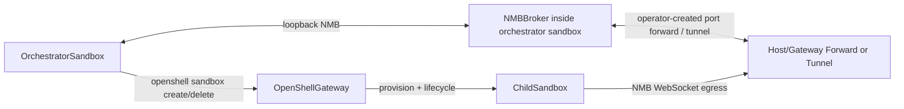

# Sandbox-to-Sandbox Launch Design (OpenShell + NMB)

> **Status:** Proposed
>
> **Last updated:** 2026-05-04
>
> **Related:**
> [NMB Design](nmb_design.md) |
> [Orchestrator Design](orchestrator_design.md) |
> [OpenShell Deep Dive](deep_dives/openshell_deep_dive.md)

---

## 1  Goal

Allow the orchestrator running inside an OpenShell sandbox to launch additional
OpenShell sandboxes for scoped tasks.

The hierarchy is encoded at the application layer (NMB metadata), not by
nested containers.

---

## 2  Non-Goals

- No Docker-in-Docker or sandbox-inside-sandbox runtime.
- No change to OpenShell core architecture.
- No broker protocol rewrite; use existing NMB payload fields.

---

## 3  Architecture (Control Plane + Message Plane)



Key point: the orchestrator sandbox and child sandboxes are sibling containers
managed by the gateway. "Parent/child" is a logical relationship tracked in NMB
messages and task state.

Current OpenShell constraint: direct sandbox-to-sandbox service discovery for a
process listening inside another sandbox is not yet a proven primitive.  For the
working prototype, something outside the pair of sandboxes facilitated the
connection: the broker sandbox exposed `0.0.0.0:9876` through an operator-created
OpenShell forward, and the client sandbox connected to that forwarded listener
with normal policy-governed egress.

The same traffic pattern can be initiated by another sandbox, not only by a
host/browser: the source sandbox opens an outbound connection, and the target
sandbox receives it on a server bound to `0.0.0.0:<port>`.  The important
requirement is routing plus policy.  The source sandbox must have
`network_policies` egress for the target endpoint, whether that endpoint is
today's external forward/tunnel or a future first-class sandbox service name
such as `<sandbox-name>.openshell.svc.cluster.local:<port>` or
`messages.local:9876`.

This means SSH tunneling or an OpenShell port forward is the correct **current
workaround** for connecting sandbox-resident services together.  It should be
understood as an external rendezvous path, not as one sandbox SSHing into another
and not as the final target architecture.  When OpenShell provides native
sandbox-to-sandbox service routing, the NMB broker route should move to that
first-class mechanism (for example a future `messages.local:9876` binding) and
the tunnel/forward workaround should be removed.

---

## 4  Spawn Contract (NMB Metadata)

No wire-protocol changes are required. Add hierarchy metadata in payloads:

- `workflow_id`: stable ID for the delegated task tree.
- `root_sandbox_id`: the top-level orchestrator sandbox ID.
- `parent_sandbox_id`: immediate launcher sandbox ID.
- `role`: `coding`, `review`, `research`, etc.
- `ttl_s`: optional expected lifetime for cleanup automation.

Suggested control events:

- `sandbox.spawn.request`
- `sandbox.spawn.started`
- `sandbox.spawn.failed`
- `sandbox.spawn.terminated`

This keeps topology and lifecycle observable without coupling NMB to OpenShell
internals.

---

## 5  Required Docker Image Changes

Target file: [`docker/Dockerfile.orchestrator`](../docker/Dockerfile.orchestrator)

1. **Install OpenShell CLI in the runtime image**
   - Track the latest stable OpenShell CLI by default.
   - Keep a build-time override (`OPENSHELL_VERSION`) so we can quickly pin/roll
     back if a new release regresses behavior.
   - Preferred pattern: download official release artifact in build stage and
     copy the binary into runtime stage.
   - Validate at build time with `openshell --version`.

2. **Add minimal runtime dependencies for CLI execution**
   - Ensure `ca-certificates` and `curl` are present.
   - Keep image lean; avoid adding Docker engine/socket support.

3. **Prepare writable CLI config location**
   - Keep `HOME=/app` (already aligned with sandbox user home).
   - Ensure `/app/.config` exists and is writable by `sandbox` user
     (already allowed by policy).
   - Optional: set `XDG_CONFIG_HOME=/app/.config` explicitly.

4. **Do not change current OpenShell supervisor assumptions**
   - Continue to avoid setting `USER` and `ENTRYPOINT`.
   - Continue creating `sandbox` user/group for policy `run_as_user`.

Example shape (illustrative, not exact release URL):

```dockerfile
ARG OPENSHELL_VERSION=latest
RUN apt-get update && apt-get install -y --no-install-recommends ca-certificates curl \
    && rm -rf /var/lib/apt/lists/*
# Resolve latest stable release when OPENSHELL_VERSION=latest.
RUN curl -fsSL "<openshell-release-url>" -o /tmp/openshell \
    && install -m 0755 /tmp/openshell /usr/local/bin/openshell \
    && openshell --version
ENV XDG_CONFIG_HOME=/app/.config
```

---

## 6  Policy + Config Deltas

### 6.1  OpenShell Network Policy

Target file: [`policies/orchestrator.yaml`](../policies/orchestrator.yaml)

- Add a network policy entry for the gateway endpoint used by the in-sandbox
  OpenShell CLI.
- Include `/usr/local/bin/openshell` in allowed binaries for that endpoint.
- Keep the scope narrow to the configured gateway host/port only.

For message-plane connectivity between sibling sandboxes, do not assume that the
child can connect directly to another sandbox's Kubernetes service name or to
`messages.local`.  Until OpenShell ships native sandbox-to-sandbox service
routing, the child policy must explicitly allow the externally facilitated NMB
endpoint chosen by the deployment.  In the prototype, that endpoint is the
forwarded broker listener at `host.docker.internal:9876`; see
[`prototypes/nmb_sandbox_communication`](../prototypes/nmb_sandbox_communication).

If native sandbox service routing becomes available, the model is still
source-side egress control: a child sandbox that initiates HTTP or WebSocket
traffic to a sibling sandbox must explicitly allow that sibling service host and
port in its own `network_policies`, and the sibling service must listen on
`0.0.0.0:<port>` inside its sandbox.  Do not rely on the host/browser
`--forward` path as the long-term mechanism for sandbox-initiated traffic.

If the deployment uses an SSH tunnel instead of `openshell --forward`, model it
the same way: the tunnel endpoint is the temporary external rendezvous, and the
child sandbox receives only the minimum egress needed to reach that endpoint.
Do not grant broad private-network egress just to make sandbox-to-sandbox
connectivity work.

### 6.2  Runtime Configuration

Targets:
- [`src/nemoclaw_escapades/config.py`](../src/nemoclaw_escapades/config.py)
- [`.env.example`](../.env.example)

Add optional settings such as:

- `SANDBOX_SPAWN_ENABLED=true|false`
- `OPENSHELL_GATEWAY_URL=...`
- `OPENSHELL_GATEWAY_NAME=...`
- `CHILD_SANDBOX_POLICY=...`
- `CHILD_SANDBOX_IMAGE_SOURCE=...` (for `--from`)

---

## 7  Orchestrator Changes (Minimal)

1. Add an OpenShell sandbox lifecycle tool module, e.g.
   `src/nemoclaw_escapades/tools/openshell_sandbox.py`:
   - `openshell_sandbox_create` (WRITE)
   - `openshell_sandbox_delete` (WRITE)
   - `openshell_sandbox_get` / `openshell_sandbox_list` (READ)

2. Register the toolset in `main.py` when `SANDBOX_SPAWN_ENABLED=true`.

3. Mark spawn/delete as high-risk in the approval gate so user confirmation is
   required before creating or deleting child sandboxes.

4. Emit NMB lifecycle events (`sandbox.spawn.started`, `sandbox.spawn.failed`,
   `sandbox.spawn.terminated`) for visibility and recovery.

---

## 8  Testing Plan

- **Unit tests**
  - Tool command construction and argument validation.
  - Approval classification for create/delete operations.

- **Integration tests**
  - Orchestrator sandbox launches child sandbox successfully.
  - Child connects to NMB through the configured external rendezvous
    (forward/tunnel today, native OpenShell service route later) and exchanges
    one request/reply cycle.
  - Failure path emits `spawn.failed` and does not leak resources.
  - Cleanup path always issues delete (normal and timeout cases).

---

## 9  Risks and Guardrails

- **Credential scope:** use dedicated gateway credentials with limited lifetime.
- **Resource leaks:** enforce TTL + watchdog cleanup for child sandboxes.
- **Name collisions:** use deterministic prefix + unique suffix per workflow.
- **Fast-moving CLI versions:** gate upgrades with a smoke test (spawn/create/get/delete)
  and support immediate rollback by setting `OPENSHELL_VERSION` explicitly.
- **Privilege creep:** no Docker socket mount; OpenShell gateway remains the
  only control-plane surface.
- **Temporary tunnel dependency:** sandbox-to-sandbox service routing currently
  needs an external forward/tunnel.  Treat that as an MVP workaround with narrow
  policy, explicit cleanup, and a migration path to native OpenShell routing.

---

## 10  `/sandbox` PVC Mapping Semantics

When multiple OpenShell sandboxes are spawned with persistent `/sandbox`
storage, they should be treated as isolated by default:

- Each sandbox gets its own persistent volume claim / volume object.
- Sandbox A's `/sandbox` does not automatically map to the same host volume as
  sandbox B's `/sandbox`.
- Multiple PVCs may still be backed by the same physical disk pool or storage
  class, but they remain logically separate volumes.
- Shared writable state across sandboxes requires explicit configuration
  (shared mount, shared PVC, or API-based exchange such as NMB).
